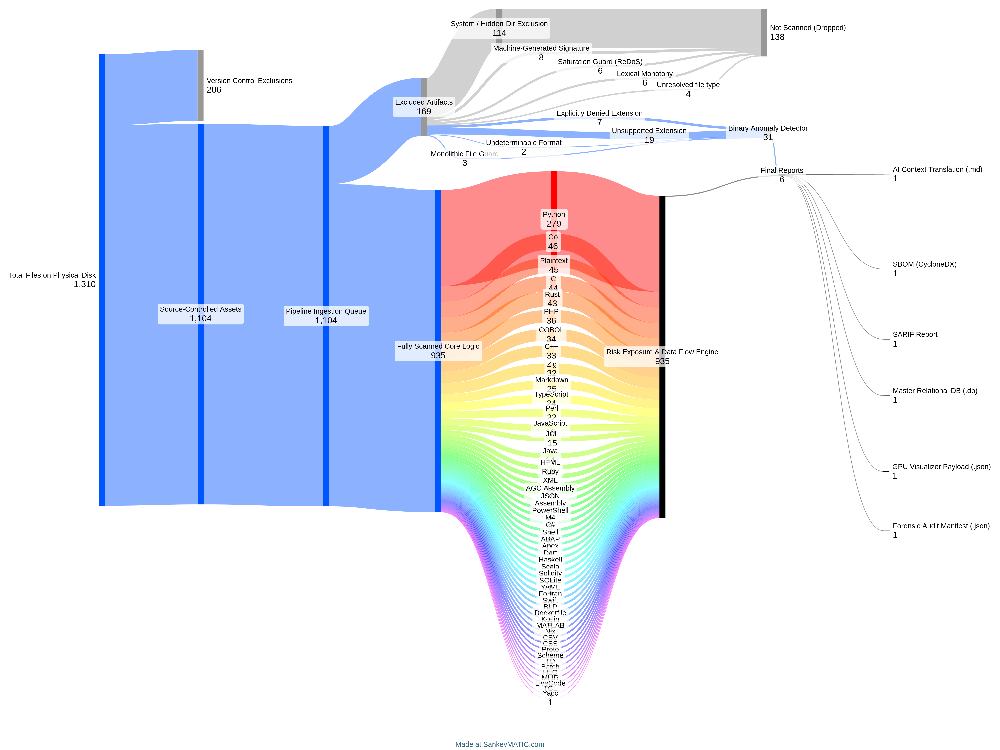
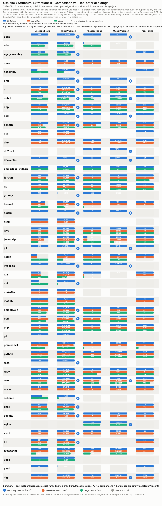

# GitGalaxy

**Repository-scale structural intelligence without compilation.**

[Docs](https://squid-protocol.github.io/gitgalaxy/) ·
[Visualizer](https://gitgalaxy.io/) ·
[Language Crucible](https://github.com/squid-protocol/language-crucible) ·
[Keyword Rosetta](https://github.com/squid-protocol/keyword-rosetta) ·
[Raw Output](https://github.com/squid-protocol/gitgalaxy-raw-output)

**1 scan · 97 structural signals · 50+ languages · no compilation · 19
risk-exposure categories · 6 outputs**

## The short version

GitGalaxy builds a **language-agnostic structural graph of an entire
repository** directly from source text — no build, no per-language toolchain.

It is designed for repositories that are polyglot, partially broken, legacy,
vendor-heavy, or otherwise difficult to analyze through a build-first workflow:

``` text
Go + C++ + Python + Java + Bash + YAML
+ generated code + vendored code + legacy code
+ half-migrated modules + broken dependencies
```

Instead of a separate parser per language, GitGalaxy extracts a common
vocabulary of **structural signatures** — functions, classes, arguments,
control flow, state mutation, I/O, APIs, dependencies — and normalizes them
into one deterministic repository model that feeds architecture analysis,
risk-exposure prioritization, SBOM generation, refactoring and ownership
analysis, AI-oriented codebase context, and CI/CD gates.

> **Central thesis:** complete language parsing is not always necessary to
> recover highly useful structural information at repository scale.

How that thesis is tested — against Tree-sitter and Ctags, against a planted
control corpus, and next against Git history — is summarized in
[Accuracy, measured](#accuracy-measured) below and laid out in full in
[the validation program](docs/validation.md).

------------------------------------------------------------------------

## What a scan gives you

One command:

``` bash
pip install gitgalaxy
galaxyscope path/to/repo
```

Six coordinated views of the same deterministic scan:

| Output | Purpose |
|---|---|
| **LLM architecture brief** | Compact machine/agent-oriented context (below) |
| **SARIF** | CI/security dashboard integration |
| **CycloneDX SBOM** | Dependency inventory/compliance |
| **SQLite** | Queryable repository knowledge graph |
| **JSON audit data** | Forensic/automation workflows |
| **3D visualization data** | Interactive repository topology |

### The architecture brief

The flagship report is a single Markdown brief built to hand an engineer — or
an AI agent — a working mental model of a repository they've never seen. It is
a self-contained package: the risk equations are printed in the report itself,
and an embedded interpretation prompt lets any LLM narrate it without
hallucinating what the numbers mean. Sections cover macro state and language
composition, network topology (modularity, articulation points, cyclic
density), dependency choke points, the heaviest functions and files, per-file
structural signatures with PageRank blast radius, targeted and cumulative risk
hitlists, supply-chain audits, and refactoring targets ranked by volatility and
authorship centralization — plus an itemized list of every file it *refused* to
scan, and why.

Two examples, scanned 2026-08-31 with the current engine. Both repositories
are public — clone either and run `galaxyscope --llm-only <path>` to reproduce
the full brief:

**curl** — 4,250 artifacts, 696 scanned, 112,653 LOC across C, Perl, Python,
Shell, M4 and Makefile. The brief ranks `src/tool_setup.h` as the top
structural pillar (80 inbound connections) and puts a *Perl* function —
`APPEND_imap` in `tests/ftpserver.pl`, Impact 2135, 1,672 LOC — at the top of
the repo-wide function hitlist, in the same ranking as the C code. That
cross-language graph is the product: one comparable signal set across every
language in the repo. The honest caveat in the same brief: only 16.4% of
artifacts were scanned — the ingestion filter drops binaries, generated code
and test data aggressively, and §5 of the brief itemizes every exclusion by
extension and reason.

**cics-genapp** (IBM's CICS COBOL/DB2 sample) — 92.1% scanned: 44 COBOL
programs, 29 JCL jobs. The cumulative-risk hitlist leads with
`base/src/lgupdb01.cbl` (state flux ~100%, cognitive load 92%), and the
heaviest paragraph in the repo is `UPDATE-POLICY-DB2-INFO` — the `SELECT FOR
UPDATE` row-locking logic, which is exactly where a maintainer of that program
would want to look first. The same brief also shows a limitation plainly: on a
flat architecture with no real import graph, the "structural pillars" list
degenerates to zero-connection files, and the report says to check the
connection counts before trusting it.

Hundreds of unedited briefs for independently selected repositories are
committed at
[gitgalaxy-raw-output](https://github.com/squid-protocol/gitgalaxy-raw-output);
this repo's own always-current self-scan brief is at
[`docs/gitgalaxy_architecture_brief.md`](docs/gitgalaxy_architecture_brief.md).

### One graph, many consumers

| Consumer | Question |
|---|---|
| Architecture | What is this repository made of? |
| Structural analysis | Where are the functions, classes, APIs, dependencies and control structures? |
| Risk exposure | Where are potentially important risk patterns concentrated? |
| Refactoring | Which files are complex, high-churn or load-bearing? |
| Supply chain | What dependencies physically exist on disk? |
| AI context | What architecture and relationships should an agent know? |
| Legacy migration | Where are the structural units to transform? |
| Historical analysis | How does measured exposure change as the repository evolves? |



------------------------------------------------------------------------

## Accuracy, measured

Two standing measurement programs back the claims above. The full narrative —
methodology, verdicts, limits, and what comes next — lives in
[the validation program](docs/validation.md); this is the summary.

### Structural validation: GitGalaxy vs Tree-sitter vs Ctags

GitGalaxy is benchmarked against **Tree-sitter and Universal Ctags** on the
pinned [Language Crucible](https://github.com/squid-protocol/language-crucible)
corpus — 24 of 45 languages get all three tools, 13 more get two, and every
disagreement is investigated against real source and recorded with a verdict
(200 of 201 logged discrepancy shapes validated). On that corpus, GitGalaxy's
validated function precision is 100% across all 31 tree-sitter-comparable
languages, and it is never the tool found wrong in a validated class or
argument disagreement. The limit: three structural targets, one fixed corpus —
not "parses as accurately as an AST" in general.



### Cross-language consistency: the Keyword Rosetta control corpus

The newer program asks the opposite question: **does GitGalaxy measure
identical intent identically in every language?** The
[keyword-rosetta](https://github.com/squid-protocol/keyword-rosetta) corpus
plants the same 12-probe program in all 46 supported languages with exact known
signal counts — so any divergence is measured language bias, by construction.
Current answer: not yet. On average 75% of languages land within ±25% of the
cross-language median per metric, but only 3 of 33 metrics pass the strict
cross-language gate, and the weakest (`risk_cognitive_load`, at 15% of
languages in band) are named in the chart rather than hidden. Each deviation is
recorded in a validated ledger and the defect classes found this way are
[filed as GitGalaxy issues](https://github.com/squid-protocol/keyword-rosetta/blob/main/docs/findings_by_language.md).


A control corpus proves measurement inequality on identical intent; it says
nothing about accuracy on real code (the tri-comparison's job above) — and a
constant per-file bias still preserves ranking *within* a language. The
[incidence report](https://github.com/squid-protocol/keyword-rosetta/blob/main/docs/incidence_report.md)
sizes each confirmed shape against real licensed code.

------------------------------------------------------------------------

## Real-world scale

Example: **Kubernetes** — ~1.39M lines across Go, YAML, JSON, Shell and Proto.
End-to-end scan: **50.83 seconds**. Scan time follows a fitted two-regime model
(flat ~0.11s below ~4.3K LOC, then `time(s) ≈ 3.36e-05 × LOC^0.969`, R²=0.88
across 599 repos) — so a handful of 20M+ LOC outliers still take minutes, and a
fast scan proves throughput, not insight quality; the accuracy question is
handled separately below.


See the [raw output
repository](https://github.com/squid-protocol/gitgalaxy-raw-output) for
unedited artifacts.

------------------------------------------------------------------------

# Risk exposure: what GitGalaxy claims

GitGalaxy produces **risk-exposure measurements**, not vulnerability verdicts.

A high exposure means:

> **This location deserves attention relative to the rest of the repository.**

It does not mean:

> "This code is definitely vulnerable."

The current system produces normalized exposure categories across the
repository and rolls information from structural entities through files,
folders and repository-level views.

The underlying signatures cover patterns involving areas such as:

-   secrets
-   injection surface
-   unsafe/memory operations
-   dynamic execution
-   I/O
-   concurrency
-   state mutation
-   reflection
-   APIs
-   dependencies
-   entropy
-   other structural/security characteristics

The important research question is whether these signatures are **empirically
associated with meaningful classes of software risk**, rather than merely
correlated with a score that GitGalaxy itself mathematically constructed.

That distinction drives the next phase.

------------------------------------------------------------------------

# Evidence, not just claims

### Language Crucible

A pinned corpus of real-world source including projects such as Godot, Roslyn,
curl, Kubernetes and Apollo 11 flight software.

[Language Crucible](https://github.com/squid-protocol/language-crucible)

### Golden-master regression

Real source is rescanned and compared against checked-in expected output so
parser changes have an observable diff. Regenerated with
[`tests/tools/update_golden_master.py`](tests/tools/update_golden_master.py),
never hand-edited.

### Tri-comparison

The same corpus is analyzed against GitGalaxy, Tree-sitter and Ctags where
coverage exists — 24 of 45 languages get all three tools, 200 of 201 logged
discrepancies validated. On the pinned corpus, GitGalaxy is never the tool
found wrong in a validated function-precision, class, or argument disagreement,
and matches tree-sitter's function recall everywhere except one nested shell
definition it skips by design. See
[the methodology](docs/self_scan/tri_comparison_README.md) and
[the validation program](docs/validation.md) for the full picture and its
limits.

### Keyword Rosetta control corpus

The same 12-probe program planted in all 46 supported languages with exact
known signal counts, measuring cross-language consistency of every metric —
with a validated deviation ledger and the resulting engine defects
[filed as issues](https://github.com/squid-protocol/keyword-rosetta/blob/main/docs/findings_by_language.md).

[Keyword Rosetta](https://github.com/squid-protocol/keyword-rosetta)

### Raw repository output

Unedited GitGalaxy output is retained for hundreds of independently selected
repositories.

[Raw Output](https://github.com/squid-protocol/gitgalaxy-raw-output)

### Regression suite

**7,043 tests** in the default suite (`python -m pytest tests/`), of which
**6,165** are per-signature tests across all 45 structurally-signatured
languages — positive matches, explicit exclusions, and adversarial/ReDoS
inputs. See [`tests/README.md`](tests/README.md) for the breakdown, and
[`docs/why_gitgalaxy_beats_ast_here.md`](docs/why_gitgalaxy_beats_ast_here.md)
for specific, evidenced cases where this extraction beats an AST read.

### Historical validation

The next research layer will test whether exposure measurements correspond to
real security and maintenance events over Git history — see
[the validation program](docs/validation.md#the-next-validation-risk-over-git-history).

------------------------------------------------------------------------

# What GitGalaxy is --- and isn't

### GitGalaxy is

-   repository-scale structural intelligence
-   language-agnostic source analysis
-   a common structural representation across heterogeneous code
-   risk-exposure prioritization
-   architecture mapping
-   CI-native evidence generation
-   useful on broken/uncompiled repositories
-   designed for local/offline operation

### GitGalaxy is not

-   a replacement for CodeQL's deep dataflow analysis
-   a replacement for Semgrep's rule ecosystem
-   a replacement for dependency CVE databases
-   a proof of exploitability
-   a runtime analyzer
-   a complete language parser
-   a guarantee that a high exposure is a vulnerability

| Tool | Primary question |
|---|---|
| **GitGalaxy** | What does this entire repository look like, structurally, and where should attention go first? |
| Tree-sitter | What syntactic structure does this source contain? |
| Ctags | Where are the navigable code entities? |
| Semgrep | Does this code match a specified pattern? |
| CodeQL | What data/control relationships can deeper analysis establish? |
| SCA/CVE tools | Is this dependency/version associated with a known advisory? |

------------------------------------------------------------------------

# Git history and architecture

GitGalaxy already incorporates Git history into signals such as churn,
contributor concentration, bus-factor exposure, refactoring hotspots, file
ownership and temporal activity. The research direction is to extend this from
**history as a contextual signal** to **history as an external validation
source for the exposure model** — the experiment design is in
[the validation program](docs/validation.md#the-next-validation-risk-over-git-history).

------------------------------------------------------------------------

# Privacy and deployment

GitGalaxy is designed for local and air-gapped operation.

-   Source code is not sent to a GitGalaxy cloud service.
-   Scanning and vectorization occur locally.
-   The scanner has no runtime network requirement.
-   CI/CD execution can remain inside the user's environment.
-   The browser visualizer operates on locally supplied data.

------------------------------------------------------------------------

# Installation

``` bash
pip install gitgalaxy
```

See the [documentation](https://squid-protocol.github.io/gitgalaxy/) for
current commands and configuration.

### CI/CD

Templates are provided for GitHub Actions, GitLab CI, Bitbucket Pipelines,
Azure Pipelines, and generic shell-invocable CI environments. See
[`templates/`](templates/) and the [CI integration
guide](github-action-readme.md).

------------------------------------------------------------------------

# Explore the evidence

| Resource | What it contains |
|---|---|
| [Documentation](https://squid-protocol.github.io/gitgalaxy/) | Architecture, claims and methodology |
| [The validation program](docs/validation.md) | The full proof narrative: thesis, benchmarks, validity ladder, next experiments |
| [Language Crucible](https://github.com/squid-protocol/language-crucible) | Cross-language benchmark and golden corpus |
| [Keyword Rosetta](https://github.com/squid-protocol/keyword-rosetta) | 46-language planted control corpus and bias reports |
| [Raw Output](https://github.com/squid-protocol/gitgalaxy-raw-output) | Unedited scans of real repositories |
| [`tests/README.md`](tests/README.md) | Regression and golden-master methodology |
| [`tri_comparison_ledger.json`](docs/self_scan/tri_comparison_ledger.json) | Disagreement-by-disagreement validation record |
| [`manual_verification.json`](docs/self_scan/manual_verification.json) | Reviewed cases where comparator coverage is unavailable |
| [`how_to_investigate_a_discrepancy.md`](docs/self_scan/how_to_investigate_a_discrepancy.md) | Comparator-disagreement methodology |
| [Visualizer](https://gitgalaxy.io/) | Local browser-based repository visualization |

------------------------------------------------------------------------

# License

Copyright (c) 2026 Joe Esquibel

GitGalaxy is distributed under the **PolyForm Noncommercial License 1.0.0**.

See the repository license for full terms.
