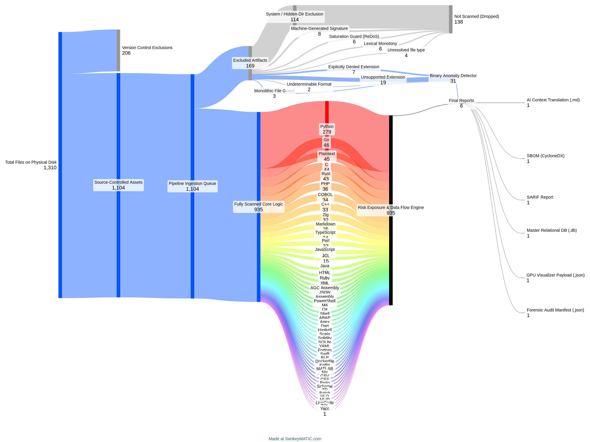
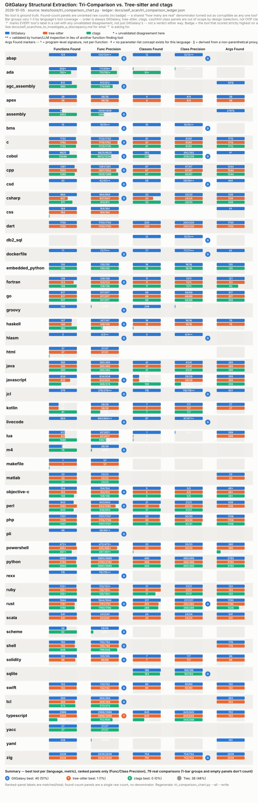
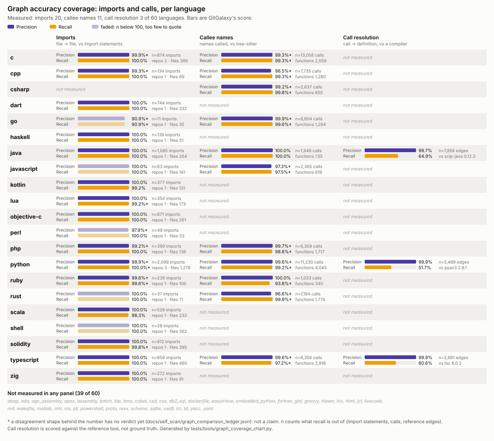

# GitGalaxy

**Repository-scale structural intelligence without compilation.**

[Docs](https://squid-protocol.github.io/gitgalaxy/) ·
[Visualizer](https://gitgalaxy.io/) ·
[Language Crucible](https://github.com/squid-protocol/language-crucible) ·
[Keyword Rosetta](https://github.com/squid-protocol/keyword-rosetta) ·
[Raw Output](https://github.com/squid-protocol/gitgalaxy-raw-output)

**1 scan · 98 structural signals · 50+ languages · no compilation · 17
risk-exposure categories · 6 outputs**

## The short version

GitGalaxy builds a **language-agnostic structural graph of an entire
repository** directly from source text — no build, no per-language toolchain.

It is designed for repositories that are polyglot, partially broken, legacy,
vendor-heavy, or otherwise difficult to analyze through a build-first workflow:

``` text
Go + C++ + Python + Java + Bash + YAML
+ generated code + vendored code + legacy code
+ half-migrated modules + broken dependencies
```

Instead of a separate parser per language, GitGalaxy extracts a common
vocabulary of **structural signatures** — functions, classes, arguments,
control flow, state mutation, I/O, APIs, dependencies — and normalizes them
into one deterministic repository model that feeds architecture analysis,
risk-exposure prioritization, SBOM generation, refactoring and ownership
analysis, AI-oriented codebase context, and CI/CD gates.

> **Central thesis:** complete language parsing is not always necessary to
> recover highly useful structural information at repository scale.

How that thesis is tested — against Tree-sitter and Ctags, against a planted
control corpus, and next against Git history — is summarized in
[Accuracy, measured](#accuracy-measured) below and laid out in full in
[the validation program](docs/validation.md).

For mainframe estates, the same facts drive a COBOL-to-Java migration where every ported
program is proven against the original: [COBOL to Java](#cobol-to-java-ported-then-proven).

------------------------------------------------------------------------

## What a scan gives you

One command:

``` bash
pip install gitgalaxy
galaxyscope path/to/repo
```

Six coordinated views of the same deterministic scan:

| Output | Purpose |
|---|---|
| **LLM architecture brief** | Compact machine/agent-oriented context (below) |
| **SARIF** | CI/security dashboard integration |
| **CycloneDX SBOM** | Dependency inventory/compliance |
| **SQLite** | Queryable repository knowledge graph |
| **JSON audit data** | Forensic/automation workflows |
| **3D visualization data** | Interactive repository topology |

### The architecture brief

The flagship report is a single Markdown brief built to hand an engineer — or
an AI agent — a working mental model of a repository they've never seen. It is
a self-contained package: the risk equations are printed in the report itself,
and an embedded interpretation prompt lets any LLM narrate it without
hallucinating what the numbers mean. Sections cover macro state and language
composition, network topology (modularity, articulation points, cyclic
density), dependency choke points, the heaviest functions and files, per-file
structural signatures with PageRank blast radius, targeted and cumulative risk
hitlists, supply-chain audits, and refactoring targets ranked by volatility and
authorship centralization — plus an itemized list of every file it *refused* to
scan, and why.

Two examples, scanned 2026-08-31 with the current engine. Both repositories
are public — clone either and run `galaxyscope --llm-only <path>` to reproduce
the full brief:

**curl** — 4,250 artifacts, 696 scanned, 112,653 LOC across C, Perl, Python,
Shell, M4 and Makefile. The brief ranks `src/tool_setup.h` as the top
structural pillar (80 inbound connections) and puts a *Perl* function —
`APPEND_imap` in `tests/ftpserver.pl`, Impact 2135, 1,672 LOC — at the top of
the repo-wide function hitlist, in the same ranking as the C code. That
cross-language graph is the product: one comparable signal set across every
language in the repo. The honest caveat in the same brief: only 16.4% of
artifacts were scanned — the ingestion filter drops binaries, generated code
and test data aggressively, and §5 of the brief itemizes every exclusion by
extension and reason.

**cics-genapp** (IBM's CICS COBOL/DB2 sample) — 92.1% scanned: 44 COBOL
programs, 29 JCL jobs. The cumulative structural-surface hitlist leads with
`base/src/lgupdb01.cbl` (mutation surface ~100%, complexity load 92%), and the
heaviest paragraph in the repo is `UPDATE-POLICY-DB2-INFO` — the `SELECT FOR
UPDATE` row-locking logic, which is exactly where a maintainer of that program
would want to look first. The same brief also shows a limitation plainly: on a
flat architecture with no real import graph, the "structural pillars" list
degenerates to zero-connection files, and the report says to check the
connection counts before trusting it.

Hundreds of unedited briefs for independently selected repositories are
committed at
[gitgalaxy-raw-output](https://github.com/squid-protocol/gitgalaxy-raw-output);
this repo's own always-current self-scan brief is at
[`docs/gitgalaxy_architecture_brief.md`](docs/gitgalaxy_architecture_brief.md).

### One graph, many consumers

| Consumer | Question |
|---|---|
| Architecture | What is this repository made of? |
| Structural analysis | Where are the functions, classes, APIs, dependencies and control structures? |
| Structural Surface Profile (formerly Risk exposure) | Where is a given structural/content pattern concentrated? |
| Refactoring | Which files are complex, high-churn or load-bearing? |
| Supply chain | What dependencies physically exist on disk? |
| AI context | What architecture and relationships should an agent know? |
| Legacy migration | Where are the structural units to transform? |
| Historical analysis | How does measured exposure change as the repository evolves? |



------------------------------------------------------------------------

## Accuracy, measured

Two standing measurement programs back the claims above, and a third, for the
dependency and call graphs, is in progress. The full narrative —
methodology, verdicts, limits, and what comes next — lives in
[the validation program](docs/validation.md); this is the summary.

### Structural validation: GitGalaxy vs Tree-sitter vs Ctags

GitGalaxy is benchmarked against **Tree-sitter and Universal Ctags** on the
pinned [Language Crucible](https://github.com/squid-protocol/language-crucible)
corpus — 24 of 45 languages get all three tools, 13 more get two, and every
disagreement is investigated against real source and recorded with a verdict
(200 of 201 logged discrepancy shapes validated). On that corpus, GitGalaxy's
validated function precision is 100% across all 31 tree-sitter-comparable
languages, and it is never the tool found wrong in a validated class or
argument disagreement. The limit: three structural targets, one fixed corpus —
not "parses as accurately as an AST" in general.



### Graph validation: imports and calls (in progress)

Blast radius, PageRank and the "structural pillars" come from the **import graph**. The
function-level rankings come from the **call graph**. Neither graph is measured in every
language yet, and the chart below says which ones are:
- Measured languages show precision and recall with n.
- Every language not yet measured is listed by name.

As of 2026-09-26, out of 59 languages:
- **The import graph is measured in 20.** Engine edges are checked against each language's
  own import statements on pinned real repos
  ([`import_graph_accuracy.py`](tests/tools/import_graph_accuracy.py)).
- **Callee names are measured in 11**, against tree-sitter.
- **Call resolution is measured in 3**, against a reference analyser:
  - Python, vs pyan3: 99.8% precision on 1,806 judged links, 51.6% recall;
  - TypeScript, vs the TypeScript 6.0.2 type checker: 99.9% precision on 1,520 judged links,
    57.1% recall;
  - Java, vs scip-java (javac's own resolution): 93.2% precision on 3,727 judged links,
    44.2% recall. A call to an overloaded method is linked only when its argument count picks
    one overload ([#3835](https://github.com/squid-protocol/gitgalaxy/issues/3835)).

  A call link, when made, is usually right, but about half or more of calls are left
  unlinked. So function-level fan-in and PageRank are a lower bound.

The limits:
- The other 38 languages' graphs are built the same way but are **not measured**.
- Several measured languages rest on one repo with fewer than 100 imports. The chart fades
  those out.
- A `*` marks a number with disagreements still awaiting a verdict against source.

The plan to close these gaps is
[epic #3772](https://github.com/squid-protocol/gitgalaxy/issues/3772).



### Cross-language consistency: the Keyword Rosetta control corpus

The newer program asks the opposite question: **does GitGalaxy measure
identical intent identically in every language?** The
[keyword-rosetta](https://github.com/squid-protocol/keyword-rosetta) corpus
plants the same 12-probe program in all 50 supported languages with exact known
signal counts — so any divergence is measured language bias, by construction.
The chart colours each deviation by *cause*, not size: red is an open engine
defect (a rule matching the wrong construct, or a scoring weight sitting inside
a count); grey is a documented variation the ledger has validated — the language
cannot express the construct, a deliberate scoring choice, or an echo of another
row. Current answer: on average 94% of languages sit within ±25% of the
cross-language median per gated metric (56 chartable metrics, 54 holding ≥80%),
and **the open-defect share is 0.0% (1 of 2,844 comparable cells across 59 gated
metrics)** — a single unexplained cell, `classes_found` in the newly planted
`bms` (CICS Basic Mapping Support) corpus; every other out-of-band cell is a
variation the ledger has validated (a strictness stratum, a construct the
language cannot express, an echo of another row, or a deliberate scoring
choice), not an open engine defect. The weakest metrics are named rather than
hidden — `cog_raw` holds 74% of languages in band, `raw_arch_api` 78%,
`avg_func_args` 80% — but their sub-band cells are documented, not defects.
The claim also survives expansion: when the corpus planted its first
security-lens probe — one identical hardcoded secret in every language —
`credential_material` (formerly `risk_secrets_risk`; the `risk_*` name remains
the DB column — see [`docs/vectors.md`](docs/vectors.md)) read a **uniform
score across all 50 languages** (an identical 25.000 per column). The two
inert-format exceptions the lens originally skipped, and the formula's measured
length dependence, were ledgered and filed the same day
([#2978](https://github.com/squid-protocol/gitgalaxy/issues/2978),
[#2979](https://github.com/squid-protocol/gitgalaxy/issues/2979)). #2978 is
closed: the lens now runs on all five inert formats
(plaintext/markdown/json/yaml/csv), with a `SECURITY_SCAN_INERT_FORMATS`
config opt-out for repos where that trades too much doc/config noise for the
coverage, and keyword-rosetta's corpus re-verification against the merged fix
now lands entirely in band (the ledger's `secrets-lens-inert-formats` entry).
Every deviation is recorded in a validated ledger, the work is tracked by cause
family under the [contract roadmap](docs/contract_roadmap.md), and
the defect classes found this way are
[filed as GitGalaxy issues](https://github.com/squid-protocol/keyword-rosetta/blob/main/docs/findings_by_language.md).


A control corpus proves measurement inequality on identical intent; it says
nothing about accuracy on real code (the tri-comparison's job above) — and a
constant per-file bias still preserves ranking *within* a language. The
[incidence report](https://github.com/squid-protocol/keyword-rosetta/blob/main/docs/incidence_report.md)
sizes each confirmed shape against real licensed code.

------------------------------------------------------------------------

## COBOL to Java: ported, then proven

For mainframe estates the structural graph is the start of a migration. `cobol-to-java`
turns an estate into a compiling Spring Boot project, and an equivalence harness proves
each ported program against the original COBOL: same inputs, byte-identical outputs.
A port that is not proven is not done, and a person approves every port.

1. **Facts.** `cobol-refractor` records what the engine verified per program: record
   layouts, datasets, JCL steps, CICS commands, COMMAREAs, CALLs, DB2 tables.
2. **Skeleton.** `cobol-to-java` generates the project from those facts: JPA entities and
   repositories for VSAM, JDBC repositories for DB2, Spring Batch jobs from JCL, REST
   endpoints for CICS transactions, BMS screens as view models, and a runtime for FILE
   STATUS, abends and DISPLAY. Where a fact is missing it writes a worklist item, not a
   guess. The kind of Java is [configurable](gitgalaxy/tools/cobol_to_java/README.md#choosing-the-java-you-get-the-target-config).
3. **Port.** Each program with business logic gets a porting ticket. Either the
   deterministic translator ports it with no model
   ([det-port](docs/language_status/det_port_design.md): each statement becomes a call into a
   runtime that follows COBOL's rules byte for byte, and anything it cannot translate is a
   named `Hole`), or a person or a model the customer chooses writes the logic
   ([`port_runner`](gitgalaxy/tools/cobol_to_java/port_runner.py)). A model may also make a
   det port readable one method at a time, each rewrite proven or reverted.
4. **Prove.** [`tests/tools/equivalence.py`](tests/tools/equivalence.py) runs the COBOL
   under GnuCOBOL and the port on the JVM. Every output record, the return code or abend,
   every DISPLAY line, every CICS screen (text, attributes, cursor), every COMMAREA, every
   Db2 table the program changes (both sides on one IBM Db2 Community Edition), and every
   injected file-status or CICS-response fault run must match. A failed proof's
   findings go back to the porter: [the porting loop](docs/language_status/porting_loop.md).
5. **Measure the proof.** The COBOL's paragraph and branch coverage across the runs says
   what was exercised. [Mutation testing](docs/language_status/mutation_testing.md) breaks
   the port on purpose and counts how many broken ports the proof still catches.

**Proven so far, deterministic ports** (2026-10-02, [cases](tests/equivalence); all of them, and the model-written ports, are re-proven in one
command by [`tests/tools/proof_sweep.py`](tests/tools/proof_sweep.py)):

| estate | programs proven | of them on Db2 | runs / scenarios | COBOL paragraphs covered | COBOL branches covered |
|---|---|---|---|---|---|
| [CardDemo](https://github.com/aws-samples/aws-mainframe-modernization-carddemo) | 27 | 3 | 615 | 557/570 | 1,748/2,100 |
| [CBSA](https://github.com/cicsdev/cics-banking-sample-application-cbsa) | 8 | 6 | 116 | 109/119 | 127/195 |
| [GenApp](https://github.com/cicsdev/cics-genapp) | 13 | 8 | 102 | 47/61 | 107/231 |

They include COACTUPC (account update, 4,236 lines), proven on 137 scenarios, which no model ported in one answer;
CICS programs that LINK to others in the same task (the task's programs proven together); named counters, SYNCPOINT
ROLLBACK and abend backout across files and Db2. The design, the runtime contract and every result are in
[det_port_design.md](docs/language_status/det_port_design.md).

**Proven so far, model-written ports,** on CardDemo:

| program | kind | ported by | proven on | COBOL branches covered | mutants caught |
|---|---|---|---|---|---|
| CBACT04C (interest) | batch | a person | 20 runs, 19 with faults | 85/86 | 30/35 (40 sampled) |
| CBTRN02C (posting) | batch | a person | 29 runs, 28 with faults | 95/96 | 27/32 (40 sampled) |
| CBTRN03C (report) | batch | Claude Sonnet 5.5, attempt 2 | 25 runs, 24 with faults | 81/82 | 26/37 (40 sampled) |
| COMEN01C (menu) | CICS | Claude Sonnet 5.5, attempt 1 | 11 scenarios | 28/33 | 77/135 (150 sampled) |
| COACTVWC (account view) | CICS | a person | 11 scenarios | 47/71 | not measured |
| CSUTLDTC (date check) | CALL | Claude Sonnet 5.5, attempt 2 | 11 calls | 4/10 | 131/190 (all) |
| COUSR01C (add user) | CICS, writes a file | Claude Sonnet 5.5, attempt 1 | 13 scenarios, each file compared after the task | 20/21 | not measured |
| COADM01C (admin menu) | CICS, CSD-defined programs (PGMIDERR) | Claude Sonnet 5.5, attempt 2 | 16 scenarios | -- | not measured |
| COCRDSLC (card detail) | CICS, reads a file | Claude Sonnet 5.5, attempt 2 | 21 scenarios | -- | not measured |
| COUSR02C (update user) | CICS, READ UPDATE / REWRITE | Claude Sonnet 5.5, attempt 1 | 23 scenarios, each file compared | -- | not measured |
| COTRN01C (view transaction) | CICS, reads a file | Claude Sonnet 5.5, attempt 1 | 15 scenarios | -- | not measured |
| COUSR03C (delete user) | CICS, DELETE | Claude Sonnet 5.5, attempt 1 | 18 scenarios, each file compared | -- | not measured |
| COUSR00C (user list) | CICS, browse both ways | Claude Sonnet 5.5, attempt 1 | 21 scenarios | -- | not measured |
| COTRN00C (transaction list) | CICS, browse both ways | Claude Sonnet 5.5, attempt 1 | 21 scenarios | -- | not measured |
| COTRN02C (add transaction) | CICS, browse + WRITE, CALLs CSUTLDTC | Claude Sonnet 5.5, attempt 1 | 31 scenarios, each file compared | -- | not measured |
| COBIL00C (bill payment) | CICS, ASKTIME / FORMATTIME, WRITE + REWRITE | Claude Sonnet 5.5, attempt 1 | 17 scenarios, each file compared | -- | not measured |
| COCRDLIC (card list) | CICS, filtered browse both ways | Claude Sonnet 5.5, attempt 2 | 43 scenarios | -- | not measured |
| COSGN00C (sign-on) | CICS, ASSIGN APPLID / SYSID | Claude Sonnet 5.5, attempt 1 | 12 scenarios | 17/17 | not measured |
| CORPT00C (report request) | CICS, WRITEQ TD (JCL to JOBS), CALLs CSUTLDTC | Claude Sonnet 5.5, attempt 1 | 16 scenarios, each JCL line compared | -- | not measured |
| CBACT02C (card file listing) | batch | Claude Sonnet 5.5, attempt 1 | normal run + 6 faults, SYSOUT compared | -- | not measured |
| CBACT03C (card xref listing) | batch | Claude Sonnet 5.5, attempt 1 | normal run + 6 faults | -- | not measured |
| CBCUS01C (customer listing) | batch | Claude Sonnet 5.5, attempt 1 | normal run + 6 faults | -- | not measured |
| CBTRN01C (daily transaction check) | batch, no JCL in the estate | Claude Sonnet 5.5, attempt 3 | normal run + 20 faults | -- | not measured |

On the [CICS crucible](docs/language_status/cics_crucible.md), a corpus of small CICS
applications built around known migration traps, all 17 programs are proven on 44 scenarios.
The scenarios cover every live paragraph and branch. The ports were written by Claude Opus
5.5: 9 on the first attempt, 7 on the second, 1 on the third.

What these numbers do not show:

- **The oracle is not a mainframe.** It is GnuCOBOL, a model of CICS, Db2 for Linux, and IBM
  services modelled only where IBM documents them. Anything else is refused, never guessed. Every
  known or suspected difference from z/OS, and whether a proven program reaches it, is in the
  [oracle-assumptions register](docs/language_status/oracle_assumptions.md): for example a POINTER
  is 8 bytes here and 4 on z/OS (C9, which blocks three CBSA programs), and text compares in
  ASCII order, not EBCDIC (D1). Proving against captured z/OS output is
  [#4050](https://github.com/squid-protocol/gitgalaxy/issues/4050).
- **This is development data.** CardDemo and the crucible are public, and the porting rules
  were built on them, so a model's attempt counts on them are not first-try rates. No
  fresh-estate trial has run yet ([trial protocol](docs/language_status/fresh_estate_trials.md)).
- **"Proven" covers the paths the runs take.** The date check's runs reach 4 of 10 COBOL
  branches. The mutation scores are raw: mutants that cannot change behaviour are not
  removed. A surviving mutant is a case to extend ([#4049](https://github.com/squid-protocol/gitgalaxy/issues/4049)).
- **28 of CardDemo's 44 programs** have a det port (27 proven); 23 have a model-written port.
- **Not proven, on purpose** (listed with their reasons in `proof_sweep.py`): a second case of CBACT04C whose
  generated keys mix letters and digits, so ASCII and EBCDIC order pick different records (D1); and COCRDUPC (card update). Its confirmed update writes blanks into the card's
  `PIC 9(3)` CVV -- invalid numeric data a typed Java field cannot hold. The case keeps the scenario and the
  port stays unproven rather than hide the defect.
- **Blocked, with no faithful run possible yet:** CBACT01C and COBSWAIT CALL assembler routines nothing models
  (COBDATFT, MVSWAIT); CBSTM03A reads z/OS control blocks (PSA / TCB / TIOT) through a null pointer; CBEXPORT and
  CBIMPORT do not compile (their RECORD KEY is outside the file's record).
- **No model-written port:** COACTUPC (account update, 4,236 lines) is too large to port in one model answer; its
  det port is proven.

------------------------------------------------------------------------

## Real-world scale

Example: **Kubernetes** — ~1.39M lines across Go, YAML, JSON, Shell and Proto.
End-to-end scan: **50.83 seconds**. Scan time follows a fitted two-regime model
(flat ~0.11s below ~4.3K LOC, then `time(s) ≈ 3.36e-05 × LOC^0.969`, R²=0.88
across 599 repos) — so a handful of 20M+ LOC outliers still take minutes, and a
fast scan proves throughput, not insight quality; the accuracy question is
handled separately below.


See the [raw output
repository](https://github.com/squid-protocol/gitgalaxy-raw-output) for
unedited artifacts.

------------------------------------------------------------------------

# Structural Surface Profile: what GitGalaxy claims (formerly "Risk exposure")

GitGalaxy's 13 per-file vectors were originally named `risk_*` and described as
**risk-exposure measurements**. The question this section used to leave open —
"are these signatures empirically associated with meaningful classes of
software risk?" — has since been tested, not just asked. The
temporal-crucible validation program (epic
[#2982](https://github.com/squid-protocol/gitgalaxy/issues/2982), ~3,550
scanned snapshots, two repositories, three label families, every test
pre-registered before the data was looked at) ran that experiment to
exhaustion, and the honest result drove a rename
([#2991](https://github.com/squid-protocol/gitgalaxy/issues/2991)): the
vectors are now called the **Structural Surface Profile**. `risk_*` remains
the DB column / JSON key name for compatibility (see
[`docs/vectors.md`](docs/vectors.md) for the full name table and the
deprecation note).

**What the record found, restated honestly:**

- **Per-file standing risk, falsified.** The founding hypothesis — that a
  file's `risk_*` level, or its change after a fix, tracks defect
  probability — did not hold. Median structural delta after a security fix
  was +0.000 (equivalence-confirmed near-zero on a second, independent
  repository, not just non-significant); summed structural exposure ranked
  *last* of six features for predicting fix-touched files; a 26-signal
  multivariate structural vector scored at chance (AUC 0.479) under a
  temporal split, below a plain line count (0.531). The full ledger is in
  temporal-crucible's `docs/HYPOTHESES.md` and is linked from
  [#2982](https://github.com/squid-protocol/gitgalaxy/issues/2982).
- **What the vectors actually validated for:** describing **activity and
  content**, not defect probability. The fix-shaped composite reliably
  tracks a security-fix → ordinary-fix → control → revert gradient; deltas
  correspond to real code events (guard code added, threading introduced,
  debt markers diluted). That's the x-ray this document now names
  accurately — see [`docs/vectors.md`](docs/vectors.md) vector-by-vector.
- **System-level / history signal, restated as the actual predictive
  finding.** Two features *did* survive validation: **recidivism** (the file
  that had the last fix gets the next one — the single most replicated
  result of the program, p<1e-4 on both repositories) and **change entropy /
  Hassan HCM**, validated out-of-selection on fresh bug labels (AUC 0.868 vs
  a line count's 0.830). Both are **history** metrics, not structural
  content metrics — and both are currently zeroed in every scan
  (`GITGALAXY_DISABLE_GIT_HISTORY`, tracked in
  [temporal-crucible#29](https://github.com/squid-protocol/temporal-crucible/issues/29)).
  This is the seed of a separate, honestly-named **predictive layer** — the
  `hist_stability`/`hist_churn` vectors are named to mark that status
  explicitly — gated on shipping history-enabled mode and then clearing
  [#2987](https://github.com/squid-protocol/gitgalaxy/issues/2987)'s
  defect-lift promotion contract.

A high Structural Surface Profile reading means:

> **This location has more of a given structural/content pattern present,
> relative to the rest of the repository.**

It does not mean:

> "This code is more likely to contain a defect" — the per-file version of
> that claim was tested and did not hold.

The underlying signatures cover patterns involving areas such as:

-   secrets
-   injection surface
-   unsafe/memory operations
-   dynamic execution
-   I/O
-   concurrency
-   state mutation
-   reflection
-   APIs
-   dependencies
-   entropy
-   other structural/security characteristics

See [`docs/vectors.md`](docs/vectors.md) for the per-vector rename table,
evidence, and appropriate/inappropriate uses, and
[temporal-crucible](https://github.com/squid-protocol/temporal-crucible)'s
`docs/HYPOTHESES.md` for the full validation ledger this section summarizes.

------------------------------------------------------------------------

# Evidence, not just claims

### Language Crucible

A pinned corpus of real-world source including projects such as Godot, Roslyn,
curl, Kubernetes and Apollo 11 flight software.

[Language Crucible](https://github.com/squid-protocol/language-crucible)

### Golden-master regression

Real source is rescanned and compared against checked-in expected output so
parser changes have an observable diff. Regenerated with
[`tests/tools/update_golden_master.py`](tests/tools/update_golden_master.py),
never hand-edited.

### Tri-comparison

The same corpus is analyzed against GitGalaxy, Tree-sitter and Ctags where
coverage exists — 24 of 45 languages get all three tools, 200 of 201 logged
discrepancies validated. On the pinned corpus, GitGalaxy is never the tool
found wrong in a validated function-precision, class, or argument disagreement,
and matches tree-sitter's function recall everywhere except one nested shell
definition it skips by design. See
[the methodology](docs/self_scan/tri_comparison_README.md) and
[the validation program](docs/validation.md) for the full picture and its
limits.

### Keyword Rosetta control corpus

The same 12-probe program planted in all 50 supported languages with exact
known signal counts, measuring cross-language consistency of every metric —
with a validated deviation ledger and the resulting engine defects
[filed as issues](https://github.com/squid-protocol/keyword-rosetta/blob/main/docs/findings_by_language.md).

[Keyword Rosetta](https://github.com/squid-protocol/keyword-rosetta)

### Raw repository output

Unedited GitGalaxy output is retained for hundreds of independently selected
repositories.

[Raw Output](https://github.com/squid-protocol/gitgalaxy-raw-output)

### Regression suite

**13,281 tests** collected in the default suite (`python -m pytest tests/
--collect-only -q`, 2026-10-01), of which **8,704** are per-language extraction
tests (`tests/extraction/languages`, 54 languages) — positive matches, explicit
exclusions, and adversarial/ReDoS inputs — and **1,222** cover the mainframe
pipeline and the COBOL-to-Java proofs (`tests/cobol_mainframe`,
`tests/cics_crucible`). The end-to-end proofs that need Docker GnuCOBOL and a JDK
are skipped by default and run with `EQUIVALENCE_E2E=1`. See [`tests/README.md`](tests/README.md) for the breakdown, and
[`docs/why_gitgalaxy_beats_ast_here.md`](docs/why_gitgalaxy_beats_ast_here.md)
for specific, evidenced cases where this extraction beats an AST read.

### Temporal Crucible (historical validation)

Whether the Structural Surface Profile corresponds to real security and
maintenance events over Git history is no longer an open question — it has been
tested. The [Temporal Crucible](https://github.com/squid-protocol/temporal-crucible)
program scanned ~3,550 repository snapshots across two repositories (curl, nDPI)
and three label families (CVE fix/introduce commits, bug labels, CWE families),
with every confirmatory test pre-registered before the data was looked at. What
it found, stated honestly:

-   **Per-file standing structural risk does not predict defects** — it reduces
    to a line count, a null confirmed by equivalence testing on a second,
    independent repository (not merely "not significant").
-   **Two *history* metrics do predict**: recidivism (the file that had the last
    fix gets the next one — p<1e-4 on both repositories, the most replicated
    result of the program) and change entropy (Hassan HCM), validated
    out-of-selection on fresh bug labels.
-   **Structure describes; history predicts.** More predictions died in the
    ledger than survived it — that is the pre-registration discipline working,
    not a disappointment.

The full record is public and reproducible: the pre-registered
[hypothesis ledger](https://github.com/squid-protocol/temporal-crucible/blob/main/docs/HYPOTHESES.md)
and a [predictor × outcome index](https://github.com/squid-protocol/temporal-crucible/blob/main/docs/EXPERIMENTS.md)
of everything the program has tried to correlate. Design and method:
[the validation program](docs/validation.md#the-next-validation-risk-over-git-history).

[Temporal Crucible](https://github.com/squid-protocol/temporal-crucible)

------------------------------------------------------------------------

# What GitGalaxy is --- and isn't

### GitGalaxy is

-   repository-scale structural intelligence
-   language-agnostic source analysis
-   a common structural representation across heterogeneous code
-   risk-exposure prioritization
-   architecture mapping
-   CI-native evidence generation
-   useful on broken/uncompiled repositories
-   designed for local/offline operation

### GitGalaxy is not

-   a replacement for CodeQL's deep dataflow analysis
-   a replacement for Semgrep's rule ecosystem
-   a replacement for dependency CVE databases
-   a proof of exploitability
-   a runtime analyzer
-   a complete language parser
-   a guarantee that a high exposure is a vulnerability

| Tool | Primary question |
|---|---|
| **GitGalaxy** | What does this entire repository look like, structurally, and where should attention go first? |
| Tree-sitter | What syntactic structure does this source contain? |
| Ctags | Where are the navigable code entities? |
| Semgrep | Does this code match a specified pattern? |
| CodeQL | What data/control relationships can deeper analysis establish? |
| SCA/CVE tools | Is this dependency/version associated with a known advisory? |

------------------------------------------------------------------------

# Git history and architecture

GitGalaxy already incorporates Git history into signals such as churn,
contributor concentration, bus-factor exposure, refactoring hotspots, file
ownership and temporal activity. The research direction is to extend this from
**history as a contextual signal** to **history as an external validation
source for the exposure model** — the experiment design is in
[the validation program](docs/validation.md#the-next-validation-risk-over-git-history).

------------------------------------------------------------------------

# Privacy and deployment

GitGalaxy is designed for local and air-gapped operation.

-   Source code is not sent to a GitGalaxy cloud service.
-   Scanning and vectorization occur locally.
-   The scanner has no runtime network requirement.
-   CI/CD execution can remain inside the user's environment.
-   The browser visualizer operates on locally supplied data.

------------------------------------------------------------------------

# Installation

``` bash
pip install gitgalaxy            # zero install dependencies
pip install "gitgalaxy[full]"    # + tiktoken, xgboost, pandas, numpy, pyyaml
pip install "gitgalaxy[translator]"  # + tree-sitter-language-pack, for the COBOL-to-Java translator
```

See the [documentation](https://squid-protocol.github.io/gitgalaxy/) for
current commands and configuration.

### Zero-dependency mode

A plain `pip install gitgalaxy` pulls in nothing, for environments where
every third-party package is a supply-chain question. Scans still run: every
structural signal, dependency edge, in/out-degree count, PageRank / blast
radius, betweenness, closeness, average path length, modularity, cyclic
density, articulation points and assortativity is measured exactly as in full
precision (these are computed natively). What needs the optional engines is
token mass and read cost (`tiktoken`), ML threat
classification (`xgboost`/`pandas`/`numpy`) and YAML config/OpenAPI parsing
(`pyyaml`). A metric that was not computed is reported as absent (`n/a` /
NULL), never as a zero. Each output says when a scan ran in this mode, and
[`docs/zero_dependency_mode.md`](docs/zero_dependency_mode.md) lists, field by
field, what is identical and what is unavailable.

### CI/CD

Templates are provided for GitHub Actions, GitLab CI, Bitbucket Pipelines,
Azure Pipelines, and generic shell-invocable CI environments. See
[`templates/`](templates/) and the [CI integration
guide](github-action-readme.md).

------------------------------------------------------------------------

# Explore the evidence

| Resource | What it contains |
|---|---|
| [Documentation](https://squid-protocol.github.io/gitgalaxy/) | Architecture, claims and methodology |
| [The validation program](docs/validation.md) | The full proof narrative: thesis, benchmarks, validity ladder, next experiments |
| [Vector reference](docs/vectors.md) | The 13 per-file vectors: names, meaning, evidence, and the `risk_*` deprecation note |
| [Vector formula facts](docs/vector_formulas.md) | Mechanical per-calculator formula audit (inputs, arithmetic, constants) |
| [Language Crucible](https://github.com/squid-protocol/language-crucible) | Cross-language benchmark and golden corpus |
| [Keyword Rosetta](https://github.com/squid-protocol/keyword-rosetta) | 50-language planted control corpus and bias reports |
| [Raw Output](https://github.com/squid-protocol/gitgalaxy-raw-output) | Unedited scans of real repositories |
| [COBOL → Java: the tool](gitgalaxy/tools/cobol_to_java/README.md) | The pipeline from facts to a proven port, the target config, and the porting ticket |
| [Porting loop](docs/language_status/porting_loop.md) · [Mutation testing](docs/language_status/mutation_testing.md) · [CICS crucible](docs/language_status/cics_crucible.md) · [Statement inventory](docs/language_status/statement_inventory.md) | How ports are written and proven, how strong each proof is, the CICS trap corpus, and how much of a port a deterministic translator could write |
| [COBOL → Java examples](https://github.com/squid-protocol/cobol_to_java_examples) | 10 COBOL repos auto-translated to compiling Spring Boot architectures (`mvn clean compile` works out of the box) |
| [Population analyses](https://github.com/squid-protocol/gitgalaxy-population-analyses) | Statistical analyses over the raw-output scan population: archetype clustering, risk distributions, threat-classifier studies |
| [Museum of Code](https://squid-protocol.github.io/gitgalaxy/museum-of-code/) | Full architectural teardowns of real codebases (Apollo 11, IBM CICS benchmarks) |
| [Distribution telemetry](https://github.com/squid-protocol/squid-telemetry) | Public fetch metrics across GitHub/GitLab/[PyPI](https://pypi.org/project/gitgalaxy/), regenerated daily |
| [`tests/README.md`](tests/README.md) | Regression and golden-master methodology |
| [`tri_comparison_ledger.json`](docs/self_scan/tri_comparison_ledger.json) | Disagreement-by-disagreement validation record |
| [`manual_verification.json`](docs/self_scan/manual_verification.json) | Reviewed cases where comparator coverage is unavailable |
| [`how_to_investigate_a_discrepancy.md`](docs/self_scan/how_to_investigate_a_discrepancy.md) | Comparator-disagreement methodology |
| [Visualizer](https://gitgalaxy.io/) | Local browser-based repository visualization |

------------------------------------------------------------------------

# License

Copyright (c) 2026 Joe Esquibel

GitGalaxy is distributed under the **PolyForm Noncommercial License 1.0.0**.

See the repository license for full terms.
