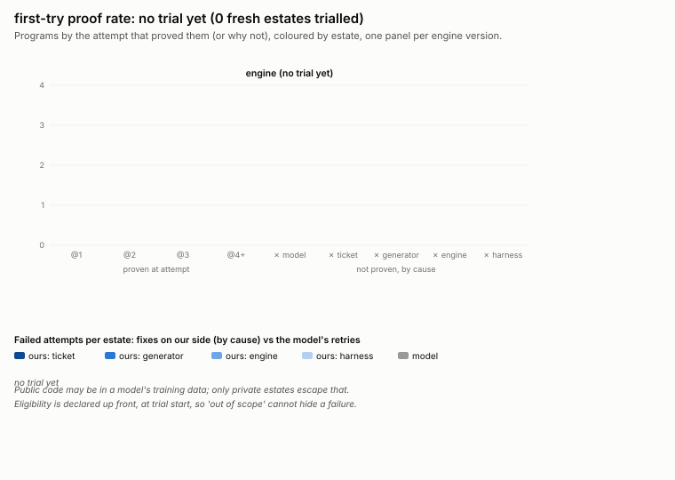

# Fresh-estate trials -- the first-try proof rate

Generated by `python tests/tools/trial.py report --write` from `tests/cobol_mainframe/trials.json`.
Do not edit by hand. `check` (in CI) fails when this page or the chart is stale.

**first-try proof rate: no trial yet (0 fresh estates trialled)**

Per program: did the porting loop's FIRST attempt produce Java the equivalence harness proves
identical to the COBOL? A trial freezes the system (engine commit, porting rules, model, harness),
takes an estate the system has never seen, and iterates each eligible program to a proof. Each
failed attempt carries its cause: the model's (a retry, same system) or ours (a fix commit with a
`Trial-Cause:` trailer: ticket, generator, engine, harness). A trialled estate is development data
for good: its numbers stay here but never count as first-try again. The rate counts programs whose
first attempt has a verdict (and every program of a closed trial).

- Public code may be in a model's training data; only private estates escape that.
- Eligibility is declared up front, at trial start, so 'out of scope' cannot hide a failure.

## Trials

No trial yet.

## Estates

| estate | kind | status | repo @ ref | trialled by |
|---|---|---|---|---|
| zopeneditor-sample | public | development | https://github.com/IBM/zopeneditor-sample @ 8f9835308de6 | - |
| cics-banking-sample-application-cbsa | public | development | https://github.com/cicsdev/cics-banking-sample-application-cbsa @ 417334533178 | - |
| aws-mainframe-modernization-carddemo | public | development | https://github.com/aws-samples/aws-mainframe-modernization-carddemo @ 59cc6c2fd7eb | - |
| cics-genapp | public | development | https://github.com/cicsdev/cics-genapp @ f6f3f4b2580d | - |
| zecs | public | development | https://github.com/walmartlabs/zECS @ 6d6bcbbc89c9 | - |
| dsf | public | development | https://github.com/navikt/DSF @ faade4961e31 | - |
