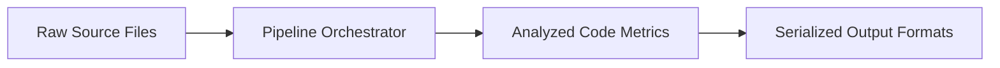

# Static Analysis Pipeline Overview

> **File Reference:** [`gitgalaxy/galaxyscope.py`](file:///home/joe/nyx_projects/gitgalaxy/gitgalaxy/galaxyscope.py)

## Engineering Summary
This subsystem is the main orchestration engine for automated, deterministic static analysis and dependency mapping of multi-language software repositories. It solves the problem of extracting structural metrics, computing risk exposures, and validating statistical integrity without relying on fragile Abstract Syntax Tree (AST) compilation or non-deterministic LLM inference. It exists to coordinate the execution phases—from data ingestion to output serialization—ensuring that all modules run efficiently and in the correct order. Within the larger architecture, this component acts as the high-speed, modular process manager known as GitGalaxy.

## Purpose
To manage and execute the end-to-end static analysis workflow, controlling parallel execution, phase transitions, and inter-process communication data transfers.

## Problem Being Solved
Codebase analysis pipelines often struggle with performance bottlenecks, fragile parsing (e.g., ASTs failing on incomplete code), and non-deterministic results. This orchestrator handles executing multiple specialized analysis stages concurrently while avoiding regex backtracking stalls, managing file processing safely, and aggregating project-wide data correctly.

## Design
The pipeline is designed as a multi-stage sequential workflow executed by an orchestrator class. It coordinates specialized modules:
- File filter (enforcing limits and exclusions)
- Metadata parser and language identifier
- Lexical stream splicer (separating code from comments)
- Structural code analyzer (using regex heuristics to extract metrics)
- Normalization, statistical validation, and temporal/churn analysis
- Dependency topology and security/vulnerability scanning
- Serialization to SQLite, JSON, Markdown, and WebGL outputs

It operates across 9 distinct execution phases, ensuring deterministic outputs without relying on full compiler toolchains.

## Pipeline Integration
Inputs: Raw source code files, Git commit history, and filesystem metadata.
Outputs: Structured telemetry including SQLite databases, JSON audit logs (SHBOM), Markdown briefs, and WebGL node-graph arrays.
Dependencies: Downstream exporters, upstream file system, and git index.

## Tradeoffs
- **Regex vs AST**: Chose regular expression heuristics over AST parsing to ensure resilience against syntax errors and incomplete code, sacrificing deep semantic precision for execution speed and language-agnostic flexibility.
- **Statistical vs Semantic Validation**: Utilizes Bayesian statistical checks (Z-score, MAD) rather than deep semantic validation to filter false positives, trading exactness for performance.

## Limitations
- Cannot perform deep semantic analysis like a compiler.
- Heuristic extraction relies on structural patterns which might miss obfuscated or highly unconventional code syntax.
- Relies on string-matching and regex, which can theoretically be subject to false positives/negatives compared to AST parsing.

## Performance Notes
Achieves high-speed processing through a multi-core `ProcessPoolExecutor` that bypasses the Python GIL for parallel lexical extraction. A strict 15-second timeout per file prevents ReDoS (Regular Expression Denial of Service) stalls. Zero-overhead process cache pre-warming avoids redundant regex compilation.

## Future Work
Expand incremental delta analysis support for more complex Git state transitions, and refine the statistical outlier detection model.

## Related Components
- [Pipeline Orchestration Framework](file:///home/joe/nyx_projects/gitgalaxy/docs/wiki/02-02-optical-orchestration.md)
- [Aperture Filter](file:///home/joe/nyx_projects/gitgalaxy/docs/wiki/02-03-aperture-filter.md)

