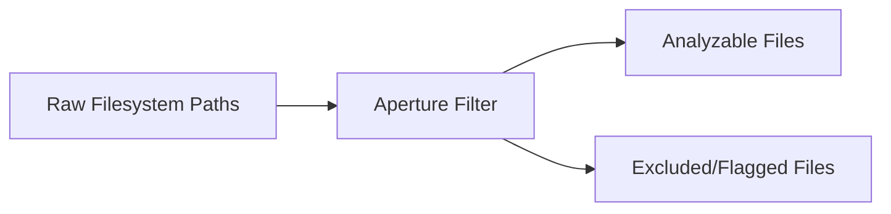

# File Filtering and Ingestion Shield

> **File Reference:** [`gitgalaxy/core/aperture.py`](file:///home/joe/nyx_projects/gitgalaxy/gitgalaxy/core/aperture.py)

## Engineering Summary
This subsystem acts as the primary perimeter security gate and ingestion filter prior to heavy analysis. It solves the problem of wasted computational resources on non-code noise such as compiled binaries, minified bundles, vendor packages, and excluded directories. It exists to strip out irrelevant assets and classify them into operational ingestion buckets, ensuring subsequent processing focuses strictly on actionable source code logic. Within the ecosystem, it functions as the foundational ingestion shield for GitGalaxy.

## Purpose
To enforce strict ingestion boundaries, file size limits, directory blacklists, and basic security checks before passing files to the lexical parsers.

## Problem Being Solved
Static analysis pipelines can easily crash or waste CPU time analyzing massive binary blobs, minified JS files, or generated `node_modules` folders. A robust filter is needed to safely exclude this noise without missing important configuration logic.

## Design
Enforces a multi-tiered hierarchy:
- Existence verification and file size guarding.
- Folder micro-file quotas (suppressing tiny files if they exceed a threshold, with exceptions).
- Secrets detection (filenames and extensions).
- Directory blacklisting (`.gitignore` integration and `BLACK_HOLES` registry).
- Stateful caching to preserve whitelist locks for explicitly referenced configurations.
Secondary content gates include shebang processing, binary header inspection (X-Ray gate reading 8KB chunks), and minified code detection (line length density).

## Pipeline Integration
Inputs: Unfiltered filesystem or Git index file paths.
Outputs: Filtered list of analyzable source files, flagged security risks, and excluded path lists.
Dependencies: Relies on project manifests and `.gitignore` from upstream; feeds into `language_lens.py` and lexical parsers.

## Tradeoffs
- **Heuristic Minification Detection**: Uses line length density (> 250 chars) to bypass regex parsing for minified files. This sacrifices deep parsing of dense files to avoid ReDoS and memory bloat.
- **8KB Binary Peek**: Only intercepts the first 8KB of binary assets to check magic bytes, trading comprehensive binary analysis for ingestion speed.

## Limitations
- Hardcoded blacklists may inadvertently block unconventional project structures.
- Secrets detection relies on file metadata and simple patterns, not deep content scanning.
- Cannot process files exceeding maximum size thresholds.

## Performance Notes
Executes zero-overhead filesystem checks. Binary header inspection is limited to a small 8KB chunk, and regex-bypassing for minified files significantly reduces downstream CPU latency.

## Future Work
Enhancing secrets detection patterns and allowing user-defined dynamic quota adjustments.

## Related Components
- [Orchestration Framework](file:///home/joe/nyx_projects/gitgalaxy/docs/wiki/02-02-optical-orchestration.md)

