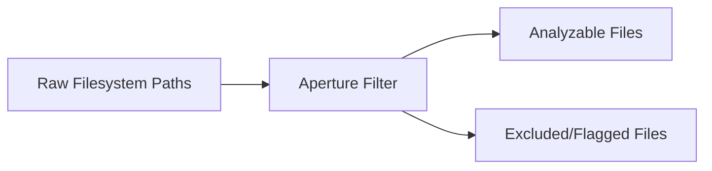

# File Filtering and Ingestion Shield

> **File Reference:** [`gitgalaxy/core/aperture.py`](https://github.com/squid-protocol/gitgalaxy/blob/main/gitgalaxy/core/aperture.py)

## Engineering Summary
This subsystem acts as the primary perimeter security gate and ingestion filter prior to heavy analysis. It solves the problem of wasted computational resources on non-code noise such as compiled binaries, minified bundles, vendor packages, and excluded directories. It exists to strip out irrelevant assets and classify them into operational ingestion buckets, ensuring subsequent processing focuses strictly on actionable source code logic. Within the ecosystem, it functions as the foundational ingestion shield for GitGalaxy.

## Purpose
To enforce strict ingestion boundaries, file size limits, directory blacklists, and basic security checks before passing files to the lexical parsers.

## Problem Being Solved
Static analysis pipelines can easily crash or waste CPU time analyzing massive binary blobs, minified JS files, or generated `node_modules` folders. A robust filter is needed to safely exclude this noise without missing important configuration logic.

## Design
Enforces a multi-tiered hierarchy:
- Existence verification and file size guarding.
- Folder micro-file quotas (suppressing tiny files if they exceed a threshold, with exceptions).
- Secrets detection (filenames and extensions).
- Directory blacklisting (`.gitignore` integration and `BLACK_HOLES` registry).
- Stateful caching to preserve whitelist locks for explicitly referenced configurations.
Secondary content gates include shebang processing, binary header inspection (X-Ray gate reading 8KB chunks), and minified code detection (line length density).

## Declared ports
A deterministic COBOL-to-Java port (`gitgalaxy/tools/cobol_to_java/det`) is machine-translated by design. Its
indentation is uniform and its compound conditions are spelled out in full, so three generated-noise gates would
otherwise drop it: line saturation (4.1), the generator-signature header check (4.3) and lexical monotony (5.1).
Before this exemption, a default scan excluded 45 of 49 det ports.

Each det port's first line declares it:

```java
// gitgalaxy-det-port: COBOL COACTUPC (COACTUPC.cbl), translated by rule, statement for statement
```

`declared_port()` reads that line, only in a `.java` file and only on the first line. A declared port passes 4.3 and
5.1, and 4.1 up to `DECLARED_PORT_MAX_LINE_LENGTH` (5000 characters) instead of `MAX_LINE_LENGTH`. The emitter keeps
its own long literals (storage images) to one 400-character piece per line, so only conditions run long. A
condition-name test over a long VALUE list can reach tens of thousands of characters (CardDemo's COACTUPC tests 400+
phone area codes on one line), but such tests sit far below line 100, past what Gate 4.1 reads.

**Why a comment is trusted.** Anyone can write the line, so it only lifts noise filters. The binary, embedded-payload,
amalgamation, size and secrets gates all still apply. A forged header can only admit a file to the scan, where every
sensor reads it; it cannot hide anything. The remaining cost is performance, bounded by the 5000-character cap and
the per-file execution timeout.

## Pipeline Integration
Inputs: Unfiltered filesystem or Git index file paths.
Outputs: Filtered list of analyzable source files, flagged security risks, and excluded path lists.
Dependencies: Relies on project manifests and `.gitignore` from upstream; feeds into `language_lens.py` and lexical parsers.


```mermaid
flowchart LR
    A[Raw Filesystem Paths] --> B[Aperture Filter]
    B --> C[Analyzable Files]
    B --> D[Excluded/Flagged Files]
```

## Tradeoffs
- **Heuristic Minification Detection**: Uses line length density (> 250 chars) to bypass regex parsing for minified files. This sacrifices deep parsing of dense files to avoid ReDoS and memory bloat.
- **8KB Binary Peek**: Only intercepts the first 8KB of binary assets to check magic bytes, trading comprehensive binary analysis for ingestion speed.

## Limitations
- Hardcoded blacklists may inadvertently block unconventional project structures.
- Secrets detection relies on file metadata and simple patterns, not deep content scanning.
- Cannot process files exceeding maximum size thresholds.

## Performance Notes
Executes zero-overhead filesystem checks. Binary header inspection is limited to a small 8KB chunk, and regex-bypassing for minified files significantly reduces downstream CPU latency.

## Future Work
Enhancing secrets detection patterns and allowing user-defined dynamic quota adjustments.

## Related Components
- [Orchestration Framework](02-02-optical-orchestration.md)

