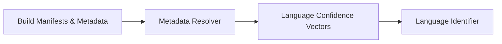

# Project Manifest and Metadata Resolution

> **File Reference:** [`gitgalaxy/core/guidestar_lens.py`](https://github.com/squid-protocol/gitgalaxy/blob/main/gitgalaxy/core/guidestar_lens.py)

## Engineering Summary
This subsystem acts as the project metadata parser and contextual intelligence engine. It solves the problem of analyzing files with ambiguous extensions or no extensions by parsing build manifests (e.g., `package.json`, `Cargo.toml`, `Makefiles`) and repository attributes (`.gitattributes`) to assign initial language priors and intent locks before lexical analysis. It exists to establish file importance and language hints based on verified developer intent, ensuring downstream components prioritize analysis correctly. Within the overall pipeline, this component is known as GitGalaxy's GuideStar.

## Purpose
To resolve contextual metadata, assign Bayesian prior probabilities for language identification, and lock in intent based on developer declarations.

## Problem Being Solved
Relying solely on file extensions for language identification fails in polyglot codebases or when extensions are missing/ambiguous. A mechanism is needed to infer identity and intent from the project's build configurations.

## Design
The metadata resolver employs a Bayesian prior probability model. It uses a 3-tier evidence hierarchy:
- Tier 1: Machine Roadmap (explicit `.gitattributes` assignments give a 0.99 confidence lock).
- Tier 2: Build Manifest Declarations (files declared as entry points or dependencies receive 0.85-0.95 confidence).
- Tier 3: Directory Location Heuristics (files in standard paths like `/src` or `/bin` get a 0.75 confidence).
It separates context resolution (intent) from concrete identification (structural validation).

## Pipeline Integration
Inputs: Unfiltered file paths, build manifests, `.gitattributes`, and priority whitelists.
Outputs: Pre-configured confidence vectors, predicted language IDs, and source provenance labels.
Dependencies: Downstream to the language identifier (`language_lens.py`).

## Tradeoffs
- **Heuristic Depth vs Certainty**: Employs heuristic path matching (e.g., assuming files in `/src` are source code) to gain broad context, which sacrifices absolute certainty for better coverage in missing-extension scenarios.
- **Lookup Sequence Priority**: Exact matches take precedence over directory context. This choice correctly overrides default heuristics but risks incorrectly locking files if a manifest is outdated.

## Limitations
- Requires recognizable build manifests; fails to provide strong priors in custom or obscure build systems.
- Normalization strips `./` prefixes, which may clash if non-standard paths are used.
- Priority whitelist boosts (+0.10) are arbitrary scalars.

## Performance Notes
Path lookup resolution occurs in $O(1)$ to $O(N)$ strict sequence, avoiding deep file reads until absolutely necessary. Lookup is purely string-based and normalized for fast execution.

## Future Work
Expanding manifest support to emerging build systems like Bazel and Buck2.

## Related Components
- [Aperture Filter](02-03-aperture-filter.md)
- [Language Lens](02-05-language-lens.md)

