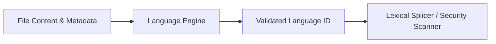

# Language Identification Engine

> **File Reference:** [`gitgalaxy/standards/language_lens.py`](https://github.com/squid-protocol/gitgalaxy/blob/main/gitgalaxy/standards/language_lens.py)

## Engineering Summary
This subsystem is the primary language identification engine. It solves the problem of inaccurately identifying programming languages in complex repositories where file extensions are misleading or non-existent. It exists to provide a deterministic language identifier and a confidence score for every analyzed file, combining metadata rules with deep lexical analysis. Within the system, this module is the language recognition layer for GitGalaxy.

## Purpose
To assign a precise language identifier and confidence score to files using a Bayesian confidence model and structural pattern matching.

## Problem Being Solved
File extensions alone are insufficient for identifying languages accurately (e.g., `.h` could be C, C++, Obj-C). Code can also lack extensions or use custom ones. A robust fallback mechanism combining context, shebangs, and lexical structure is required.

## Design
The engine uses a 6-tier Bayesian trust matrix (Tiers 0 to 5) to classify files, ranging from Convergent Lock (0.95-0.99) to Identity Contradiction (0.00). It employs:
- Pre-flight normalization to handle false extensions and sibling context.
- Conflict detection (e.g., `.py` with a `#!/bin/bash` shebang) flags files for threat evaluation.
- Ecosystem gravity (Tier 1.5) to resolve collisions by measuring language density in directories.
- Lexical verification (Tier 3) with regex validation and delimiter scoring.
- Discovery funnel (Tier 4) for extension-less files via structural density scanning.
- Hybrid detection for embedded languages.

## Pipeline Integration
Inputs: Unclassified file paths, context priors from metadata resolver, and file content buffers.
Outputs: Deterministic language classification, embedded language ratios, and conflict flags.
Dependencies: Upstream metadata from `guidestar_lens.py`, downstream routing to `prism.py` and `security_lens.py`.

## Tradeoffs
- **Ecosystem Gravity vs Explicit Tagging**: Resolves ambiguous `.h` extensions based on neighboring files rather than parsing them deeply immediately. This sacrifices standalone file precision for massive performance gains at the project level.
- **Logarithmic Normalization**: Normalizing regex hit scores logarithmically against lines of code favors structural density over raw length, which sacrifices sensitivity in extremely large, sparse files.

## Limitations
- Requires a pre-defined `LanguageSpec` registry.
- Embedded language detection is constrained to tracked transition markers.
- Heavily obfuscated files or single-line minified logic can thwart the discovery funnel.

## Performance Notes
Uses ecosystem mass computation to skip regex verification on heavily dominant extensions. The discovery funnel computes density as an $O(N)$ operation over lines of code, preventing quadratic scaling during ambiguous classification.

## Future Work
Expanding the transition marker registry to better handle nested JSX/TSX and template engines.

## Related Components
- [Guidestar Protocol](02-04-guidestar-protocol.md)
- [The Prism](02-07-the-prism.md)
(index.md)**