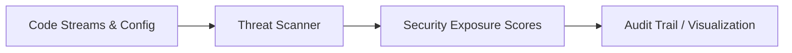

# Vulnerability & Threat Scanner

> **File Reference:** [`gitgalaxy/security/security_lens.py`](https://github.com/squid-protocol/gitgalaxy/blob/main/gitgalaxy/security/security_lens.py)

## Engineering Summary
This subsystem is the pattern-based security analysis and threat detection engine. It solves the problem of static vulnerability databases (CVEs) and simple string-matching failing against custom obfuscation, zero-days, or unmitigated taint flows. It exists to evaluate structural density of high-risk operations and behavioral execution mechanics. Within the architecture, this module acts as the AppSec scanner for GitGalaxy.

## Purpose
To detect structural attack patterns, dynamic execution threats, and credential exposure across the codebase.

## Problem Being Solved
Traditional scanners rely on CVEs or brittle signatures. Modern threats use obfuscation, zero-width characters, and dynamic logic (e.g., arbitrary `eval`, prototype poisoning) that bypass standard signatures. A structural approach is necessary to identify these mechanics.

## Design
The engine decouples threat measurement from policy enforcement, allowing dynamic threat threshold injection (e.g., `--paranoid` mode). It scans for 13 distinct structural threat patterns, including obfuscation, security control bypasses, dynamic execution (`eval`), prototype poisoning, steganography, memory overrides, and agentic RCE paths. It utilizes content scanning (Shannon entropy for packed payloads) and data flow taint analysis (tracking untrusted I/O into execution sinks). Threat density is normalized against executable lines of code, scaled exponentially by network centrality metrics.

## Pipeline Integration
Inputs: Analyzable source code, network centrality metrics, and runtime policies.
Outputs: Security exposure scores, vulnerability flags, and threat highlight markers.
Dependencies: Upstream lexical slicer, NetworkRiskSensor for centrality, downstream audit serializer.

## Tradeoffs
- **Structural Mechanics vs Semantic Analysis**: Uses regex patterns to identify risk structures (e.g., dense XOR loops) rather than abstract interpretation, sacrificing data-flow precision for rapid scanning across any language.
- **Heuristic Entropy Limits**: Hardcodes a Shannon entropy threshold of > 7.9 to detect encryption/packing, which risks false positives on certain high-entropy benign data files, though mitigated by excluding machine-generated files.

## Limitations
- Cannot detect purely logical vulnerabilities (e.g., flawed business logic).
- Minification guard (>250 chars) prevents deep scanning of minified files, potentially missing threats in them.
- Taint analysis is limited to line-locality or simple variable propagation, not deep inter-procedural flow.

## Performance Notes
Employs hardware-optimized regular expression engines. Uses a minification guard to bypass regex parsing on extremely dense lines, avoiding ReDoS and significant performance degradation.

## Future Work
Expanding inter-procedural taint analysis capabilities and tuning the XGBoost threat classifier integration.

## Related Components
- [Optical Orchestration](02-02-optical-orchestration.md)
