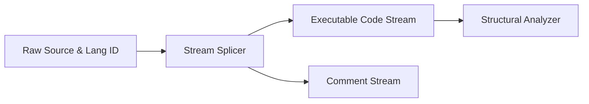

# Lexical Stream Splicer

> **File Reference:** [`gitgalaxy/core/prism.py`](file:///home/joe/nyx_projects/gitgalaxy/gitgalaxy/core/prism.py)

## Engineering Summary
This subsystem is the source code tokenizer and stream separator. It solves the problem of metric distortion caused by commented-out code blocks or documentation text intermingled with executable logic. It exists to split the source file into isolated executable code and comment streams using language-specific rules. Within the pipeline, this component functions as the structural lexical splicer for GitGalaxy.

## Purpose
To securely mask string literals and separate a source file into two isolated streams (code and comments) to prevent analysis distortion.

## Problem Being Solved
Static analysis tools often yield false positives when they process commented-out code or string literals containing structural characters (e.g., `{`, `}`). Separating these streams ensures metrics reflect only actual executable logic.

## Design
The splicer applies confidence threshold gates and prose deflection before parsing. It employs an Atomic Literal Shield to mask string sequences (e.g., C++ raw strings, heredocs, Ruby bracketed sequences) to prevent them from breaking bracket-tracking parsers. It generates two outputs:
1. Executable Code Stream: Mapped with spatial coordinates for $O(N)$ correlation checks (taint, suppression, memory leaks) and token mass evaluation.
2. Comment Stream: Parsed for technical debt markers (`TODO`, `FIXME`) and commented-out code (Graveyard Analysis).
It uses 5 distinct parsing modes based on language family: Label-Based, Recursive Scope Tracking, Density Stratification, Semantic Keyword Stacking, and Terminator Cleaving.

## Pipeline Integration
Inputs: Confirmed language IDs and raw source files.
Outputs: Separate code stream and comment stream buffers.
Dependencies: Upstream language identifier; downstream structural code analyzer (`detector.py`).

## Tradeoffs
- **Masking vs AST Parsing**: Uses atomic literal shielding (regex-based masking) instead of full AST parsers to separate code and strings. This trades syntactic perfection for immense speed and resilience to broken/incomplete code.
- **Timeouts for ReDoS**: Imposes a 0.5-second limit on string masking. This sacrifices the ability to cleanly parse pathologically complex obfuscated strings to guarantee system stability.

## Limitations
- Declarative data formats (`json`, `yaml`) bypass slicing.
- Misclassified languages will cause the splicer to use incorrect scope tracking logic, leading to malformed code streams.
- Relies on heuristics for heredoc isolation, which can fail on extremely unconventional formatting.

## Performance Notes
The atomic literal shield uses timed execution loops. Spatial coordinate mapping enables $O(N)$ correlation checks instead of $O(N^2)$ cross-comparisons. Uses `tiktoken` for fast LLM context token counting.

## Future Work
Adding support for more exotic string literal formats in niche languages and improving the speed of the heredoc state machine.

## Related Components
- [Language Lens](file:///home/joe/nyx_projects/gitgalaxy/docs/wiki/02-05-language-lens.md)
- [The Detector](file:///home/joe/nyx_projects/gitgalaxy/docs/wiki/02-08-the-detector.md)
