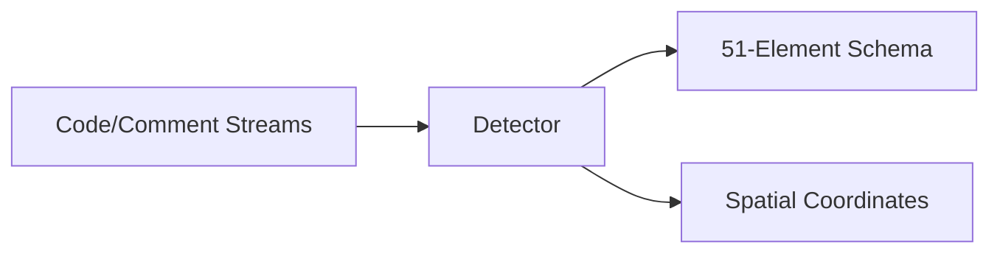

# Structural Code Analyzer & Spatial Cartographer

> **File Reference:** [`gitgalaxy/core/detector.py`](https://github.com/squid-protocol/gitgalaxy/blob/main/gitgalaxy/core/detector.py)

## Engineering Summary
This subsystem is the structural code analyzer and spatial cartography module. It solves the problem of extracting code complexity metrics and generating spatial layout coordinates without compiling the code. It exists to map structural logic (like function definitions, parameter counts, and control-flow density) into a fixed schema, and then calculate coordinates for rendering a 3D node graph. Within the pipeline, this component functions as the primary detector for GitGalaxy.

## Purpose
To extract structural metrics using regular expression rule suites and to compute 3D spatial layout coordinates for the repository graph.

## Problem Being Solved
Code complexity and spatial mapping require reliable extraction of logic structures across multiple languages, avoiding desynchronization from strings or incomplete syntax.

## Design
The detector enforces viability gates (bypassing low-confidence or prose files) and uses string literal/sequence shielding (e.g., atomic masking) to protect bracket-tracking logic.
Code streams are mapped to a fixed 51-element schema (`UNIVERSAL_METRICS_SCHEMA`). Comment streams are scanned for debt markers.
Metric extraction uses 5 modes (Label-Based, Recursive Scope, Density Stratification, Semantic Keyword, Terminator Cleaving) tailored by language family.
Spatial positioning groups files by directory sector, calculating hull radii and using a ray-casting algorithm to avoid collisions. Local orbits use a Fibonacci spiral layout with volumetric tilting and deterministic jitter.

## Pipeline Integration
Inputs: Spliced code and comment streams from `prism.py`.
Outputs: 51-element structural schema per file, 3D spatial layout coordinates.
Dependencies: Upstream streams; downstream signal processing and WebGL serialization.

## Tradeoffs
- **Regex vs Parser Combinators**: Uses regex tracking tailored by language mode instead of ASTs, sacrificing deep semantic context for execution speed and language-agnostic flexibility.
- **Deterministic Spatial Jitter**: Applies MD5 hashing to inject jitter, sacrificing perfect geometric packing for reproducible organic node separation.

## Limitations
- Cannot infer deeply nested macro complexity in languages like C/C++.
- 51-element schema is rigidly fixed; custom unrecognized metrics are dropped.
- Ray-casting layout can struggle with highly disproportionate directory clusters.

## Performance Notes
Employs a backtracking latency guard that issues a warning if regex shielding exceeds 0.5s. Spatial positioning uses angular spatial hashing to solve ray-circle intersections efficiently.

## Future Work
Enhancing the layout algorithm to better support millions of nodes without geometric overlapping.

## Related Components
- [Signal Processing](02-09-signal-processing.md)
- [The Prism](02-07-the-prism.md)
