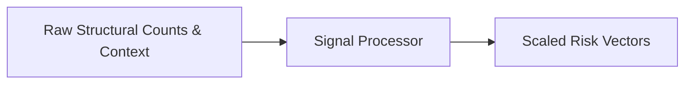

# Metrics Normalization & Risk Score Processor

> **File Reference:** [`gitgalaxy/metrics/signal_processor.py`](https://github.com/squid-protocol/gitgalaxy/blob/main/gitgalaxy/metrics/signal_processor.py)

## Engineering Summary
This subsystem is the metrics normalization and risk evaluation engine. It solves the problem of translating raw structural counts into scaled, comparable risk scores across different languages and project structures. It exists to evaluate files in context—comparing individual metrics against directory distributions, repository-wide baseline curves, and Git commit history—to pinpoint systemic bottlenecks and anomalous code. Within the ecosystem, it functions as the risk signal processor for GitGalaxy.

## Purpose
To normalize raw 60-point structural counts into an 18-point scaled risk score vector (`RISK_SCHEMA`).

## Problem Being Solved
Raw metric counts (like cyclomatic complexity or lines of code) are not directly comparable across different programming languages or project scales. Churn volume also varies by project.

## Design
The engine uses domain ontologies to detect context mismatches (e.g., C code in a JS frontend folder). It normalizes languages into three tiers (Explicit, Structured, Implicit) to handle syntactical verbosity differences.
It employs biaxial anomaly detection to measure both global repository drift and local language drift.
Infrastructure shields bypass scoring for minified files, documentation, or exposed secrets.
Temporal normalization is performed via a two-pass approach to scale churn metrics against the repository maximum logarithmically.
Systemic risk is calculated by synthesizing local risk scores with network centrality metrics.

## Pipeline Integration
Inputs: Raw structural counts, directory context, Git commit churn, and network centrality scores.
Outputs: 18-point scaled risk score vector per file, forensic metric reports.
Dependencies: Downstream statistical quality auditor; upstream detector and network risk sensor.

## Tradeoffs
- **Two-Pass vs Streaming Normalization**: Uses two passes to establish repository ceilings for churn normalization, which trades memory and time for highly accurate relative scaling.
- **Tiered Linguistic Fairness**: Hardcodes language tiers to adjust opacity and fidelity, sacrificing some nuance for a stable standardization model.

## Limitations
- Anomaly detection heavily relies on standard directory structures; non-standard architectures can skew scores.
- Biaxial drift requires a minimum file population per language to compute accurate baselines.

## Performance Notes
Pass 2 temporal normalization and biaxial drift computation execute across pre-aggregated datasets in-memory to minimize I/O overhead.

## Future Work
Integrating dynamic machine learning models to adjust language tier normalizations based on empirical data.

## Related Components
- [The Detector](02-08-the-detector.md)
- [Spectral Audit](02-11-spectral-audit.md)
