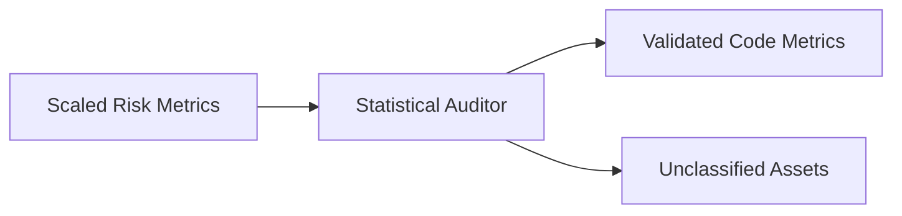

# Statistical Quality Auditor & Bayesian Data Validation

> **File Reference:** [`gitgalaxy/metrics/statistical_auditor.py`](https://github.com/squid-protocol/gitgalaxy/blob/main/gitgalaxy/metrics/statistical_auditor.py)

## Engineering Summary
This subsystem acts as the statistical quality control and data validation gate. It solves the problem of distinguishing valid source code from anomalous non-code artifacts (like data dumps or unparseable blobs) that might skew repository-wide metrics. It exists to apply Bayesian accountability models to ensure assigned classifications and structural metrics are mathematically plausible. Within the pipeline, this component functions as the spectral statistical auditor for GitGalaxy.

## Purpose
To perform automated statistical verification across processed files, excluding outliers and filtering false positives before final metric serialization.

## Problem Being Solved
Raw static analysis often processes files that technically match a language extension but are practically data blobs (e.g., massive generated SQL dumps), polluting the statistical mean of codebase quality.

## Design
Employs an Empirical Bayes consensus loop to resolve ambiguous file classifications based on the local ecosystem's dominant extensions. Uses dynamic auditability gates depending on the language's structural sensor coverage.
Implements an Ecosystem Orphan Guard to require strong locks for rare language species.
Uses the Median Absolute Deviation (MAD) protocol on Intent Density ($\rho = \text{Signal Hits} / \text{LOC}$) to identify outliers robustly. Adjusts outlier thresholds dynamically based on prior confidence.
Applies specific event horizon policies: Quarantine Override (security precedence saves files from relegation), Necrosis Guard (reprieves dead code), or Relegation to an unclassified asset store.

## Pipeline Integration
Inputs: Scaled risk vectors, structural metrics, prior language confidence scores.
Outputs: Validated codebase metrics, outlier exclusion lists, unclassified asset records.
Dependencies: Final validation step before serialization.

## Tradeoffs
- **Median Absolute Deviation (MAD)**: Uses MAD instead of standard deviation to avoid skewed means caused by massive data dumps, trading computational simplicity for robust outlier detection.
- **Security Precedence**: Allows security findings to override statistical relegation, prioritizing threat visibility over pure statistical purity.

## Limitations
- MAD calculations require at least 50 files of a given language; smaller projects won't benefit from full robust statistics.
- Multi-language hybrid files are excluded from baseline calculations, potentially missing some edge cases.

## Performance Notes
Calculates MAD statistics in $O(N)$ operations. The 50/0 rule (files >50 lines with 0 signals) provides a fast-path $O(1)$ rejection for massive inert blobs before invoking heavy statistical checks.

## Future Work
Expanding the Bayesian consensus model to incorporate project-specific history.

## Related Components
- [Signal Processing](02-09-signal-processing.md)
