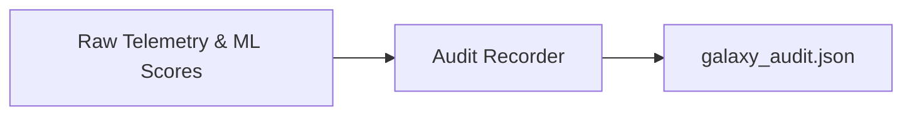

# Audit Recorder

> **File Reference:** [`gitgalaxy/recorders/audit_recorder.py`](file:///home/joe/nyx_projects/gitgalaxy/gitgalaxy/recorders/audit_recorder.py)

## Engineering Summary
This subsystem is the final compliance and reporting module of the static analysis pipeline. It extracts raw structural telemetry from memory and serializes it into a verbose, human-readable forensic JSON audit manifest. It solves the problem of providing end-to-end traceability for every analyzed file, acting as an enhanced Software Bill of Materials (SBOM) that incorporates structural health telemetry. It exists to provide detailed mathematical metrics covering code quality, security exposure, and structural integrity across the repository for enterprise compliance, software supply chain auditing, and deep security inspection. Within the system, this module is known as the GitGalaxy Audit Recorder.

## Purpose
The primary purpose is to generate a comprehensive structural JSON schema (`galaxy_audit.json`) that encapsulates Git source control metadata, hierarchical module mapping, security and vulnerability triage, network and AppSec posture, formatting and style metrics, and excluded artifact logging.

## Problem Being Solved
Traditional SBOMs lack deep structural health telemetry and traceability anchored to immutable repository states. This component addresses the need for a unified report that couples raw pattern signature hits with machine learning threat confidence scores, and explicitly breaks down code complexity and pattern archetypes per module, preventing audit blind spots.

## Design
### Current Behavior
- **Traceability Anchor:** Encapsulates exact Git source control metadata (active branch, SHA-1 commit hash, remote URL, and last commit timestamp) alongside the analysis execution timestamp in the manifest header.
- **Hierarchical Module Mapping:** Groups analyzed source files by directory path and orders them by total structural mass. Generates directory-level Architectural Fingerprints.
- **Security & Vulnerability Triage:** Integrates raw pattern signature hits with XGBoost Machine Learning Threat Confidence scores, decoupling active malware threats from general code quality risks.
- **Network & AppSec Posture:** Injects directed dependency network graph metrics (PageRank, blast radius) and autonomous AI security findings into each file's profile.
- **Excluded Artifact Logging:** Preserves excluded files (due to path filters, binary formats) with explicit diagnostic reasons and exact byte sizes.

### Planned Improvements
- Streamline the `galaxy_audit.json` schema for easier ingestion by external SIEM tools.

## Pipeline Integration
- **Inputs Received:** Raw structural telemetry, XGBoost threat confidence scores, dependency network graph metrics, and raw pattern signature hits.
- **Outputs Produced:** A structured JSON manifest (`galaxy_audit.json`) detailing forensic traceability, global synthesis, security audits, high-value reports, and scanned/excluded artifacts.
- **Dependencies:** Relies on upstream metrics from the network risk sensor and AI threat models.

## Tradeoffs
- **Verbosity vs. Parsability:** The JSON manifest is highly verbose to ensure no audit blind spots, sacrificing compactness for comprehensive traceability.
- **Rule-Based vs. AI Threat Scores:** Integrates both hardcoded signature hits and ML confidence scores to provide layered security triage, which increases the schema complexity.

## Limitations
- **Schema Rigidity:** The deep nested JSON structure can be overly large for standard parsers on massive repositories.
- **Heuristic Boundaries:** The security posture relies heavily on XGBoost ML scores and heuristic boundaries, which may produce false positives.

## Performance Notes
- Operates purely on pre-computed in-memory structures, so execution time scales linearly $O(N)$ with the number of analyzed files. Memory consumption is proportional to the size of the repository.

## Future Work
- Enhance the AI threat intelligence capabilities to detect more subtle supply chain attacks and anomalous commit behaviors.
- Optimize JSON serialization to handle larger repository manifests without high memory overhead.

## Related Components
- Network Risk Sensor
- AI AppSec Sensor
- LLM Recorder
