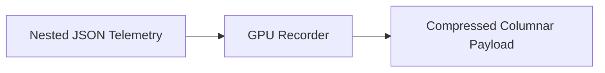

# GPU Recorder

> **File Reference:** [`gitgalaxy/recorders/gpu_recorder.py`](file:///home/joe/nyx_projects/gitgalaxy/gitgalaxy/recorders/gpu_recorder.py)

## Engineering Summary
This subsystem is the high-performance data transformation module of the pipeline. It converts verbose, object-oriented JSON telemetry into a hypercompressed columnar format (Structure of Arrays / SoA) designed specifically for WebGL/WebGPU 3D rendering engines. It solves the problem of high latency and memory overhead when loading large codebase models into the browser. It exists to prioritize memory efficiency, low payload transfer size, and fast buffer loading over human readability. Within the system, this module is known as the GitGalaxy GPU Recorder.

## Purpose
The primary purpose is to generate a highly compressed, serialized payload suitable for direct ingestion by WebGL and WebGPU vertex buffers.

## Problem Being Solved
Object-oriented JSON structures consume excessive memory and network bandwidth, causing WebGL visualizers to crash or stall when rendering thousands of nodes. This component flattens the data and uses techniques like string interning and fixed-point quantization to minimize memory footprint and transfer times.

## Design
### Current Behavior
- **Memory Management:** Iteratively evicts arrays from RAM-resident dictionaries using `.pop()` and explicit garbage collection (`gc.collect()`) during serialization.
- **Columnar Layout:** Generates parallel arrays for spatial positions, file masses, and structural metrics.
- **Dependency Resolution:** Pre-resolves string import declarations into numerical array index pointers for fast GPU vertex buffer rendering.
- **String Dictionary Encoding:** Replaces repeated string values with integer dictionary keys (`ext_lookup`, `import_lookup`, etc.).
- **Fixed-Point Quantization:** Multiplies floating-point values by fixed scaling factors and stores them as integers.

### Planned Improvements
- Optimize fixed-point scaling dynamically per attribute range.

## Pipeline Integration
- **Inputs Received:** Verbose, nested dictionary hierarchies of JSON telemetry, metrics, and dependencies.
- **Outputs Produced:** A hypercompressed, columnar format serialized payload suitable for WebGL/WebGPU rendering.
- **Dependencies:** Relies on the core telemetry and dependency resolution output.

## Tradeoffs
- **Compression vs. Readability:** Flattens JSON data and serializes without formatting whitespace, making the output unreadable to humans but highly optimized for WebGL consumption.
- **Precision vs. Format Compatibility:** Employs fixed-point quantization for floating-point values, sacrificing some mathematical precision to match graphics pipeline vertex buffer formats.

## Limitations
- **Format Rigidity:** The output format strictly adheres to the Structure of Arrays (SoA) layout, making it difficult to append new ad-hoc metadata fields without modifying the rendering engine.
- **Memory Spikes:** Despite iterative eviction, large codebases can still cause temporary memory spikes during the final serialization step.

## Performance Notes
- Achieves high memory efficiency and low-latency buffer loading through iterative array eviction, explicit garbage collection, and minimal-byte payload serialization. Lookups and quantization execute in $O(N)$ time relative to telemetry node count.

## Future Work
- Explore direct binary serialization formats (like FlatBuffers or Cap'n Proto) for even faster ingestion.

## Related Components
- Record Keeper
- Audit Recorder
