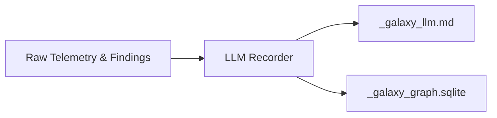

# LLM Recorder

> **File Reference:** [`gitgalaxy/recorders/llm_recorder.py`](https://github.com/squid-protocol/gitgalaxy/blob/main/gitgalaxy/recorders/llm_recorder.py)

## Engineering Summary
This subsystem formats static analysis telemetry into token-dense artifacts optimized for AI context windows, Retrieval-Augmented Generation (RAG) pipelines, and autonomous coding agents. Instead of requiring Large Language Models to parse raw, verbose JSON structures, it generates structured markdown briefs and a relational SQLite database. It solves the problem of inefficient context utilization by AI models when reasoning over large codebases. It exists to bridge the gap between static analysis and agentic tooling. Within the system, this module is known as the GitGalaxy LLM Recorder.

## Purpose
The primary purpose is to compress codebase telemetry into an LLM-friendly markdown brief (`_galaxy_llm.md`) and a relational knowledge graph (`_galaxy_graph.sqlite`) for SQL-based agents.

## Problem Being Solved
Raw structural telemetry JSON is often too large for LLM context windows and lacks the narrative framing needed for effective prompt engineering. This component extracts key metrics, dependency graph insights, and security vulnerabilities, presenting them in a token-efficient format that prioritizes actionable intelligence over raw data.

## Design
### Current Behavior
- **Bi-Directional Dependency Graphing:** Builds a reverse-dependency map to identify load-bearing modules (blast radius) and orchestrator modules (fragility index).
- **Token-Dense Markdown Brief:** Produces `_galaxy_llm.md`, featuring:
  - Security & Malware Summary (XGBoost findings)
  - Analysis Framing & Guidelines (prompt instructions)
  - Repository Architecture & AI Topology
  - Code Anomalies & Architectural Drift
  - Priority Refactoring Targets (volatility hotspots, bottlenecks)
  - AI Application Security Vulnerabilities
- **Relational Knowledge Graph:** Produces `_galaxy_graph.sqlite` with relational tables (`stars`, `constellations`, `satellites`, `dna_hits`, dependency edges) for agents to execute SQL queries.

### Planned Improvements
- Filter the SQLite output intelligently to only include actionable subsets for extremely massive codebases.

## Pipeline Integration
- **Inputs Received:** Raw static analysis telemetry, file metrics, security findings, and dependency structures.
- **Outputs Produced:** A markdown brief (`_galaxy_llm.md`) and a relational SQLite database (`_galaxy_graph.sqlite`).
- **Dependencies:** Relies on AI AppSec findings, network topology metrics, and XGBoost threat intelligence.

## Tradeoffs
- **Token Density vs. Completeness:** Excludes granular details of every single file in favor of summarizing high-priority refactoring targets and vulnerabilities to preserve context window limits.
- **Pre-computed Brief vs. Dynamic Querying:** The markdown brief offers immediate context, but limits the AI to pre-selected metrics, whereas the SQLite graph offers dynamic querying at the cost of requiring the AI to write valid SQL.

## Limitations
- **Context Window Scaling:** For extremely large repositories, even the summarized token-dense markdown may approach the context window limits of smaller models.
- **SQL Hallucinations:** When querying the SQLite graph, agents may still hallucinate complex graph traversals if the schema is misunderstood.

## Performance Notes
- Fast token compression and relational table inserts ensure minimal overhead during the export phase. Relational graph generation scales efficiently using SQLite batched inserts.

## Future Work
- Integrate dynamic embedding generation for RAG pipelines to selectively retrieve code chunks based on semantic similarity.

## Related Components
- Record Keeper
- AI AppSec Sensor
- Network Risk Sensor
