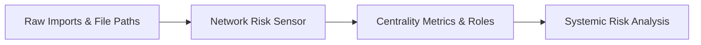

# Network Risk Sensor

> **File Reference:** [`gitgalaxy/core/network_risk_sensor.py`](https://github.com/squid-protocol/gitgalaxy/blob/main/gitgalaxy/core/network_risk_sensor.py)

## Engineering Summary
This subsystem constructs an $N$-dimensional Directed Graph from raw import statements extracted across all scanned files. By mapping inter-file module dependencies, it transforms isolated file metrics into a systemic dependency analysis engine. It solves the problem of understanding cascading failure risks and architectural bottlenecks in large codebases. It exists to compute blast radius values, classify component roles, and evaluate repository-wide network resilience. Within the system, this module is known as the GitGalaxy Network Risk Sensor.

## Purpose
The primary purpose is to compute network centrality metrics (PageRank, betweenness, closeness) and categorize modules into operational roles based on their dependency graph position.

## Problem Being Solved
Evaluating code quality in isolation is insufficient; a poorly written script has low impact, but poorly written core utilities can bring down entire systems. This component contextualizes local risk scores with global architectural topology to accurately assess systemic threat vectors.

## Design
### Current Behavior
- **Directed Graph Construction:** Uses pre-computed lookup maps to resolve raw import strings into target paths and assigns weighted edges based on dependency specificity.
- **Centrality Metrics:** Computes PageRank (Normalized Blast Radius) with the engine's own pure-Python implementation in every mode (#3027: one implementation, so no mode or networkx-version drift), plus Betweenness Centrality (Architectural Choke Points) and Closeness Centrality via networkx. Closeness is not computed above 1,500 files (recorded as `None`/NULL, never 0.0), and a failed centrality computation leaves the metrics `None` (#3027).
- **Component Roles:** Classifies modules as Producers (Foundation), Consumers (Orchestrators), Transceivers (Middle Tier), or Isolated, based on inbound/outbound edge ratios.
- **Global Topology Metrics:** Evaluates modularity, assortativity, cyclic density, average path length, and articulation points.
- **Zero-Dependency Mode:** Without `networkx`, the same resolved edges are counted linearly: in/out degree (`popularity`, `internal_dependency_links`), producer ratio and ecosystem role are exact and identical to full-precision mode (#3024), and the `edge_data` table is identical. PageRank (and so blast radius and the systemic threat vector) is the same native pure-Python PageRank full precision uses (#3027). Betweenness, closeness and the global topology metrics are not computed: `None` in telemetry, NULL in the SQLite DB, "n/a" in the LLM brief. See [`docs/zero_dependency_mode.md`](../zero_dependency_mode.md).

### Planned Improvements
- Introduce community detection algorithms to auto-discover implicit package domains.

## Pipeline Integration
- **Inputs Received:** Raw import declarations and source file paths from the parsing phase.
- **Outputs Produced:** Systemic risk metrics, node centrality scores, component role classifications, and global graph topology health statistics.
- **Dependencies:** Relies on accurate import parsing from upstream syntax analyzers.

## Tradeoffs
- **Approximation vs. Exactness:** For repositories exceeding 5,000 nodes, betweenness computation uses randomized sampling ($k=50$) to maintain $O(N)$ execution speed, sacrificing exact shortest-path metrics for performance.
- **Static Analysis Limits:** Resolving dynamic imports or dependency injection at runtime is skipped in favor of static, explicit import declarations to guarantee determinism.

## Limitations
- **Language Nuances:** Implicit dependencies (e.g., global variables or reflection) are not captured in the graph.
- **Ecosystem Boundaries:** Does not map external third-party package dependencies, limiting the graph to intra-repository files.

## Performance Notes
- Operates linearly $O(N)$ for graph construction. Path traversal and centrality metrics are heavily optimized using `networkx` heuristics and sampling for large repositories, ensuring low runtime overhead.

## Future Work
- Extend dependency parsing to map cross-repository package dependencies and internal sub-module cyclic detection.

## Related Components
- Security Auditor
- Dev Agent Firewall
