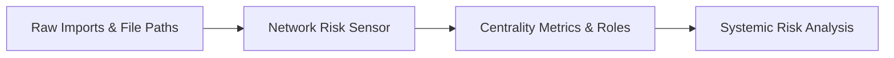

# Network Risk Sensor

> **File Reference:** [`gitgalaxy/core/network_risk_sensor.py`](https://github.com/squid-protocol/gitgalaxy/blob/main/gitgalaxy/core/network_risk_sensor.py)

## Engineering Summary
This subsystem constructs an $N$-dimensional Directed Graph from raw import statements extracted across all scanned files. By mapping inter-file module dependencies, it transforms isolated file metrics into a systemic dependency analysis engine. It solves the problem of understanding cascading failure risks and architectural bottlenecks in large codebases. It exists to compute blast radius values, classify component roles, and evaluate repository-wide network resilience. Within the system, this module is known as the GitGalaxy Network Risk Sensor.

## Purpose
The primary purpose is to compute network centrality metrics (PageRank, betweenness, closeness) and categorize modules into operational roles based on their dependency graph position.

## Problem Being Solved
Evaluating code quality in isolation is insufficient; a poorly written script has low impact, but poorly written core utilities can bring down entire systems. This component contextualizes local risk scores with global architectural topology to accurately assess systemic threat vectors.

## Design
### Current Behavior
- **Directed Graph Construction:** Uses pre-computed lookup maps to resolve raw import strings into target paths and assigns weighted edges based on dependency specificity.
- **Native Graph Index:** The resolved edges are loaded once per scan into an integer-indexed CSR adjacency (`gitgalaxy/core/graph_engine.py`, #3034) that the native graph metrics read, with no networkx graph involved. `tests/tools/graph_parity.py` checks each native metric against networkx as a test-time oracle and benchmarks it on a real scan's graph.
- **Centrality Metrics:** Computes PageRank (Normalized Blast Radius) with the engine's own pure-Python implementation in every mode (#3027: one implementation, so no mode or networkx-version drift), plus Betweenness Centrality (Architectural Choke Points, #3038) and Closeness Centrality (#3037), both native in every mode. Both are exact at every graph size, with no sampling and no file-count cutoff. Each is bounded only by a deterministic work budget (`PATH_METRICS_WORK_BUDGET` edge scans, never wall-clock time), past which it is `None`/NULL, never 0.0. A failed centrality computation leaves the metric `None` (#3027).
- **Component Roles:** Classifies modules as Producers (Foundation), Consumers (Orchestrators), Transceivers (Middle Tier), or Isolated, based on inbound/outbound edge ratios.
- **Global Topology Metrics:** Evaluates modularity, assortativity, cyclic density, average path length, and articulation points.
- **One builder, no optional package (#3041):** The resolved edges are counted linearly for degree (`popularity`, `internal_dependency_links`, producer ratio and ecosystem role; #3024), the `edge_data` table persists them, and every graph metric is computed natively (#3027, #3034-#3040). Every install therefore computes the same graph values; networkx is only a test-time oracle. See [`docs/zero_dependency_mode.md`](../zero_dependency_mode.md).

### Planned Improvements
- Introduce community detection algorithms to auto-discover implicit package domains.

## Pipeline Integration
- **Inputs Received:** Raw import declarations and source file paths from the parsing phase.
- **Outputs Produced:** Systemic risk metrics, node centrality scores, component role classifications, and global graph topology health statistics.
- **Dependencies:** Relies on accurate import parsing from upstream syntax analyzers.

## Tradeoffs
- **Exactness vs. Scale:** Every centrality is exact. #3038 removed networkx's 100-source betweenness sampling above 500 files. Instead of approximating, a metric whose search exceeds its deterministic work budget is recorded as `None`, never as a sampled or placeholder value.
- **Static Analysis Limits:** Resolving dynamic imports or dependency injection at runtime is skipped in favor of static, explicit import declarations to guarantee determinism.

## Limitations
- **Language Nuances:** Implicit dependencies (e.g., global variables or reflection) are not captured in the graph.
- **Ecosystem Boundaries:** Does not map external third-party package dependencies, limiting the graph to intra-repository files.

## Performance Notes
- Graph construction is linear in files plus imports. Every metric is exact and native (`gitgalaxy/core/graph_engine.py`), bounded by deterministic work budgets rather than sampling.

## Future Work
- Extend dependency parsing to map cross-repository package dependencies and internal sub-module cyclic detection.

## Related Components
- Security Auditor
- Dev Agent Firewall
