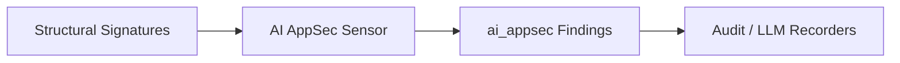

# AI AppSec Sensor

> **File Reference:** [`gitgalaxy/tools/ai_guardrails/ai_appsec_sensor.py`](file:///home/joe/nyx_projects/gitgalaxy/gitgalaxy/tools/ai_guardrails/ai_appsec_sensor.py)

## Engineering Summary
This subsystem analyzes application architectures for security vulnerabilities arising from generative AI and autonomous agent integrations. It evaluates structural overlaps between LLM Orchestration, Public API Routing, and Privileged System Operations. It solves the problem of detecting prompt injection and agentic escalation vectors in non-deterministic control paths. It exists to proactively flag unsafe architectural patterns before they can be exploited. Within the system, this module is known as the GitGalaxy AI AppSec Sensor.

## Purpose
The primary purpose is to scan codebases for Agentic Remote Code Execution (RCE) funnels, over-permissioned agent bindings, and unsanitized socket vectors associated with LLM integrations.

## Problem Being Solved
Traditional SAST tools target standard vulnerabilities like SQL injection, but fail to evaluate agentic control flow risks where LLM outputs drive external user prompts into privileged system operations. This component identifies intersections of AI capabilities with risky API/IO operations.

## Design
### Current Behavior
- **Agentic RCE Funnels:** Detects modules combining LLM API calls, public API routing, and OS command execution routines (`eval`, `exec`, `subprocess`).
- **Over-Permissioned Agent Bindings:** Identifies modules where AI tool invocations bind to state modification operations in files with low defensive safety density (< 50%).
- **Data Exfiltration Vectors:** Flags modules combining LLM integration, outbound network sockets, and environment secret access.
- **Findings Generation:** Attaches an `ai_appsec` findings object to the file's central telemetry dictionary.

### Planned Improvements
- Support detection for specific agentic orchestrator models and proprietary RAG implementations.

## Pipeline Integration
- **Inputs Received:** Extracted structural signatures (`llm_orchestrator`, `llm_api`, `api`, `sec_high_risk_execution`, `io`, `sec_hardcoded_secrets`) and defensive safety metrics.
- **Outputs Produced:** AI-specific application security findings, injected into the central telemetry map.
- **Dependencies:** Relies on robust signature extraction from upstream syntax parsing.

## Tradeoffs
- **Heuristic Overlaps vs. Flow Analysis:** Uses structural signature proximity (co-location of features in a file) rather than deep data-flow analysis, sacrificing exact execution path verification for speed and language-agnostic compatibility.
- **False Positives vs. Security Coverage:** May flag benign files where AI logic and system logic coexist safely, prioritizing broad coverage over precision.

## Limitations
- **Data-Flow Ignorance:** Cannot determine if an LLM output explicitly feeds into an OS command; it only detects that both exist in the same module and lack sufficient defensive guardrails.
- **Custom Agent Frameworks:** May miss proprietary or highly abstracted LLM integrations that do not match known orchestrator signatures.

## Performance Notes
- Operates in $O(1)$ time per file by evaluating pre-computed structural signatures and safety density metrics, resulting in negligible runtime overhead.

## Future Work
- Implement basic intra-file taint tracking to verify if LLM output variables flow directly into sensitive subprocess or socket arguments.

## Related Components
- Dev Agent Firewall
- Audit Recorder
- LLM Recorder
