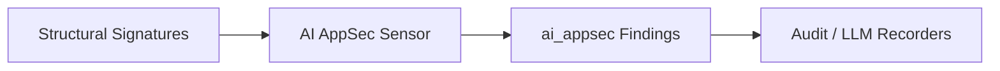

# AI AppSec Sensor

> **File Reference:** [`gitgalaxy/tools/ai_guardrails/ai_appsec_sensor.py`](file:///home/joe/nyx_projects/gitgalaxy/gitgalaxy/tools/ai_guardrails/ai_appsec_sensor.py)

## Engineering Summary
This subsystem flags one specific AI-integration architecture risk: an agent-orchestration framework (langchain/llama_index) bound to raw network/disk write access in a file with weak defensive programming density. It exists to proactively surface unreviewed autonomous data-corruption risk. Within the system, this module is known as the GitGalaxy AI AppSec Sensor.

## Purpose
The primary purpose is to scan codebases for over-permissioned agent bindings: files where a detected agent-orchestration library import coexists with raw I/O write access and low defensive-code density.

## Problem Being Solved
Traditional SAST tools target standard vulnerabilities like SQL injection, but don't reason about agent tool-binding risk at all. This component identifies files where an autonomous agent framework has been given raw state-mutation capability without adequate guardrails.

## Design
### Current Behavior
- **Over-Permissioned Agent Bindings:** Identifies modules where an agent-orchestration framework import (`llm_orchestrator`) coexists with raw network/disk IO write access, in files with low defensive safety density (< 50%).
- **Findings Generation:** Attaches an `ai_appsec` findings object to the file's central telemetry dictionary.

### Removed in #1102 (epic #1025)
Two prior checks were removed: **Agentic RCE Funnels** (LLM API + public API routing + OS execution regex co-occurrence) and **Data Exfiltration Vectors** (LLM API + outbound sockets + secrets regex co-occurrence). Both inferred a specific vulnerability class purely from unrelated regex categories firing anywhere in the same file, with no proof the data actually flows between them -- the same unprovable pattern epic #1025's issue #1020 already removed from the core `RISK_SCHEMA`/`SIGNAL_SCHEMA`. This module had reimplemented that pattern independently, under different field names, which is why #1020's original sweep missed it.

### Planned Improvements
- Support detection for specific agentic orchestrator models and proprietary RAG implementations.

## Pipeline Integration
- **Inputs Received:** Extracted structural signatures (`llm_orchestrator`, `io`, `sec_io`) and defensive safety metrics.
- **Outputs Produced:** AI-specific application security findings, injected into the central telemetry map.
- **Dependencies:** Relies on robust signature extraction from upstream syntax parsing.

## Tradeoffs
- **Library-Identity vs. Behavior:** Detects that a known agent-orchestration framework is *imported*, not that it actually invokes tools at runtime -- a deliberate scope limit (see #365/#323) matching what a regex-only engine can honestly claim.
- **False Positives vs. Security Coverage:** May flag benign files where the framework and I/O access coexist safely (e.g. behind an already-reviewed sandbox), prioritizing broad coverage over precision.

## Limitations
- **Data-Flow Ignorance:** Cannot determine if the framework's tool-calling logic actually reaches the I/O access in question; it only detects that both exist in the same module and lack sufficient defensive guardrails. This is why the RCE-funnel and exfiltration checks were removed in #1102 -- that same limitation made those two claims unprovable.
- **Custom Agent Frameworks:** May miss proprietary or highly abstracted LLM integrations that do not match known orchestrator signatures.

## Performance Notes
- Operates in $O(1)$ time per file by evaluating pre-computed structural signatures and safety density metrics, resulting in negligible runtime overhead.

## Future Work
- None planned. Prior "Future Work" here (intra-file taint tracking to verify LLM-output-to-sink flow) would have been the prerequisite for re-adding the RCE/exfiltration checks; no active plan to build it.

## Related Components
- Dev Agent Firewall
- Audit Recorder
- LLM Recorder
