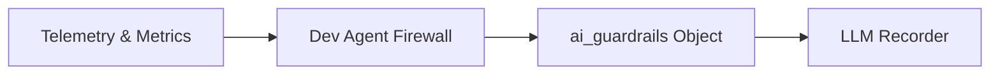

# Dev Agent Firewall

> **File Reference:** [`gitgalaxy/tools/ai_guardrails/dev_agent_firewall.py`](https://github.com/squid-protocol/gitgalaxy/blob/main/gitgalaxy/tools/ai_guardrails/dev_agent_firewall.py)

## Engineering Summary
This subsystem evaluates codebase complexity and network graph metrics to determine safety boundaries for autonomous AI coding agents. It analyzes token mass, algorithmic complexity, graph topology, and documentation density. It solves the problem of AI agents causing silent regressions, context window degradation, or API hallucinations when editing critical architectural choke points. It exists to enforce statistical safety guardrails for autonomous code modifications. Within the system, this module is known as the GitGalaxy Dev Agent Firewall.

## Purpose
The primary purpose is to identify modules where autonomous code edits present high statistical probabilities of failure, generating an `ai_guardrails` object to constrain AI behavior.

## Problem Being Solved
Autonomous AI agents frequently struggle with large files, highly coupled components, and dynamically typed logic. Without explicit guardrails, they can truncate code, hallucinate methods, or introduce subtle state corruption in core producers. This component provides the metadata needed to gate or warn agents before they modify these fragile structures.

## Design
### Current Behavior
- **Context Window Exhaustion (`is_agentic_black_hole`):** Flags files with massive token footprints (`token_mass > 8000`) and severe algorithmic complexity ($O(N^3)$).
- **Human-In-The-Loop (`requires_hitl`):** Triggers on files with high PageRank Blast Radius (`> 1.0`) and high technical debt (`> 200`).
- **Dynamic Logic Warning (`hallucination_zone`):** Flags files relying on reflection or dynamic dispatch without sufficient documentation (`doc_density < 0.2`).
- **Silent Mutation Risk (`silent_mutation_risk`):** Identifies foundational producers (`in_degree > 5`) with high state volatility and no unit test coverage.

### Planned Improvements
- Adjust context exhaustion thresholds dynamically based on target AI capabilities.

## Pipeline Integration
- **Inputs Received:** File telemetry, risk vectors, token mass, and dependency graph metrics (in-degree, blast radius).
- **Outputs Produced:** An `ai_guardrails` object injected into the central telemetry map, containing active guardrails and warning strings.
- **Dependencies:** Relies heavily on the Network Risk Sensor for blast radius and centrality metrics.

## Tradeoffs
- **Statistical Probability vs. Guaranteed Failure:** Relies on statistical heuristics to block or warn agents, potentially triggering human-in-the-loop requirements for modules an agent could technically handle, prioritizing safety over autonomy.
- **Language-Agnostic Boundaries:** Uses universal metrics (token mass, structural complexity) rather than language-specific type system analysis.

## Limitations
- **Agent Capability Drift:** As LLM context windows and reasoning capabilities improve, the static threshold values (e.g., token mass > 8000) may become overly restrictive and require tuning.
- **Test Coverage Blind Spots:** Cannot determine the quality of unit tests; it only verifies structural coverage.

## Performance Notes
- Rule evaluations execute in $O(1)$ time per file using pre-computed telemetry attributes, adding zero latency to the overall scan pipeline.

## Future Work
- Introduce dynamic threshold scaling based on the specific LLM model being used (e.g., increasing token mass limits for models with larger context windows).

## Related Components
- Network Risk Sensor
- LLM Recorder
