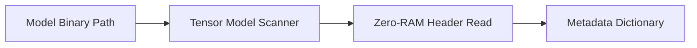

# Tensor Model Scanner

> **File Reference:** [`gitgalaxy/metrics/tensor_scanner.py`](https://github.com/squid-protocol/gitgalaxy/blob/main/gitgalaxy/metrics/tensor_scanner.py)

## Engineering Summary
This subsystem inspects large Machine Learning model weights (`.safetensors`, `.gguf`) stored within repositories without loading multi-gigabyte files into system RAM. By parsing binary headers using zero-RAM byte reads, it extracts parameter counts, quantization levels, and architecture metadata. It solves the problem of auditing massive ML binaries during static analysis without causing memory exhaustion. It exists to track model architecture attributes and physical node mass across repository boundaries. Within the system, this module is historically known as the GitGalaxy Neural Auditor or Tensor Model Scanner.

## Purpose
The primary purpose is to provide static analysis reporting for machine learning model footprints by extracting metadata from binary weight files safely and efficiently.

## Problem Being Solved
Standard static analysis tools skip large binary files, creating blind spots regarding ML models stored in the codebase. Loading these models to inspect them would crash CI runners due to RAM limits. This component safely extracts metadata from model headers using targeted stream reads.

## Design
### Current Behavior
- **Safetensors Inspection:** Reads the first 8 bytes to determine header size, validates limits, and parses JSON metadata. Calculates total parameter counts from tensor dimensions and formats them (e.g., "8.0B").
- **GGUF Inspection:** Verifies the `GGUF` magic byte, extracts a 1MB chunk to decode ASCII strings, and uses heuristics to extract architecture names and quantization levels (e.g., "Q4_K").
- **Metadata Mapping:** Returns structured dictionaries (`architecture`, `parameters`, `quantization`) to the pipeline orchestrator, mapping attributes to the repository file node.

### Planned Improvements
- Support chunked parsing to extract extended configuration blocks safely.

## Pipeline Integration
- **Inputs Received:** File paths of large AI model binaries filtered by the ingestion module (`aperture.py`).
- **Outputs Produced:** Structured metadata dictionaries detailing parameter counts and architecture metadata.
- **Dependencies:** Relies on the file ingestion filter to route appropriate extensions (`.safetensors`, `.gguf`) to the scanner.

## Tradeoffs
- **Heuristic Parsing vs. Full Decoding:** Uses regex and pattern matching on ASCII text strings within GGUF headers rather than implementing full binary tree parsing, trading strict format compliance for execution speed and simplicity.
- **Surface Level vs. Deep Integrity:** Only inspects headers; it cannot verify if the tensor data itself is corrupted or malicious, only what the metadata claims.

## Limitations
- **Supported Formats:** Currently limited to `.safetensors` and `.gguf`. Legacy formats like PyTorch `.pt` or Pickle `.pkl` are not supported due to their inherent structural risks.
- **Header Parsing Fragility:** Changes in the underlying binary specification for GGUF may break the ASCII regex extraction heuristics.

## Performance Notes
- Operates in constant time $O(1)$ per file using fixed-size byte stream reads, ensuring memory usage remains near zero regardless of the actual model size on disk.

## Future Work
- Add support for `.onnx` and TensorFlow `.pb` metadata inspection.
- Introduce header checksum validation to detect tampered metadata.

## Related Components
- Security Auditor
