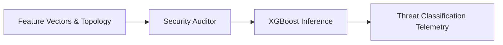

# Security Auditor

> **File Reference:** [`gitgalaxy/security/security_auditor.py`](file:///home/joe/nyx_projects/gitgalaxy/gitgalaxy/security/security_auditor.py)

## Engineering Summary
This subsystem executes a trained XGBoost multiclass classification model across extracted codebase feature vectors. It evaluates structural metrics, code complexity distributions, and graph topology to predict malicious software patterns (such as Trojans, Stealers, Droppers, or Botnets). It solves the problem of detecting sophisticated code obfuscation and zero-day threats that evade traditional static analysis rules. It exists to provide machine learning-backed security intelligence and supply chain integrity verification. Within the system, this module is known as the GitGalaxy Security Auditor.

## Purpose
The primary purpose is to classify source files into a multiclass threat taxonomy and flag high-confidence malware detections based on structural heuristics rather than raw pattern matching.

## Problem Being Solved
Traditional SAST tools rely on explicit signature hits, making them vulnerable to obfuscated malware and unknown attack vectors. This component utilizes the structural "shape" of the code (complexity distributions, orphan functions, graph placement) to identify malicious intent even when signatures are masked.

## Design
### Current Behavior
- **Dependency Graph Features:** Traces import connections (BFS up to 10,000 nodes) to compute transitive coupling ratios (`total_upstream`, `total_downstream`).
- **Feature Vector Sanitization:** Applies logarithmic scaling to structural counts, integrates Gini complexity coefficients, signature counts, and global architectural distances into a Pandas DataFrame.
- **Multiclass Threat Taxonomy:** Uses `XGBClassifier` to predict probabilities across: Safe Code, Botnet/DDoS, Stealer/Trojan, Dropper/Webshell, and Native Infector.
- **Supply Chain Integrity:** The `is_shadow_patch` flag overrides ML inference for unverified binary changes with executable logic, explicitly flagging them as critical threats.
- **Fallback Mode:** Skips ML inference gracefully if `xgboost` or `pandas` are unavailable.

### Planned Improvements
- Optimize feature vector extraction to eliminate overhead from unused features.

## Pipeline Integration
- **Inputs Received:** Sanitized feature vectors, dependency graph topologies, and content hash mutation statuses.
- **Outputs Produced:** AI Threat Class, AI Threat Confidence percentages, and `is_ml_threat` booleans attached to the file's telemetry dictionary.
- **Dependencies:** Requires pre-computed structural metrics, pattern signature counts, and topological graph paths.

## Tradeoffs
- **Statistical Inference vs. Determinism:** Machine learning classification introduces non-deterministic confidence scores (false positives/negatives), sacrificing strict boolean logic for the ability to detect unknown threats.
- **Dependency Bloat vs. Functionality:** Integrating Pandas and XGBoost increases the engine's memory and disk footprint, mitigated slightly by the graceful fallback mode.

## Limitations
- **Training Data Bias:** Model accuracy relies entirely on the quality and diversity of the malicious repositories used during the XGBoost training phase.
- **Feature Obfuscation:** Highly advanced attackers might artificially balance code metrics to mimic the structural shape of "Safe Code".

## Performance Notes
- Feature sanitization and model inference are heavily optimized using vectorized Pandas and XGBoost C++ backends. Graph BFS traversal is capped at 10,000 nodes to prevent $O(N^2)$ execution times on circular dependencies.

## Future Work
- Retrain the XGBoost model periodically with updated malware datasets.
- Implement Shapley Additive Explanations (SHAP) to provide human-readable explanations of why the model flagged a specific file.

## Related Components
- Network Risk Sensor
- AI AppSec Sensor
- Audit Recorder
