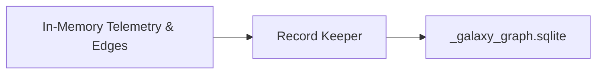

# Record Keeper

> **File Reference:** [`gitgalaxy/recorders/record_keeper.py`](file:///home/joe/nyx_projects/gitgalaxy/gitgalaxy/recorders/record_keeper.py)

## Engineering Summary
This subsystem is the database serialization module responsible for writing GitGalaxy's in-memory static analysis state into a portable, relational SQLite database (`_galaxy_graph.sqlite`). It solves the problem of persisting complex, relational dependency graph data without requiring external infrastructure. It exists to provide a normalized relational schema designed for autonomous AI agents, Retrieval-Augmented Generation (RAG) workflows, and CI/CD analytics pipelines. Within the system, this module is known as the GitGalaxy Record Keeper.

## Purpose
The primary purpose is to serialize in-memory telemetry, metrics, and bi-directional dependency graphs into a self-contained, queryable SQLite database.

## Problem Being Solved
Exporting dependency graphs into traditional graph databases (like Neo4j) requires containerized services and complex Cypher queries that LLMs often hallucinate. This component outputs native SQLite, which LLMs query reliably via Text-to-SQL, providing zero-infrastructure portability and strict schema integrity.

## Design
### Current Behavior
- **Normalized Schema:** Constructs tables including `stars` (Source File Ledger), `constellations` (Directory Groups), `satellites` (Functions & Methods), and `dna_hits` (Pattern Trigger Ledger).
- **Bi-directional Edges:** Creates `inbound_dependencies` and `outbound_dependencies` join tables to represent graph edges for blast radius and fragility queries.
- **Foreign Key Mapping:** Maps extracted functions, methods, and edge connections to parent file IDs using strict relational constraints.

### Planned Improvements
- Normalize DNA hits to optimize table sizes on repositories with heavy signature matches.

## Pipeline Integration
- **Inputs Received:** Fully computed in-memory telemetry objects, extracted signatures, and dependency graph edge mappings.
- **Outputs Produced:** A portable `.sqlite` database file (`_galaxy_graph.sqlite`).
- **Dependencies:** Operates at the end of the analysis pipeline, requiring all sensors and metrics modules to complete execution.

## Tradeoffs
- **Relational vs. Graph Representation:** Flattening graph topologies into relational join tables makes deep path traversal queries (e.g., "find all paths between A and B") computationally heavier in SQL compared to native graph query languages like Cypher, but greatly increases AI compatibility and portability.
- **Disk I/O vs. Speed:** Serializing thousands of nodes via batched inserts introduces disk I/O overhead at the end of the pipeline.

## Limitations
- **Query Complexity:** Complex, multi-hop architectural queries require intricate `INNER JOIN` logic that can become unwieldy for basic CI/CD shell scripts.
- **Concurrent Writes:** SQLite restricts concurrent write operations, though this is mitigated since the Record Keeper operates as a single-threaded batch exporter.

## Performance Notes
- Utilizes batched transaction inserts to process thousands of telemetry records in seconds. File-size footprint remains small due to SQLite's native compression and optimized column schemas.

## Future Work
- Implement optimized view layers within the SQLite schema to simplify common LLM architectural queries.

## Related Components
- LLM Recorder
- State Rehydrator
