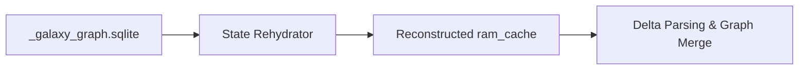

# State Rehydrator

> **File Reference:** [`gitgalaxy/core/state_rehydrator.py`](https://github.com/squid-protocol/gitgalaxy/blob/main/gitgalaxy/core/state_rehydrator.py)

## Engineering Summary
This subsystem enables efficient incremental scans within Continuous Integration/Continuous Deployment (CI/CD) pipelines. It solves the problem of high compute overhead caused by re-parsing large, unmodified codebases on every commit. It exists to load previously analyzed state from the SQLite database into memory, restoring the repository baseline and exclusively analyzing modified source files. Within the system, this module is known as the GitGalaxy State Rehydrator.

## Purpose
The primary purpose is to reconstruct the in-memory static analysis state (`ram_cache`) from a prior scan, enabling rapid Delta Scans and computing structural metric shifts across commits.

## Problem Being Solved
Performing full static analysis across 10,000+ files for a pull request modifying only three files is incredibly inefficient. This component bypasses full filesystem ingestion by reusing historical telemetry and selectively recalculating interdependent graph metrics.

## Design
### Current Behavior
- **State Extraction:** Queries `_galaxy_graph.sqlite` to find the most recent complete analysis baseline. Reconstructs file telemetry, structural metrics, and signature counts into the `ram_cache` dictionary.
- **Incremental Workflow:** Identifies delta targets (files added, modified, deleted) via Git, executes parsing on those specific files, and merges them into the rehydrated state.
- **Topology Recalculation:** Re-triggers graph analysis modules across the merged state to ensure global centrality metrics (blast radius, PageRank) remain accurate.
- **Structural Delta Reporting:** Compares baseline state against modified state to calculate technical debt progression, blast radius escalations, and security vulnerability deltas.

### Planned Improvements
- Partial topological recalculations to save computational overhead on large graphs.

## Pipeline Integration
- **Inputs Received:** An existing SQLite database (`_galaxy_graph.sqlite`) and the current commit's Git delta (modified file paths).
- **Outputs Produced:** A populated in-memory `ram_cache` dictionary and calculated Structural Deltas for CI/CD gates.
- **Dependencies:** Relies on the Record Keeper to have produced a valid SQLite baseline, and interfaces tightly with Git for delta tracking.

## Tradeoffs
- **Stale State Risk vs. Speed:** Relies entirely on the accuracy of the baseline database. If the `.sqlite` file is corrupted or out of sync with the true parent commit, the resulting delta analysis will be flawed, sacrificing strict absolute correctness for speed.
- **Memory Spikes:** Requires loading the entire previous repository state into RAM before parsing the new delta files.

## Limitations
- **Database Dependency:** Incremental analysis fails completely if the prior `_galaxy_graph.sqlite` artifact is not preserved and accessible by the CI runner.
- **Global Metric Ripple:** Changes to a single foundational module force recalculation of the entire network graph topology, partially diminishing the speed benefits of the delta scan.

## Performance Notes
- Eliminates $O(N)$ string parsing overhead for unmodified files. The speed of incremental analysis is bound entirely by SQLite read speeds and the time required to recalculate network graph centrality.

## Future Work
- Implement partial graph recalculation to only update the blast radius of nodes immediately connected to modified files.

## Related Components
- Record Keeper
- Network Risk Sensor