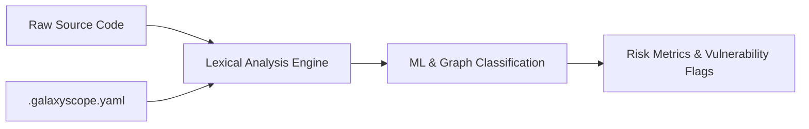

# Security Architecture & Competitive Analysis

> **File Reference:** [gitgalaxy/security/security_auditor.py](https://github.com/squid-protocol/gitgalaxy/blob/main/gitgalaxy/security/security_auditor.py)

## Engineering Summary
The DevSecOps ecosystem is populated by static analysis and software composition analysis (SCA) platforms that traditionally rely on full source code compilation, heavy Abstract Syntax Tree (AST) generation, or reliance on external vulnerability databases. These approaches introduce performance bottlenecks in high-throughput CI/CD pipelines, making real-time analysis difficult. To address this, a compilation-free, multi-language static security analysis framework evaluates raw code structures, lexical patterns, and heuristic signatures across 50+ programming languages simultaneously. By computing risk metrics, generating call reachability graphs, and identifying potential vulnerabilities without pre-compiled build artifacts, it provides low-latency feedback. This subsystem is the GitGalaxy analysis engine.

## Purpose
To provide fast, compilation-free static security auditing that can run directly on raw source code, eliminating the need for build environments or external database lookups.

## Problem Being Solved
Standard enterprise static analysis engines require successful compilation before analysis can proceed. This blocks analysis on partial or non-compiling code bases and slows down the CI/CD pipeline. Additionally, reliance on external cloud databases or language-specific compiler toolchains creates processing overhead and data egress concerns.

## Design
### Compilation-Free Lexical Analysis
Instead of building ASTs or requiring binary packaging, the system parses raw source code directly. Security rules are defined using standardized regular expression patterns and keyword permutations. Because core language constructs follow predictable structural patterns, a unified rule set can analyze multiple languages efficiently in a single pass.

### Machine Learning & Graph-Based Threat Classification
The system evaluates structural mass, cyclomatic complexity, ownership entropy, and dependency topology to identify anomalous files and potential Trojans. 

### Architectural Comparison
* **Black Duck, npm audit, Snyk:** Traditionally rely on exact signature matching and proprietary cloud databases for known CVEs. The system operates fully offline, scanning actual source files directly alongside manifests. It uses configurable regular expression patterns and heuristic signature vectors to flag security risks.
* **Checkmarx, SonarQube:** Traditionally use deep data-flow and control-flow analysis on compiled artifacts or ASTs. The system operates entirely without source code compilation, constructing function call graphs via lightweight lexical parsing.
* **CodeQL:** Traditionally builds a relational database representation of the codebase. The system bypasses database compilation completely.
* **Dependabot, Socket.dev, Phylum:** Monitor dependency manifests and package behavior via cloud APIs. The system inspects installed package files locally on disk for hidden payloads, structural anomalies, and file spoofing using entropy analysis.
* **Endor Labs, govulncheck:** Use semantic call-graph analysis within compiled environments. The system generates function reachability graphs natively using unified pattern definitions across 50+ languages.
* **Semgrep:** Applies lightweight AST-based pattern matching. The system utilizes regular expression signatures and heuristic density scoring without building ASTs, complemented by ML threat classification.
* **Trivy:** Focuses on manifest parsing and CVE lookup tables. The system extends manifest scanning to include physical source file inspection.
* **Veracode:** Requires binary packaging and cloud processing. The system runs entirely on local developer hardware or self-hosted runners.

## Pipeline Integration
Inputs received include raw source code files and configuration settings (`.galaxyscope.yaml`). Outputs produced are risk metrics, call reachability graphs, and vulnerability flags. The subsystem relies on standard Python libraries like `NetworkX` or optimized deque traversals.

## Tradeoffs
* **Lexical vs. Semantic Analysis:** By choosing compilation-free lexical analysis over deep data-flow analysis on ASTs, the system sacrifices semantic understanding (e.g., precise taint tracking across complex data structures) for speed and the ability to scan uncompiled code.
* **Heuristics vs. Exact CVE Matching:** Relying on heuristics and patterns allows for offline scanning and zero-day detection, but may increase false positives compared to exact CVE hash matching. False positive rates are controlled via configurable allowlists.

## Limitations
* Semantic understanding of the code is limited because full ASTs are not generated.
* Cannot detect complex data-flow vulnerabilities that require precise type information or deep inter-procedural taint tracking.
* Heuristic signatures may generate false positives, requiring manual tuning of allowlists and denylists in the configuration.

## Performance Notes
The analysis completes rapidly and enables low-latency scanning per repository module because it bypasses database compilation, AST generation, and external network calls, relying instead on single-pass lexical scanning and in-memory graph traversals.

## Future Work
* **Planned Improvements:** Enhancing the precision of reachability graphs without sacrificing compilation-free speed.
* **Future Additions:** Refining the XGBoost multi-class classifier to reduce false positive rates on heuristic rules across more language paradigms.

## Related Components
* [GitGalaxy Documentation Master Index](index.md)
* [Next: Full API Network Map](04-01-full-api-network-map.md)

