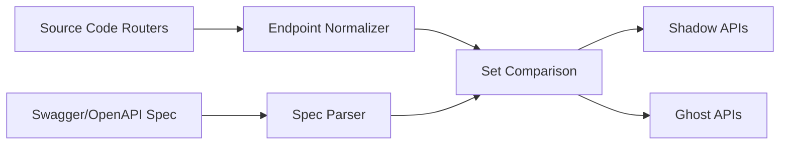

# Full API Network Map (Shadow & Ghost API Audit)

> **File Reference:** [gitgalaxy/tools/network_auditing/full_api_network_map.py](https://github.com/squid-protocol/gitgalaxy/blob/main/gitgalaxy/tools/network_auditing/full_api_network_map.py)

## Engineering Summary
While internal dependency tools map file-to-file imports, they do not track the external network boundary of a repository. Web API surfaces drift out of sync with official documentation, leaving undocumented endpoints exposed or deprecated endpoints cluttering specifications. To solve this, an automated attack surface mapping module evaluates executable router code signatures against official OpenAPI/Swagger documentation. By performing a set theory comparison, it identifies undocumented "Shadow APIs" and deprecated "Ghost APIs". This subsystem is the GitGalaxy API Network Mapper.

## Purpose
To automatically map backend REST APIs and detect drift between executable source code endpoints and their official OpenAPI/Swagger documentation.

## Problem Being Solved
Web APIs frequently change during development, but API documentation updates are often missed. This results in "Shadow APIs" (undocumented endpoints in code that pose security risks because they bypass audits) and "Ghost APIs" (endpoints present in documentation that no longer exist in code). Discovering this manually or at runtime is error-prone.

## Design
### Router Pattern Matching Across Frameworks
Rather than requiring a runtime environment or language-specific AST parsers, the mapper uses regular expression routing signatures (`FRAMEWORK_SIGNATURES`) to scan raw source files across major web frameworks:
* **Python, Node.js, Java, Golang, C#, PHP, Rust, Ruby:** Scans for standard decorator, annotation, or function call patterns defining route registration.

### Endpoint Normalization & Path Parameter Matching
The `normalize_endpoint()` function standardizes all discovered endpoints to prevent false discrepancies:
1. Strips query parameters and whitespace.
2. Converts framework-specific path parameters (like `/users/:userId` or `/users/<int:user_id>`) to a universal `{var}` token.
3. Ensures leading root slashes and strips non-root trailing slashes.

### Set Theory Validation & API Drift Analysis
The mapper compares the documented specification set ($A$) and physical code endpoint set ($P$):
* **Shadow API Detection ($P \setminus A$):** Identifies endpoints present in source code but missing from documentation.
* **Ghost API Detection ($A \setminus P$):** Identifies endpoints declared in documentation that no longer exist in code.

### Specification Auto-Discovery
If no explicit Swagger path is provided, `auto_discover_swagger()` probes the target directory, inspecting the initial 1000 characters of JSON/YAML files to verify schemas without loading massive files entirely into memory.

## Pipeline Integration
Inputs received include raw source code files and OpenAPI/Swagger specification files (`swagger.json`, `openapi.yaml`). Outputs produced are structured dictionaries of detected frameworks, shadow counts, ghost counts, and endpoint lists. The component integrates natively via CLI or programmatically into CI/CD pipelines (`run_api_audit()`).

## Tradeoffs
* **Regex Signatures vs. Runtime Reflection:** By using regex matching on raw source instead of runtime reflection or AST construction, the system is much faster and can run on uncompiled code. However, it sacrifices the ability to detect dynamically generated routes that are not statically analyzable.
* **Static Tokenizing vs. Type Enforcement:** Normalizing all path parameters to `{var}` ignores type constraints (like `<int:user_id>`), simplifying comparison at the expense of ignoring parameter-type drift.

## Limitations
* Dynamic routes registered conditionally or inside loops may be missed by regex patterns.
* Only supports REST API frameworks mapped in `FRAMEWORK_SIGNATURES`; GraphQL or gRPC endpoints require different structural checks.
* Specifications located outside the scanned directory or in external registries cannot be auto-discovered.

## Performance Notes
The module processes files efficiently by reading only the first 1000 characters to auto-discover Swagger files, minimizing memory buffer allocation.

## Future Work
* **Current Behavior:** Identifies structural drift between code and specs.
* **Planned Improvements:** Adding support for GraphQL schema drift detection and improving topological suffix matching for nested router prefixes.

## Related Components
* [GitGalaxy Platform](https://gitgalaxy.io/)
* [⬅️ Back to Master Index](index.md)

