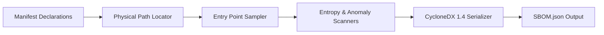

# Software Bill of Materials (SBOM) Generator

> **File Reference:** [gitgalaxy/recorders/sbom_recorder.py](https://github.com/squid-protocol/gitgalaxy/blob/main/gitgalaxy/recorders/sbom_recorder.py)

## Engineering Summary
Software supply chains rely heavily on declarative package manifests (like `package.json` or `requirements.txt`) to determine the bill of materials. However, relying solely on manifests fails to confirm whether the deployed code on disk matches what was declared, exposing environments to malware payloads and dependency spoofing. A physical verification tool inspects installed packages on disk to ensure component integrity before generating CycloneDX 1.4 compliant records. This subsystem is the GitGalaxy SbomRecorder.

## Purpose
To generate enterprise-compliant CycloneDX 1.4 Software Bill of Materials (SBOM) documents backed by physical verification of installed third-party dependencies on disk.

## Problem Being Solved
Declarative package manifests can be easily modified or spoofed. Standard SBOM tools blindly trust these manifests without verifying the actual installed code. This creates a vulnerability gap where hidden malware payloads, spoofed packages, or encrypted blobs can bypass audits.

## Design
### Universal Manifest Parsing
The generator delegates manifest extraction to `UniversalManifestSlicer`, supporting multiple ecosystems (NPM, Packagist, PyPI, Cargo) within polyglot repositories.

### Physical Dependency Verification
For every dependency, the tool locates the physical package on disk. It flags missing packages (`UNVERIFIED_MISSING_ON_DISK`).
* **Candidate Sampling:** Candidate files are ordered by risk priority (common entry points like `index`, `main` first, shallow depth).
* **Structural Anomaly Inspection:** Scanned files undergo dual evaluation:
  * *High-Entropy Payload Check:* Identifies dense string blobs (Shannon Entropy > 4.8).
  * *Language Anomaly Verification:* Verifies file extension against structural heuristics. Mismatches trigger `SPOOF_DETECTED` warnings.
* **Stateful Caching:** File contents are hashed, and verdicts cached per file hash across scan sessions, respecting `fresh_scan_budget`.

### CycloneDX 1.4 Serialization
The final report is a CycloneDX 1.4 JSON document enriched with custom properties representing the `gitgalaxy:trust_status` (e.g., `VERIFIED_SAFE`, `SPOOF_DETECTED`, `PARTIALLY_VERIFIED`).

## Pipeline Integration
Inputs received include pipeline census data (`manifest_paths`), parsed artifact graphs, and session metadata. Outputs produced are structured CycloneDX JSON files. The generator integrates with `UniversalManifestSlicer` upstream and downstream compliance aggregators.

## Tradeoffs
* **Physical Scanning vs. Generation Speed:** Scanning physical files adds overhead compared to simply parsing manifests. To mitigate this, stateful caching and prioritized entry point sampling (`fresh_scan_budget`) are used, trading exhaustive file scanning for timely feedback.
* **Heuristics vs. Determinism:** Using Shannon Entropy (> 4.8) is a heuristic that can flag benign compressed or encrypted blobs as suspicious, requiring manual verification but increasing defense-in-depth against obfuscated malware.

## Limitations
* If `fresh_scan_budget` is exceeded, deep nested files in large packages may be marked `PARTIALLY_VERIFIED` and left uninspected until subsequent runs.
* Highly dynamic dependency loading that bypasses package managers cannot be tracked.

## Performance Notes
The implementation is optimized using a `DependencyAuditCache`. Hashing files and looking up verdicts enables $O(1)$ result retrieval for unmodified packages, drastically reducing I/O and CPU overhead on repeated CI runs.

## Future Work
* **Current Behavior:** Inspects physical files and emits CycloneDX 1.4 metadata based on static and entropy checks.
* **Planned Improvements:** Expand support to system-level package managers (e.g., APT, RPM) and integrate deeper binary artifact inspection.

## Related Components
* [GitGalaxy Platform](https://gitgalaxy.io/)
* [⬅️ Back to Master Index](index.md)

