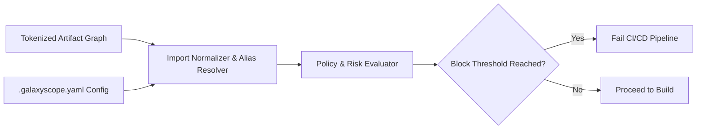

# Supply Chain Firewall (Zero-Trust Dependency Gate)

> **File Reference:** [gitgalaxy/tools/supply_chain_security/supply_chain_firewall.py](file:///home/joe/nyx_projects/gitgalaxy/gitgalaxy/tools/supply_chain_security/supply_chain_firewall.py)

## Engineering Summary
Modern applications heavily rely on third-party dependencies, which can introduce severe supply chain risks such as malicious updates, namespace hijacking, or embedded malware. Relying solely on asynchronous vulnerability scans allows bad code to enter the environment during the build phase. To proactively block threats, an in-memory logic gate evaluates package imports, resolves aliases, and enforces risk thresholds before third-party code reaches production build environments. This subsystem is the GitGalaxy Supply Chain Firewall.

## Purpose
To provide zero-trust dependency verification and behavioral policy enforcement during CI/CD execution, acting as an active gate to block malicious or unauthorized dependencies from executing.

## Problem Being Solved
Vulnerability scanners often rely on post-build static analysis or asynchronous cloud alerts. By the time a malicious package is flagged, it may have already compromised the build environment via build scripts or hidden logic. The firewall evaluates dependencies deterministically at runtime.

## Design
### In-Memory Graph Processing
The firewall operates directly on the pre-tokenized artifact graph (`parsed_files`), eliminating redundant file reads from disk. It evaluates raw package import declarations against configured allowlists, denylists, and policy flags from `.galaxyscope.yaml`.

### Import Verification & Alias Resolution
The firewall normalizes packages (e.g., stripping relative imports, collapsing deep module paths to root package names). It actively dereferences manifest aliases to verify true package origins, preventing **Dependency Confusion** attacks. 

### Behavioral Policy Enforcement
Rather than recomputing static analysis, the firewall reads risk vectors computed during metrics evaluation (`SignalProcessor.RISK_SCHEMA`). Risk categories (Hidden Malware, Data Injection, Secrets Leak) are evaluated against a sigmoid block threshold (`_FIREWALL_BLOCK_THRESHOLD = 50.0`). 

### Contextual Risk Multipliers
1. **Build-Time Execution Multiplier ($10.0\times$):** Risk scores for build scripts (`setup.py`, `postinstall.js`) are heavily multiplied because they execute automatically and can compromise host systems immediately.
2. **Network Centrality Multiplier:** High downstream blast radius files receive dynamic risk score multipliers.

## Pipeline Integration
Inputs received include tokenized artifact graph data (`parsed_files`), alias maps, and configuration rules. Outputs produced are risk alerts, policy violation metrics, and a build pass/fail signal. Downstream CI/CD stages depend on this gate successfully passing.

## Tradeoffs
* **Strict Policy vs. Developer Velocity:** Enforcing `STRICT_IMPORT_MODE` (where only pre-approved imports are allowed) provides the highest security but increases friction for developers adding new legitimate dependencies.
* **Behavioral Multipliers vs. False Positives:** The aggressive $10.0\times$ multiplier on build scripts may block legitimate complex installations, requiring explicit exceptions in `ALLOWLIST_PATHS`.

## Limitations
* The firewall only analyzes static imports. Dynamic runtime imports (e.g., heavily obfuscated string evaluations of dependency paths) may bypass initial analysis.
* Dependent on the accuracy of the upstream tokenized artifact graph.

## Performance Notes
Because the firewall consumes pre-tokenized in-memory graph data and applies vectorized block thresholds, it performs zero disk I/O and executes sub-second policy enforcement across massive dependency trees.

## Future Work
* **Current Behavior:** Exits with status code `1` upon detecting threats, failing the pipeline securely.
* **Planned Improvements:** Provide interactive dry-run modes that log warnings without halting builds during initial deployment phases.

## Related Components
* [GitGalaxy Platform](https://gitgalaxy.io/)
* [⬅️ Back to Master Index](index.md)

