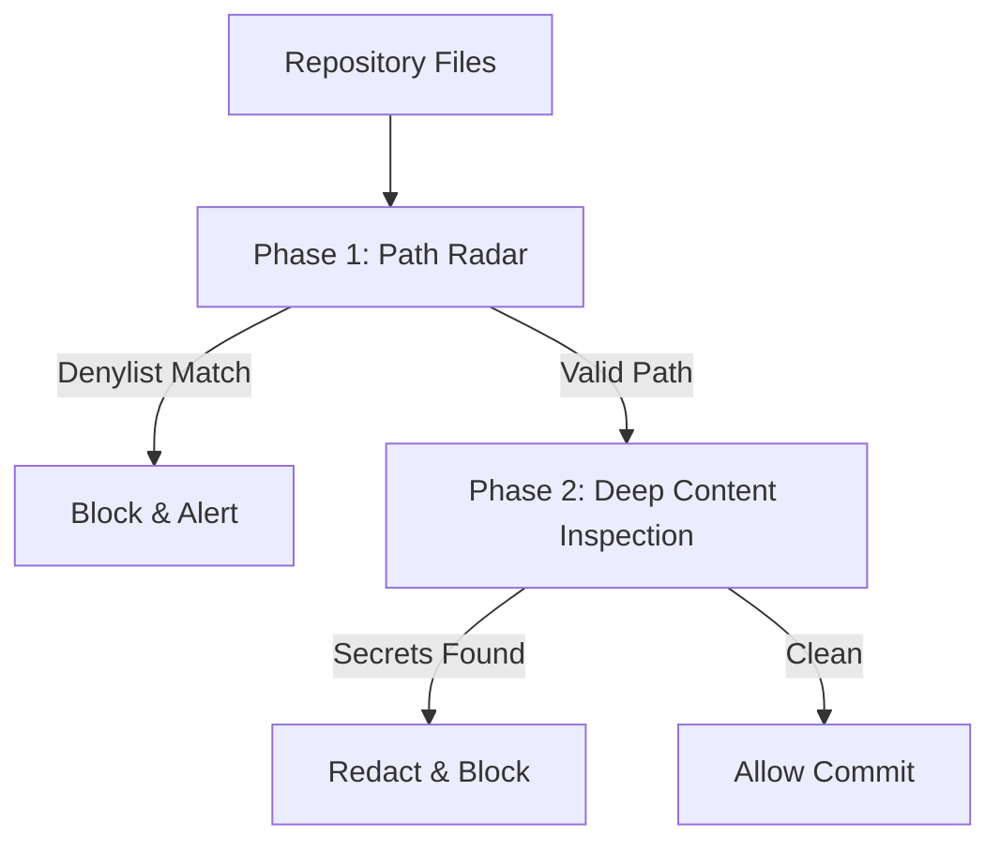

# Vault Sentinel (High-Speed Secrets Scanner)

> **File Reference:** [gitgalaxy/tools/supply_chain_security/vault_sentinel.py](file:///home/joe/nyx_projects/gitgalaxy/gitgalaxy/tools/supply_chain_security/vault_sentinel.py)

## Engineering Summary
Developer environments often accidentally leak sensitive credentials via hardcoded keys or committed configuration files. Catching these leaks requires scanning code before it enters version control. To solve this, a high-speed secret scanning module acts as a pre-commit hook and CI/CD validator, detecting hardcoded API keys, SaaS credentials, private key certificates, and uncommitted `.env` files. It emphasizes sub-second execution speeds to avoid blocking local developer workflows. This subsystem is the GitGalaxy Vault Sentinel.

## Purpose
To provide high-speed, low-latency secret scanning for developer pre-commit hooks and CI/CD pipelines, blocking the accidental commit or deployment of sensitive credentials.

## Problem Being Solved
Standard security scanners apply hundreds of heavy regex patterns and AST rules, which can take minutes to execute. If a pre-commit hook takes too long, developers bypass it. Vault Sentinel isolates only critical credential signatures to execute in milliseconds, ensuring compliance without impacting developer velocity.

## Design
### Sensor Optimization
The tool narrows the scope of `SecurityLens` signature matching exclusively to high-priority targets (`hardcoded_secrets` and `dead_code`). By stripping general AST, cyclomatic complexity, and non-credential regex rules, the scanner maximizes file throughput.

### Two-Pass Detection Pipeline
1. **Phase 1: Path Surface Radar (Zero-I/O Checks):** Evaluates file paths against ignore patterns (`ApertureFilter`), wildcard denylists (`DENYLIST_PATTERNS`, e.g., `*.pem`, `.env*`), and path integrity checks. Matching paths block execution immediately without opening file handles.
2. **Phase 2: Deep Content Inspection:** Files passing Phase 1 are loaded into memory. The optimized `SecurityLens` hunts for cloud tokens, SaaS keys, and commented-out credentials. Detected secret snippets are redacted in console logs to prevent exposure in build output.

### Configuration & Allowlist Management
Settings are resolved via `resolve_config()`. `ALLOWLIST_PATHS` bypasses checks for test fixtures, while `APERTURE_CONFIG` controls max file size limits to prevent scanning enormous binary blobs.

## Pipeline Integration
Inputs received include local repository files and `.galaxyscope.yaml` configurations. Outputs produced are scan velocity metrics, leak counts, and console-redacted evidence. It functions as an active blocking gate upstream of the main build process.

## Tradeoffs
* **Speed vs. Exhaustive Scanning:** By limiting the `SecurityLens` signatures strictly to `hardcoded_secrets` and `dead_code`, the tool sacrifices the ability to catch general code vulnerabilities during this phase in exchange for sub-second credential scanning.
* **Regex Matching vs. Entropy Analysis:** The sentinel relies primarily on regex matching and path checks. It does not perform deep Shannon entropy analysis (used by other GitGalaxy modules) on file contents to find obfuscated secrets, prioritizing speed over deep anomaly detection.

## Limitations
* Custom, proprietary internal key formats will not be detected unless manually added to the `THREAT_SIGNATURES`.
* Large text files exceeding `APERTURE_CONFIG` file size limits may be bypassed to maintain performance SLAs.

## Performance Notes
Phase 1 operates with zero-I/O by evaluating paths before opening file handles. Phase 2 leverages optimized regex compilation to achieve processing velocities measured in thousands of files per second.

## Future Work
* **Current Behavior:** Blocks commits based on static regex and path matching.
* **Planned Improvements:** Integrating an asynchronous key-validation API call to check if detected AWS or GitHub tokens are actively valid before failing the build, reducing false positive blocks on revoked keys.

## Related Components
* [GitGalaxy Platform](https://gitgalaxy.io/)
* [⬅️ Back to Master Index](index.md)

