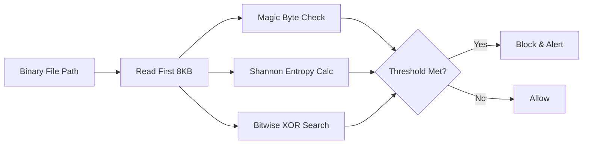

# Binary Anomaly Detector (Heuristic File Integrity Scanner)

> **File Reference:** [gitgalaxy/tools/supply_chain_security/binary_anomaly_detector.py](file:///home/joe/nyx_projects/gitgalaxy/gitgalaxy/tools/supply_chain_security/binary_anomaly_detector.py)

## Engineering Summary
Standard source code parsers drop binary assets to conserve memory and avoid parsing errors. However, attackers exploit this blind spot by embedding malware, packed executables, or steganographic payloads inside seemingly benign files like images or archives. To combat this, a heuristic file integrity scanner explicitly targets binary files, inspecting byte-level headers and calculating mathematical entropy to flag hidden threats. This subsystem is the GitGalaxy Binary Anomaly Detector.

## Purpose
To perform high-speed triage of binary anomalies, magic byte mismatches, and obfuscated payloads within the build pipeline.

## Problem Being Solved
Binary files (`.png`, `.zip`, `.dll`) are typically ignored by SAST tools. Attackers use this to bypass security checks by disguising executable payloads with benign file extensions. Discovering these threats requires byte-level inspection without loading massive gigabyte assets into memory.

## Design
### Selective Binary Ingestion Logic
The module explicitly overrides the standard `ApertureFilter` binary exclusion rules. It enqueues binary files while automatically whitelisting test fixtures (`/test/`, `/tests/`) and compressed configuration formats (`XRAY_BYPASS_EXTENSIONS`) to prevent false positives.

### 8KB Header Inspection
To maintain throughput and avoid out-of-memory risks, the detector reads only the first $8\text{ KB}$ (8,192 bytes) of a file.

### Mathematical Entropy & Header Checks
The 8KB chunk undergoes several evaluations:
1. **Magic Byte Mismatch:** Compares the file's magic bytes against its declared file extension (e.g., flagging an executable disguised as a `.png`).
2. **Expected Shebang Exemption:** Suppresses anomaly alerts for shell scripts (`.sh`, `.bash`) that legitimately contain executable header signatures.
3. **Shannon Entropy Validation:** Calculates string entropy. If $\text{Entropy} > 4.8$, it flags the file as potentially containing packed executables or encrypted payloads.
4. **Bitwise Operation Traps:** Inspects byte buffers for dense clusters of XOR operations, indicating potential unpacking routines.

## Pipeline Integration
Inputs received include raw binary file paths and configuration settings. Outputs produced are anomaly alerts and execution blocks (exit code `1`). It runs alongside or immediately after standard source code static analysis.

## Tradeoffs
* **8KB Truncation vs. Exhaustive Scanning:** By only reading the first 8KB of a file, the system achieves massive speed gains and zero out-of-memory crashes on large video or archive files. However, it sacrifices the ability to detect payloads appended to the very end of massive legitimate files.
* **Heuristics vs. Signatures:** Relying on Shannon entropy (> 4.8) catches novel zero-day packed malware, but will generate false positives on heavily compressed benign files (like certain encrypted test fixtures or compressed data models).

## Limitations
* Steganographic payloads embedded deep within large files (past the 8KB header) will not be detected.
* Heuristic thresholds for entropy require careful tuning via allowlists to avoid blocking legitimate binary data.

## Performance Notes
Memory usage is capped at $O(1)$ per file (exactly 8,192 bytes allocated). Execution time is bound by raw disk read speed rather than CPU computation.

## Future Work
* **Current Behavior:** Inspects 8KB headers and blocks based on magic byte and entropy math.
* **Planned Improvements:** Implementing a dual-chunk read (first 8KB and last 8KB) to detect payloads appended to the EOF tail without loading the middle contents.

## Related Components
* [GitGalaxy Platform](https://gitgalaxy.io/)
* [⬅️ Back to Master Index](index.md)

