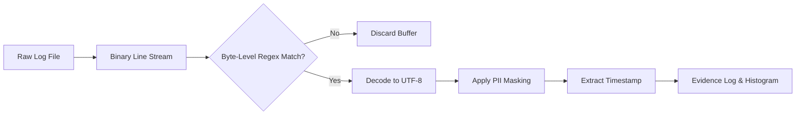

# PII Leak Hunter (Log Privacy & Incident Responder)

> **File Reference:** [gitgalaxy/tools/terabyte_log_scanning/pii_leak_hunter.py](https://github.com/squid-protocol/gitgalaxy/blob/main/gitgalaxy/tools/terabyte_log_scanning/pii_leak_hunter.py)

## Engineering Summary
Server logs and database dumps often inadvertently capture Personally Identifiable Information (PII) such as credit cards, SSNs, and API keys. Scanning terabyte-scale log files for these leaks using standard text parsers causes immense memory overhead and CPU starvation due to string decoding. To solve this, a high-throughput stream processor evaluates raw binary data against byte-level regular expressions, decoding strings only upon a positive match. It sanitizes sensitive data and provides chronological histograms of exposure events. This subsystem is the GitGalaxy PII Leak Hunter.

## Purpose
To provide high-throughput, single-pass log analysis that detects exposed PII, masks sensitive values, and outputs sanitized evidence logs for compliance auditing.

## Problem Being Solved
Processing multi-gigabyte log files using standard UTF-8 string decoding is too slow for rapid incident response. Storing raw evidence of leaked PII creates secondary compliance violations. Security teams need a way to rapidly discover leaks and extract sanitized evidence without crashing the system or multiplying data risks.

## Design
### Byte-Level Pattern Matching
The hunter compiles detection patterns directly as binary byte regular expressions (`PII_PATTERNS`), bypassing the need to decode every line of a log file.
* **Lazy Decoding:** Reads files line-by-line in binary mode (`open(..., "rb")`). Lines are decoded into UTF-8 text *only* after a binary regex match is confirmed.
* **Multi-Pattern Deduction:** Ensures that a single line containing multiple PII instances is logged once with full masking applied across all categories.

### Sensitive Value Masking
The `mask_pii()` function applies surgical string replacements to format matches securely (e.g., `4111222233334444` becomes `VISA-MASKED-4444`). Sanitized entries are written to a secondary evidence log.

### Time-Series Exposure Histograms
The tool extracts ISO and syslog timestamps, bucketing hits into hourly intervals. It generates ASCII histograms (`draw_ascii_histogram()`) and flags volume anomalies where hit rates exceed $3\times$ the interval average.

## Pipeline Integration
Inputs received are multi-gigabyte log files or database dumps. Outputs produced are sanitized evidence logs (`<target_stem>_pii_leak_evidence.log`) and terminal-based time-series histograms. It acts as a standalone operational security tool rather than an automated CI/CD pipeline gate.

## Tradeoffs
* **Binary Regex vs. Text Context:** By evaluating byte streams instead of UTF-8 strings, the system guarantees extreme velocity but sacrifices complex contextual analysis that requires full structural parsing (like JSON unmarshalling).
* **Static Masking vs. Format Preservation:** Hard-coded masking strings (`XXX-XX-6789`) destroy the original data shape, which is safer for compliance but prevents data-science recovery workflows that require format-preserving encryption.

## Limitations
* Detection is strictly limited to the regular expressions defined in `PII_PATTERNS`. Custom or novel PII formats require code modification.
* Very long log lines without newline delimiters may still cause memory spikes despite the stream design.

## Performance Notes
By utilizing lazy decoding, the tool achieves streaming velocities in hundreds of MB/s or GB/s, strictly bound by I/O read speeds rather than CPU decoding cycles. Memory remains at $O(1)$ based on the longest log line.

## Future Work
* **Current Behavior:** Streams files linearly and outputs static masked logs.
* **Planned Improvements:** Adding multi-threaded chunk processing for even faster throughput on massive, single-file database dumps.

## Related Components
* [GitGalaxy Platform](https://gitgalaxy.io/)
* [⬅️ Back to Master Index](index.md)

