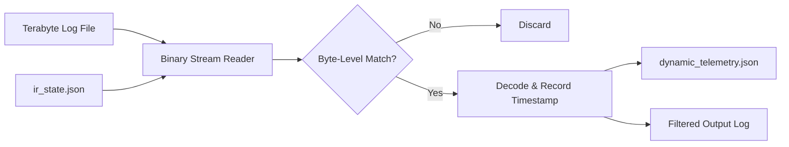

# Terabyte Log Scanner (High-Volume Telemetry & Dead Code Validator)

> **File Reference:** [gitgalaxy/tools/terabyte_log_scanning/terabyte_log_scanner.py](https://github.com/squid-protocol/gitgalaxy/blob/main/gitgalaxy/tools/terabyte_log_scanning/terabyte_log_scanner.py)

## Engineering Summary
Static code analysis often flags legacy code as "dead" or unused, but removing it without runtime verification can cause catastrophic production outages. Validating execution requires scanning massive server or mainframe logs to find module invocation signatures. To accomplish this, a high-speed log processor streams multi-terabyte files in binary mode, matching dynamic telemetry against statically generated program lists to confirm execution state. This subsystem is the GitGalaxy Terabyte Log Scanner.

## Purpose
To provide single-pass log processing that cross-references static code analysis hypotheses against live execution logs, enabling security teams to confidently identify and decommission dead code.

## Problem Being Solved
Scanning multi-terabyte logs with standard string-processing tools creates memory exhaustion and extreme CPU overhead. Security and ops teams need a way to prove that a piece of suspected dead code (which is a liability) has completely zero execution hits in production over an extended timeframe, without waiting days for a query to finish.

## Design
### Dual Target Discovery
The scanner accepts explicit keywords via CLI (`-k PROG01`) or ingests a GitGalaxy Intermediate Representation JSON file (`ir_state.json`), parsing `analysis.known_programs` to extract target module names dynamically.

### Binary Streaming & Performance
To process massive files without memory bottlenecks:
1. Compiles target keywords into binary byte patterns.
2. Streams the log file line-by-line in binary mode (`open(..., "rb")`).
3. Uses lazy line decoding: only matching lines are decoded into UTF-8 text and written to a filtered results log.

### Time-Series & Anomaly Filtering
Extracts chronological timestamps and groups hits into hourly buckets. It displays the top 15 highest-volume spikes and flags volume anomalies where hits exceed $3\times$ the interval average.

### Telemetry Sidecar
Exports a `dynamic_telemetry.json` sidecar containing execution counts for each monitored module. A count of zero confirms the dead code hypothesis, while $> 0$ validates active use.

## Pipeline Integration
Inputs received are raw server/mainframe log files and GitGalaxy IR state files (`ir_state.json`). Outputs produced are filtered text logs, terminal time-series histograms, and a telemetry sidecar (`dynamic_telemetry.json`). The sidecar feeds back into the GitGalaxy static analysis engine to close the loop on dead code reporting.

## Tradeoffs
* **Binary Matching vs. Log Parsing:** By treating logs as raw byte streams and matching flat strings, the scanner achieves extreme performance but cannot execute complex semantic queries (e.g., joining events across different log formats) like a structured SIEM or Elasticsearch cluster.
* **Exact Keyword vs. Fuzzy Matching:** The tool relies on exact byte compilation of module names. It sacrifices fuzzy matching capabilities to maintain scanning velocity, meaning dynamic or heavily parameterized invocation strings may be missed.

## Limitations
* Execution counts represent log occurrences, which may overcount if a module logs multiple lines per invocation.
* Assumes timestamps follow standard ISO or syslog formats; bespoke time structures may fail parsing.

## Performance Notes
The scanner operates at bare-metal disk read speeds by avoiding UTF-8 decoding on non-matching lines, allowing it to process terabytes of data on standard developer hardware without large memory footprints.

## Future Work
* **Current Behavior:** Outputs static JSON counters and terminal histograms.
* **Planned Improvements:** Support for streaming decompression of `.tar.gz` and `.zip` archives directly without requiring preliminary disk extraction.

## Related Components
* [GitGalaxy Platform](https://gitgalaxy.io/)
* [⬅️ Back to Master Index](index.md)

