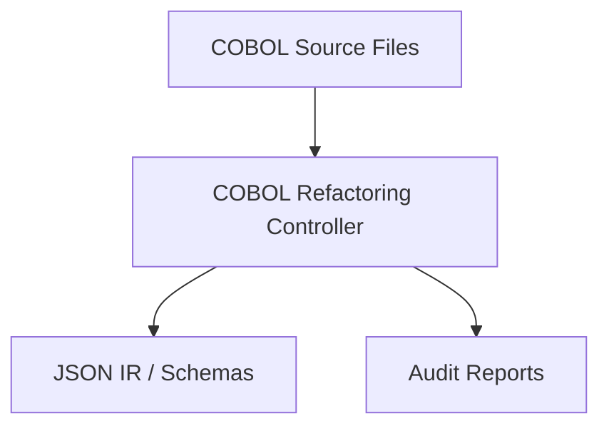

# COBOL Refactoring Controller

> **File Reference:** [`gitgalaxy/cobol_refractor_controller.py`](https://github.com/squid-protocol/gitgalaxy/blob/main/gitgalaxy/cobol_refractor_controller.py)

## Engineering Summary
This subsystem is an orchestration engine that parses procedural legacy source code to extract deterministic business logic into a structured format. It solves the problem of analyzing massive monolithic codebases by converting source text into a machine-readable intermediate representation. It exists to provide the foundational data structures required for downstream code generation and architectural visualization. Within the ecosystem, it functions as the primary entry point for static analysis, producing artifacts consumed by the rest of GitGalaxy.

## Purpose
To parse COBOL source code, extract business logic and data structures, and output a standardized JSON Intermediate Representation (IR).

## Problem Being Solved
Legacy codebases contain large amounts of monolithic procedural code, undocumented data dependencies, and unstructured control flow. Modernizing this code requires a structured way to analyze and extract the relevant logic without executing it.

## Design
The controller uses a three-phase extraction pipeline:
1. **Lexical Sanitization:** Neutralizes legacy syntax pitfalls, such as deprecated `NEXT SENTENCE` directives, to enable clean syntax tree processing.
2. **Static Analysis & Code Audit:** 
   - Uses `x_ray_dead_code` to identify orphaned variables and unreachable paragraphs.
   - Maps program I/O relationships using `extract_lineage`.
   - Scans for structural anomalies and unresolved dynamic `CALL` statements via `scan_system_limits`.
3. **Context-Aware Code Generation:**
   - Translates active variables into JSON and PostgreSQL DDL database schemas.
   - Generates Job Control Language (JCL) execution scripts based on dataset lineage.
   - Slices business logic around target variables to output isolated JSON business rules, skipping unreachable blocks.

## Pipeline Integration
**Inputs received:** Procedural COBOL source code files.
**Outputs produced:** JSON Intermediate Representation (IR), PostgreSQL DDL schemas, JCL scripts.
**Dependencies:** Upstream file system readers; downstream consumers include the Java Translation Controller and code generation agents.

## Tradeoffs
- Uses a hybrid state manager instead of purely in-memory structures. Chosen to prevent Out-Of-Memory (OOM) failures on large repositories, sacrificing raw processing speed for stability by writing to SQLite when limits are reached.

## Limitations
- Relies on heuristics for dynamic `CALL` statements, which may not resolve at compile time.
- Unresolved system limits and overrides require manual architectural review.

## Performance Notes
The controller checks repository size on launch. If the volume exceeds 2,000 files or 200 MB, it shifts IR storage from RAM to a localized SQLite database. This limits memory usage to $O(1)$ for state storage, allowing processing of theoretically unbounded repository sizes at the cost of disk I/O latency.

## Future Work
- Implementation of more precise control flow graph analysis to eliminate edge cases in dynamic subroutine resolution.

## Related Components
- `cobol_to_java_controller.py`
- `cobol_dag_architect.py`
