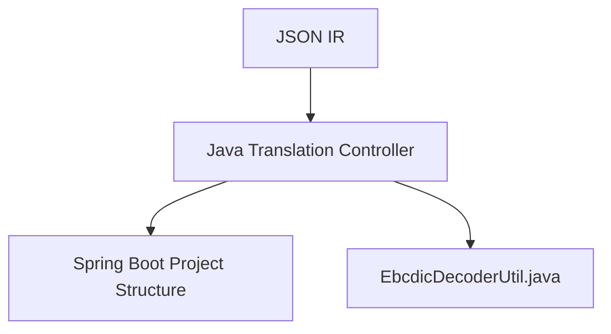

# Spring Boot Scaffolding Architecture

> **File Reference:** [`gitgalaxy/cobol_to_java_controller.py`](https://github.com/squid-protocol/gitgalaxy/blob/main/gitgalaxy/cobol_to_java_controller.py)

## Engineering Summary
This subsystem automatically generates a complete Java project structure from parsed legacy application state. It solves the problem of manually translating procedural environments into modern, compilable application frameworks. It exists to eliminate boilerplate setup and ensure consistency across migrated microservices. This orchestrator functions as the bridge between static analysis outputs and target application architectures within GitGalaxy.

## Purpose
To ingest JSON Intermediate Representation (IR) dumps and generate a compilable Spring Boot microservice project structure.

## Problem Being Solved
Migrating from procedural execution to Object-Oriented and RESTful paradigms involves substantial boilerplate, such as configuring build systems, application properties, and standard utility classes for legacy data decoding.

## Design
The controller scaffolds the foundational project:
- **`pom.xml`**: Configures Maven dependencies (Spring Boot Starter Web, Spring Data JPA, Spring Batch, Lombok, PostgreSQL) for Java 17.
- **`application.yml`**: Configures database connections, Hibernate DDL properties, and logging.
- **Application Entry Point**: Generates the `@SpringBootApplication` main class.
- **Header Injection**: Scans for `header.txt` and wraps contents into Java block comments at the top of generated files.
- **EBCDIC & COMP-3 Data Decoder Utility (`EbcdicDecoderUtil.java`)**: Generated to unpack binary legacy payloads into UTF-8 and `BigDecimal`. It validates the high nibble (0-9) and sign nibble (A-F). On encountering corrupt data, it logs a hex-dump and returns `BigDecimal.ZERO`.

## Pipeline Integration
**Inputs received:** JSON Intermediate Representation (IR) dumps.
**Outputs produced:** Compilable Maven Spring Boot project directory (Java source, pom.xml, application.yml).
**Dependencies:** Upstream COBOL Refactoring Controller; downstream Maven compiler and Java Forge tools.

## Tradeoffs
- Returning `BigDecimal.ZERO` on corrupt COMP-3 data rather than throwing an exception. Chosen to prevent application crashes during batch processing, sacrificing strict data integrity for system resilience.

## Limitations
- Scaffolding assumes a Spring Boot + JPA + PostgreSQL stack, with limited flexibility for other Java frameworks or databases without modifying the template generator.

## Performance Notes
File generation operations are linear $O(N)$ with respect to the number of configured endpoints and modules, relying on basic file I/O operations with minimal memory overhead.

## Future Work
- Support for generating Gradle build scripts alongside Maven.
- Configurable error handling strategies for corrupt EBCDIC data.

## Related Components
- `cobol_refractor_controller.py`
- `cobol_to_java_spring_forge.py`
