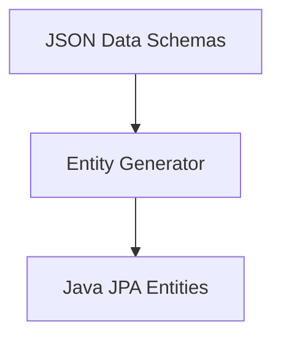

# Entity & Memory Mapping

> **File Reference:** [`gitgalaxy/tools/cobol_to_java/cobol_to_java_spring_forge.py`](file:///home/joe/nyx_projects/gitgalaxy/gitgalaxy/tools/cobol_to_java/cobol_to_java_spring_forge.py)

## Engineering Summary
This subsystem translates procedural memory layouts into relational database entity mappings. It solves the problem of converting byte-level memory overlays, fixed-length arrays, and specialized numeric constraints into object-relational mapping (ORM) structures. It exists to bridge the gap between contiguous memory segments and normalized SQL tables. Within the GitGalaxy pipeline, it generates the data access layer for target microservices.

## Purpose
To translate extracted JSON schemas of legacy data structures into standard Spring Boot JPA Entities (`@Entity`).

## Problem Being Solved
Legacy languages like COBOL use explicit byte-level memory layouts (like `REDEFINES` and `OCCURS`) and specific numeric representations (`PIC` clauses) that do not map 1:1 to modern Java types or relational database columns.

## Design
The generator maps specific legacy constructs to JPA annotations:
- **Memory Overlay Resolution (`REDEFINES`)**: Maps the primary variable to a persistent database column. The redefined alias is mapped with `@Transient`, making it available in business logic without creating redundant SQL columns.
- **Array Generation (`OCCURS`)**: Translates fixed-length arrays into Java `List<T>` fields, annotated with `@ElementCollection` and `@CollectionTable`. Uses foreign key join columns to the parent's primary key (`sys_id`).
- **Financial Precision (`PIC` Clauses)**: 
  - Strings (`PIC X` / `PIC A`) map to `@Column(length = N)`.
  - Decimals (`PIC S9(7)V99` / `PIC Z`) map to `BigDecimal` with `@Column(precision = P, scale = S)`.
- **Sanitization**: Converts hyphens to camelCase, prefixes numeric variables (e.g., `1099-FORM` to `v1099Form`), and shields reserved keywords by appending `Val` (e.g., `classVal`).

## Pipeline Integration
**Inputs received:** JSON data schemas from the IR state.
**Outputs produced:** Java `@Entity` source files with JPA annotations.
**Dependencies:** Upstream COBOL Refactoring Controller; downstream Maven compiler and Hibernate schema generators.

## Tradeoffs
- Using `@Transient` for `REDEFINES` fields instead of splitting into normalized tables. Chosen to maintain memory equivalence and ease of business logic translation, sacrificing full relational query capability on the redefined fields.

## Limitations
- Complex nested `REDEFINES` with misaligned byte boundaries may require manual intervention.
- The use of `@ElementCollection` for `OCCURS` clauses can lead to $O(N)$ query patterns (N+1 selects) if not fetched eagerly or joined correctly.

## Performance Notes
Entity generation relies on string manipulation and template rendering, executing in $O(1)$ time per field definition, scaling linearly with the size of the legacy data structures.

## Future Work
- Implementation of custom Hibernate user types for more complex byte-aligned memory representations.

## Related Components
- `cobol_to_java_controller.py`
- `cobol_to_java_api_contract_forge.py`
