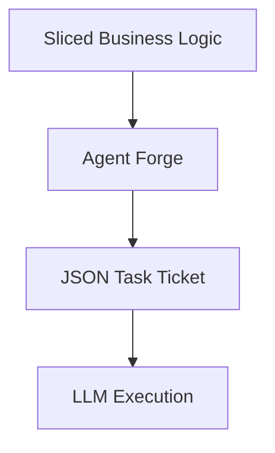

# Autonomous Agent Task Tickets

> **File Reference:** [`gitgalaxy/tools/cobol_to_java/cobol_to_java_agent_forge.py`](https://github.com/squid-protocol/gitgalaxy/blob/main/gitgalaxy/tools/cobol_to_java/cobol_to_java_agent_forge.py)

## Engineering Summary
This subsystem formats isolated segments of legacy code into bounded task payloads for large language models. It solves the problem of context window saturation and hallucination when translating large source files. It exists to enforce strict constraints on AI code generation by limiting the provided context to exact business logic paths. Within GitGalaxy, it bridges the deterministic static analysis pipeline with probabilistic AI generation.

## Purpose
To package pre-sliced business logic into structured JSON Task Tickets (`{prog_id}_java_service_job.json`) for autonomous code generation agents.

## Problem Being Solved
Feeding entire legacy source files to an LLM causes hallucinated dependencies, forgotten state, and context window limits. Agents need explicitly bounded contexts to generate accurate implementations.

## Design
- **JSON Task Ticket Schema**: Generates a ticket containing only localized logic statements required for a target variable, explicit enumerations of unresolved subroutine calls, and injected architectural warnings (e.g., dynamic GOTOs).
- **Prompt Bounding**: Uses a `system_prompt` to enforce strict generation rules:
  1. No creation of unlisted external systems or tables.
  2. Interface calls must target Spring-managed dependencies for unresolved external calls.
  3. Structured response format (JSON payload with `diagnosis` and `java_code`) for automated insertion.

## Pipeline Integration
**Inputs received:** Sliced business logic blocks and dependency data from static analysis.
**Outputs produced:** JSON Task Tickets containing prompts and bounded context.
**Dependencies:** Upstream microservice business logic slicer; downstream LLM agent execution and AST insertion.

## Tradeoffs
- Restricting context to sliced business logic instead of providing the full file. Chosen to increase deterministic output and reduce hallucinations, sacrificing the model's ability to infer global, unmapped context.

## Limitations
- Highly coupled business rules that span multiple files may not be fully resolved if the slicer heuristics fail to capture the entire slice.

## Performance Notes
Ticket generation is an $O(1)$ string formatting operation per target variable slice, adding negligible overhead to the pipeline.

## Future Work
- Integration of continuous feedback loops where the agent can request additional context if the provided slice is insufficient.

## Related Components
- `cobol_refractor_controller.py`
- `cobol_to_java_service_forge.py`
