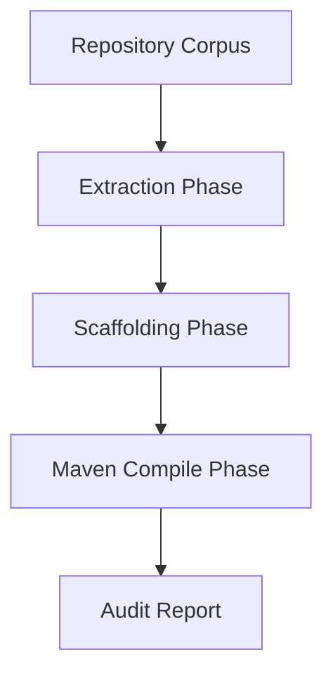

# Batch Test Harness

> **File Reference:** [`gitgalaxy/tools/cobol_to_java/batch_test_harness.py`](https://github.com/squid-protocol/gitgalaxy/blob/main/gitgalaxy/tools/cobol_to_java/batch_test_harness.py)

## Engineering Summary
This subsystem is an automated verification framework that executes the entire end-to-end modernization pipeline across multiple repositories. It solves the problem of detecting regressions in static analysis or code generation logic by compiling the output artifacts. It exists to guarantee that changes to the core engine do not break downstream compilability. In GitGalaxy, it serves as the primary CI/CD integration testing tool.

## Purpose
To stress-test the modernization pipeline and verify that static analysis extraction and Java code generation produce 100% compilable Spring Boot applications.

## Problem Being Solved
Modifying code generation templates or parsing rules can introduce syntax errors in the generated output that are only discovered when developers attempt to compile the target application.

## Design
- **Three-Phase Pipeline**:
  1. **Structural Extraction**: Runs `cobol_refractor_controller.py` to generate IR state.
  2. **Spring Boot Scaffolding**: Runs `cobol_to_java_controller.py` to generate Java source and configuration.
  3. **Compilation Verification**: Spawns a localized Maven subprocess (`mvn clean compile`) to verify the generated Java code.
- **Environment Isolation**: Forces `JAVA_HOME` to Java 17 OpenJDK for deterministic compilation. Wraps subprocess executions with a 300-second timeout to terminate infinite loops cleanly.
- **Test Logging**: Records summary metrics (passed, failed_refractor, failed_java_forge, failed_maven). Captures stdout/stderr into dedicated log files.

## Pipeline Integration
**Inputs received:** Raw legacy repository corpora.
**Outputs produced:** Build success metrics and compilation error logs.
**Dependencies:** Executes the entire pipeline; relies on a local Maven and JDK 17 environment.

## Tradeoffs
- Using full subprocess Maven compilation rather than AST validation. Chosen because it provides absolute ground-truth verification of the generated `pom.xml` and Java source, sacrificing test execution speed for accuracy.

## Limitations
- Only validates syntax and compilability; it does not execute functional unit tests on the translated business logic.

## Performance Notes
Test execution is bounded by the speed of Maven compilation and JDK startup overhead. Bounded by a 5-minute timeout per project to prevent blocking CI/CD runners.

## Future Work
- Integration with JUnit generation for functional validation testing.

## Related Components
- `cobol_refractor_controller.py`
- `cobol_to_java_controller.py`
