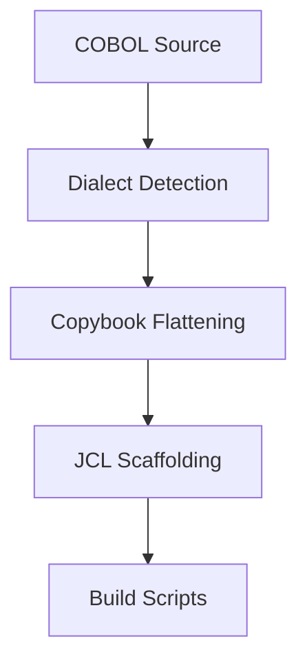

# Mainframe Compiler Generator

> **File Reference:** [`gitgalaxy/tools/cobol_to_cobol/cobol_compiler_forge.py`](file:///home/joe/nyx_projects/gitgalaxy/gitgalaxy/tools/cobol_to_cobol/cobol_compiler_forge.py)

## Engineering Summary
This subsystem constructs Job Control Language (JCL) build scripts required to compile legacy modules on MVS mainframe architectures. It solves the problem of manually determining the correct compiler utility and dataset allocations based on source code dialects. It exists to automate the deployment process for legacy environments. In GitGalaxy, it supports in-place modernization and testing on legacy architectures.

## Purpose
To dynamically produce JCL build scripts for compiling COBOL modules, detecting language dialects, and routing to compatible compilers (`COBUCL` or `IGYWCL`).

## Problem Being Solved
Mainframe compilers enforce strict syntax rules based on standards (COBOL-74 vs. COBOL-85). Additionally, legacy codebases rely on external copybook files that must be resolved, and require explicit dataset allocation steps for compilation.

## Design
- **Language Dialect Detection**: Scans for modern COBOL signatures (`EVALUATE`, `INITIALIZE`, explicit scope terminators, `*>` comments). Routes to `IGYWCL` if found, else defaults to `COBUCL`.
- **Recursive Copybook Flattening**: Resolves and inlines external `COPY` statements. Enforces a maximum recursion depth of 10 to guard against cyclic dependency stack overflows.
- **Dataset Allocation & JCL Scaffolding**: 
  - Extracts `PROGRAM-ID` to assign job names and load module output locations.
  - Parses `SELECT ... ASSIGN TO` to construct dataset allocation steps (`IEFBR14`).
  - Configures linkage editor steps (`LKED`) to resolve system libraries and output binary load modules.

## Pipeline Integration
**Inputs received:** Raw COBOL source files and associated copybooks.
**Outputs produced:** Validated, flat COBOL source and JCL compilation scripts.
**Dependencies:** Upstream file system access; downstream mainframe job submission endpoints.

## Tradeoffs
- Inlining copybooks before compilation rather than relying on the compiler's library resolution. Chosen to guarantee self-contained payload submissions for remote compilation, sacrificing modularity in the final payload.

## Limitations
- Maximum recursion depth of 10 for copybooks prevents resolution of deeply nested architectures.
- Dependent on predefined system library mappings (e.g., `SYS1.COBLIB`).

## Performance Notes
Copybook flattening executes efficiently in memory. Cycle detection limits recursion strictly, ensuring $O(1)$ depth overhead and preventing exponential expansion in degenerate cases.

## Future Work
- Dynamic detection of required system libraries based on external CALL heuristics.

## Related Components
- `cobol_dag_architect.py`
