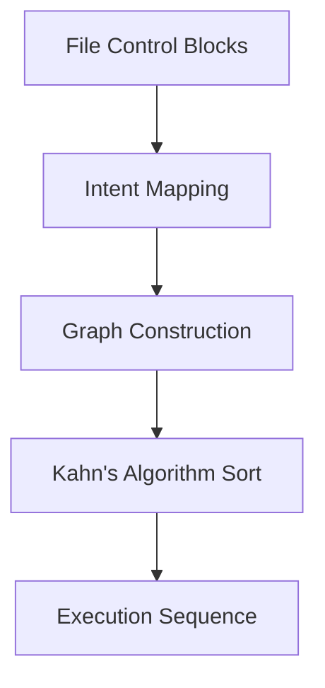

# DAG Architect (Data Lineage)

> **File Reference:** [`gitgalaxy/tools/cobol_to_cobol/cobol_dag_architect.py`](file:///home/joe/nyx_projects/gitgalaxy/gitgalaxy/tools/cobol_to_cobol/cobol_dag_architect.py)

## Engineering Summary
This subsystem constructs a Directed Acyclic Graph (DAG) to model data flow across procedural programs. It solves the problem of understanding implicit execution orders in batch environments driven by dataset dependencies. It exists to provide a deterministic sequence for executing legacy jobs or migrating data. Within GitGalaxy, it serves as the core mapping engine for macro-level architectural views.

## Purpose
To parse structural source declarations, map Input/Output data flows across COBOL programs, and compute a deterministic execution order for legacy workflows.

## Problem Being Solved
Legacy batch workflows often lack explicit orchestration scripts, relying instead on shared datasets where Program A writes to a file that Program B later reads. Determining the correct execution order requires analyzing the physical dataset read/write intent across the entire codebase.

## Design
- **Unreachable Code Masking**: Accepts a set of known dead paragraphs. Masks out dead paragraph text before parsing `OPEN` statements to prevent false dependencies.
- **Input / Output Intent Mapping**: 
  - `OPEN INPUT`: Registers dataset as a program input.
  - `OPEN OUTPUT`: Registers dataset as a program output.
  - `OPEN I-O` / `OPEN EXTEND`: Registers as both input and output.
- **Topological Sorting**: Uses Kahn's Algorithm to calculate execution ordering. Computes in-degrees, enqueues zero-dependency programs, and halts upon detecting circular dataset dependencies, isolating deadlocked nodes for review.

## Pipeline Integration
**Inputs received:** Parsed file control blocks, `OPEN` statements, and dead code metadata from static analysis.
**Outputs produced:** Directed Acyclic Graph (DAG) of data dependencies and a sorted execution sequence.
**Dependencies:** Upstream dead code analyzer; downstream batch scheduling or visualization tools.

## Tradeoffs
- Masking dead code using whitespace replacement instead of AST pruning. Chosen because it preserves original line numbers and character offsets for downstream reporting, sacrificing minor memory overhead for mapping accuracy.

## Limitations
- Dynamic file assignments (where the dataset name is resolved at runtime via variables) cannot be statically mapped and are omitted from the DAG.

## Performance Notes
Kahn's Algorithm executes in $O(V + E)$ time, where $V$ is the number of programs and $E$ is the number of dataset dependencies, ensuring rapid resolution even for extensive enterprise architectures.

## Future Work
- Integration of symbolic execution to partially resolve dynamic dataset assignments at runtime.

## Related Components
- `cobol_refractor_controller.py`
- `cobol_etl_unpacker.py`
