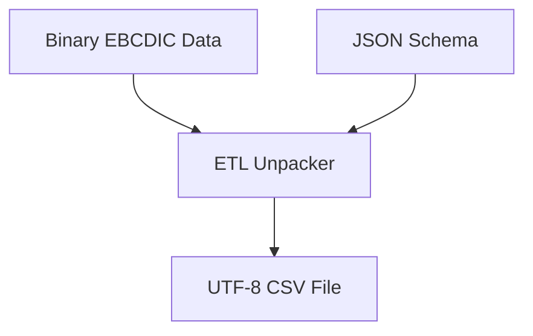

# ETL Unpacker (EBCDIC to CSV)

> **File Reference:** [`gitgalaxy/tools/cobol_to_cobol/cobol_etl_unpacker.py`](file:///home/joe/nyx_projects/gitgalaxy/gitgalaxy/tools/cobol_to_cobol/cobol_etl_unpacker.py)

## Engineering Summary
This subsystem translates raw legacy binary data into standard character-delimited formats. It solves the problem of migrating fixed-width, non-delimited mainframe datasets encoded in EBCDIC and COMP-3 into modern relational databases. It exists to decouple data migration from application logic execution. In GitGalaxy, this tool enables the seamless transition of legacy state to cloud-native data stores.

## Purpose
To convert raw EBCDIC binary byte streams into UTF-8 CSV files by parsing Packed Decimal (COMP-3) and Zoned Decimal fields using layout metadata.

## Problem Being Solved
Mainframe binary datasets lack row delimiters (newlines) and utilize specialized encodings (EBCDIC) and compression (Packed Decimal). These formats cannot be natively read by modern database import utilities.

## Design
- **Schema-Driven Byte Slicing**: Reads GitGalaxy JSON Schema (`_schema.json`) to calculate exact field byte boundaries based on `PIC` clauses. Slices incoming binary streams row-by-row based on calculated `record_length`.
- **Packed Decimal (COMP-3) Decoding**: 
  - Calculates physical footprint using `ceil((digits + 1) / 2)`.
  - Inspects final nibble for sign (`D`/`B` negative; `C`/`A`/`F`/`E` positive).
  - Divides integer by `10^decimals` according to schema scale.
- **EBCDIC Encoding Conversion**: Decodes alphanumeric text and Zoned Decimal numbers to UTF-8 using the IBM US EBCDIC code page (`cp037`), preserving special characters.

## Pipeline Integration
**Inputs received:** Raw mainframe binary datasets and GitGalaxy JSON schemas.
**Outputs produced:** UTF-8 encoded CSV files.
**Dependencies:** Upstream static analysis (schema generator); downstream database ingestion pipelines.

## Tradeoffs
- Decoding entirely in memory row-by-row instead of utilizing native database extensions. Chosen to maximize portability across target database engines, sacrificing raw ingestion speed for platform independence.

## Limitations
- Only supports standard IBM `cp037` encoding; international EBCDIC code pages require manual configuration.
- Does not automatically resolve nested OCCURS DEPENDING ON (variable length records) without explicit length headers.

## Performance Notes
Processing is $O(N)$ relative to dataset size. Stream-based processing ensures memory consumption remains flat ($O(1)$) regardless of the total file size.

## Future Work
- Implementation of variable-length record decoding using dynamic schema resolution.

## Related Components
- `cobol_refractor_controller.py`
- `cobol_to_java_controller.py`
