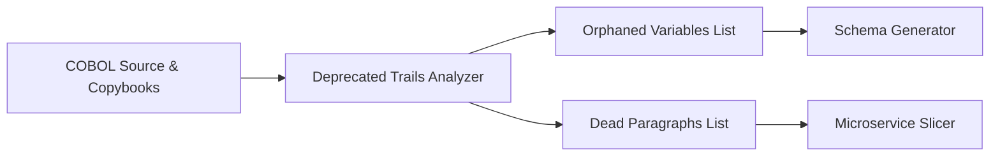

# Dead Code & Unused Data Analysis

> **File Reference:** [gitgalaxy/tools/cobol_to_cobol/cobol_graveyard_finder.py](file:///home/joe/nyx_projects/gitgalaxy/gitgalaxy/tools/cobol_to_cobol/cobol_graveyard_finder.py)

## Engineering Summary
This subsystem performs static analysis on COBOL source files to isolate unused variable declarations in memory and unreachable execution logic in control flow. It solves the problem of legacy code bloat by preventing the propagation of unused data structures and dead paragraphs into modern systems. It exists to reduce the footprint of generated databases and microservices during migration. Within the larger migration pipeline, it acts as a filter prior to schema and service generation. This subsystem is known as the Deprecated Trails Analyzer.

## Purpose
The purpose of this component is to identify and flag orphaned memory variables and dead procedural logic blocks within COBOL programs, calculating estimated Lines of Code (LOC) saved.

## Problem Being Solved
Legacy COBOL systems accumulate unused variables and unreachable paragraphs over time. If migrated blindly, these dead elements generate unnecessary database columns and redundant microservice endpoints, increasing memory footprint, cognitive load, and maintenance costs. 

## Design
### Current Behavior
Before performing static analysis, copybook files (`.cpy`) are expanded inline to obtain the full execution context. It recursively searches for `COPY` statements (up to 3 nesting levels deep) and injects target copybooks. It parses `REPLACING ==OLD== BY ==NEW==` clauses, performing word-boundary regex substitutions (`re.sub` with negative lookarounds) so the expanded source matches compiled behavior.

**Phase 1: Unused Memory Variable Analysis**
The analyzer splits the COBOL program at the `PROCEDURE DIVISION`. It scans the `DATA DIVISION` for variable declarations (level numbers `01` through `49`, `77`, and `88`), filtering structural noise like `FILLER`. It performs word-boundary regex scans against the `PROCEDURE DIVISION` to check if declared variables are ever referenced. Unreferenced variables are flagged as orphaned memory.

**Phase 2: Unreachable Execution Logic Analysis**
The analyzer evaluates control flow topology to identify dead code blocks. It scans the `PROCEDURE DIVISION` to record all declared paragraph headers (`^[ \t]{0,11}([A-Z0-9\-]+)\.`). It designates the first paragraph as the main execution entry point. It maps all reachable targets by scanning for explicit transfer-of-control statements (`PERFORM` and `GO TO`). Declared paragraphs not reachable from the entry point or jump statements are flagged as unreachable logic (excluding common loop exit labels like `*-EXIT`). It calculates estimated LOC saved: `(dead_paragraphs * 10) + orphaned_variables`.

## Pipeline Integration
**Inputs received:** COBOL source files (`.cbl`, `.cob`) and external copybook files (`.cpy`).
**Outputs produced:** Lists of orphaned variables and unreachable paragraphs, along with an estimated LOC reduction metric.
**Dependencies:** Upstream relies on raw COBOL code availability; downstream schema generators and microservice slicers depend on its outputs to omit unused elements.

## Tradeoffs
We chose to use regular expressions and textual substitution for copybook expansion instead of a full abstract syntax tree (AST) parse. This choice was made because it is faster and sufficient for locating explicit textual references in variable usage analysis. The rejected alternative was building a complete COBOL AST for all legacy dialects, which is computationally expensive and difficult to maintain. The sacrifice is that highly complex macro expansions might be missed if they defy standard `REPLACING` patterns.

## Limitations
* Recursive copybook expansion is strictly limited to 3 nesting levels deep.
* The LOC saved calculation relies on a simple heuristic `(dead_paragraphs * 10) + orphaned_variables` rather than counting actual lines inside the dead paragraphs.
* It may falsely flag dynamically referenced code if control flow relies on indirect or obscure jump mechanics unsupported by explicit `PERFORM` or `GO TO` scans.

## Performance Notes
The subsystem uses word-boundary regex (`re.sub`) with negative lookarounds for variable substitution, which allows for fast processing of large files by avoiding line-by-line manual string traversal. Processing time is proportional to the size of the `PROCEDURE DIVISION` and the number of declared variables.

## Future Work
* **Planned Improvements:** Increase the copybook nesting depth limit dynamically based on system memory.
* Replace the heuristic LOC calculation with an exact line-counting mechanism for unreachable paragraphs.

## Related Components
* [Schema Generator](05-15-cloud-schema-forge.md)
* [Microservice Slicer](05-14-microservice-slicer.md)
