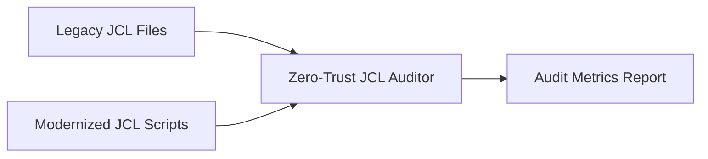

# JCL Security & Reduction Auditor

> **File Reference:** [gitgalaxy/tools/cobol_to_cobol/cobol_jcl_auditor.py](file:///home/joe/nyx_projects/gitgalaxy/gitgalaxy/tools/cobol_to_cobol/cobol_jcl_auditor.py)

## Engineering Summary
This subsystem acts as a verification tool that compares generated, program-specific Job Control Language (JCL) scripts against legacy IBM JCL files. It solves the problem of verifying the effectiveness and security posture of newly generated execution scripts by quantifying code bloat reduction and measuring the elimination of over-permissioned I/O access boundaries. It exists to provide measurable proof that the modernized JCL scripts enforce least privilege. It fits into GitGalaxy as the final audit step in the JCL modernization pipeline. This subsystem is known as the Zero-Trust JCL Auditor.

## Purpose
The purpose of this component is to audit and calculate security and reduction metrics by mapping legacy JCL scripts to modernized scripts and evaluating changes in dataset allocations and line counts.

## Problem Being Solved
Legacy mainframe environments often retain multi-step or redundant JCL scripts that execute identical COBOL programs with broad, over-permissioned file access rights. This introduces security risks and excessive code bloat. A verification mechanism is required to ensure modernized scripts successfully eliminate these excesses.

## Design
### Current Behavior
**Intent Parsing & Legacy Script Mapping**
The auditor scans legacy JCL files (`.jcl`, `.txt`) and groups them by their target binary (`EXEC PGM=`). When multiple legacy scripts reference the same executable, it designates the largest script (highest line count and dataset allocations) as the baseline for audit comparison. It ignores standard IBM system programs (e.g., `IEFBR14`, `IDCAMS`, `IEBGENER`, `IGYCRCTL`) and system data definitions (e.g., `STEPLIB`, `SYSOUT`, `SYSPRINT`, `SYSUDUMP`, `SYSIN`) to focus exclusively on application data definitions.

**Security & Reduction Metrics Calculation**
The auditor compares baseline legacy metrics against modernized JCL files. It calculates `bloat_reduction_pct` by measuring the net reduction in lines of code achieved by replacing multi-step legacy jobs with focused, single-program scripts. It calculates `excess_dds_blocked` by evaluating datasets defined in legacy JCLs that are omitted from modernized execution scripts. For example, if a legacy JCL allocated 15 datasets but static analysis proves the COBOL program only accesses 3, the 12 unreferenced datasets are flagged as blocked excess permissions. The results are output as a structured CLI report or as raw JSON (`--json`).

## Pipeline Integration
**Inputs received:** Legacy JCL files and newly generated modernized JCL scripts.
**Outputs produced:** Security and reduction metrics (code bloat reduction percentage, excess data definitions blocked) in CLI or JSON format.
**Dependencies:** Upstream depends on the output of the Job Control Language (JCL) Generator. Downstream is consumed by automated integration testing pipelines or developers.

## Tradeoffs
The design chooses to select the largest legacy JCL script (highest line count and allocations) as the baseline when multiple scripts reference the same executable. This choice was made to calculate the maximum potential reduction and security improvement. The rejected alternative was averaging the metrics across all legacy scripts, which would dilute the security findings. The sacrifice is that the baseline might represent a rare batch job rather than the typical execution, slightly skewing typical bloat metrics.

## Limitations
* The auditor relies purely on static comparison of data definitions and line counts; it does not trace dynamic runtime allocations.
* It assumes the largest legacy script is the most appropriate baseline, which may not always align with actual business importance.

## Performance Notes
Grouping execution scripts by `EXEC PGM=` is highly efficient, utilizing single-pass string matching rather than complex parsing logic, allowing rapid processing of large batches of legacy job definitions.

## Future Work
* **Planned Improvements:** Add support for tracking parameter substitutions and condition codes (`COND=`) across legacy job steps.
* Integrate with runtime execution logs to identify datasets that are allocated but never opened.

## Related Components
* [Job Control Language (JCL) Generator](05-12-zero-trust-jcl-forge.md)
