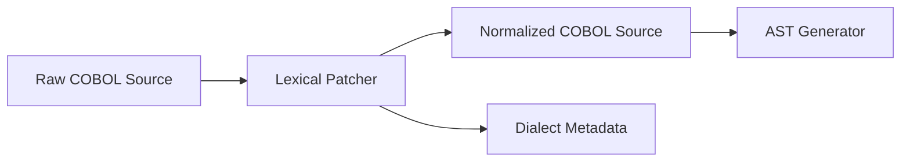

# Lexical Control Flow Preprocessor

> **File Reference:** [gitgalaxy/tools/cobol_to_cobol/cobol_lexical_patcher.py](file:///home/joe/nyx_projects/gitgalaxy/gitgalaxy/tools/cobol_to_cobol/cobol_lexical_patcher.py)

## Engineering Summary
This subsystem is a source code preprocessor that identifies legacy control flow constructs and safely refactors them into explicit scope terminators prior to Abstract Syntax Tree (AST) parsing or static analysis. It solves the problem of implicit jump mechanics disrupting modern code parsers. It exists to ensure stable control flow graphs can be extracted from legacy COBOL. Within GitGalaxy, it acts as an immediate preprocessing step on source code before deeper static analysis tools are invoked. This subsystem is known as the Lexical Patcher.

## Purpose
The purpose of this component is to detect the COBOL dialect of a source file and safely remediate problematic lexical anomalies, such as `NEXT SENTENCE`, into predictable structures.

## Problem Being Solved
Legacy constructs like `NEXT SENTENCE` skip execution forward to the statement following the next period (`.`), creating implicit control flow branches. These implicit branches complicate static dependency extraction, break modern code parsers, and hinder accurate AST generation.

## Design
### Current Behavior
**Compiler Dialect Detection**
Because altering legacy source code can introduce incompatibilities, the patcher includes a dialect sensor (`detect_cobol_dialect`). It scans for COBOL-85 features such as `EVALUATE`, `INITIALIZE`, explicit scope terminators (`END-IF`, `END-PERFORM`, `END-READ`, `END-EVALUATE`, `CONTINUE`), or inline comments (`*>`). It classifies the source file as `COBOL-85` (modern dialect) or `COBOL-74` (legacy dialect) to govern transformation safety.

**Control Flow Refactoring**
The `patch_lexical_traps` function remediates the `NEXT SENTENCE` directive. In COBOL-85 mode, it refactors `NEXT SENTENCE` into a block-scoped `CONTINUE` statement and inserts an inline tracking comment (`CONTINUE *> GitGalaxy Patch: Neutralized Flow Control Anomaly`). In COBOL-74 mode, it leaves the `NEXT SENTENCE` syntax intact to preserve strict compiler compatibility, but standardizes surrounding whitespace to ensure predictable parsing by downstream extraction engines.

## Pipeline Integration
**Inputs received:** Raw COBOL source files.
**Outputs produced:** Preprocessed, structurally normalized COBOL source code and dialect classification metadata.
**Dependencies:** Upstream consumes source files directly from the repository. Downstream AST generators and static analyzers depend on its clean output.

## Tradeoffs
The design chooses to implement dialect-specific transformation modes (COBOL-74 vs COBOL-85). This choice was made to guarantee compiler compatibility for older systems. The rejected alternative was to forcefully upgrade all `NEXT SENTENCE` constructs to `CONTINUE`, which was sacrificed because older COBOL-74 compilers lack support for `CONTINUE` and would fail to compile the patched code. 

## Limitations
* The dialect sensor relies on simple heuristic feature scanning and may misclassify files that lack distinct dialect markers.
* It currently only addresses `NEXT SENTENCE` anomalies and does not refactor implicit `GO TO` branches outside of period boundaries.

## Performance Notes
Dialect detection and string substitution are executed using lightweight regular expressions in memory, operating extremely quickly without requiring an initial syntactic parsing pass.

## Future Work
* **Planned Improvements:** Expand the patcher to automatically inject explicit terminators (e.g., `END-IF`) into legacy nested `IF` statements.
* Improve the dialect sensor with a probabilistic classifier for edge-case files.

## Related Components
* [Deprecated Trails Analyzer](05-10-graveyard-reaper.md)
