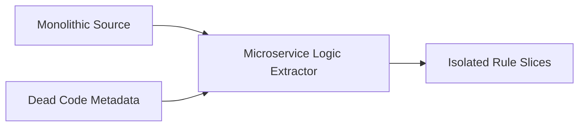

# Microservice Business Logic Extractor

> **File Reference:** [gitgalaxy/tools/cobol_to_cobol/cobol_microservice_slicer.py](https://github.com/squid-protocol/gitgalaxy/blob/main/gitgalaxy/tools/cobol_to_cobol/cobol_microservice_slicer.py)

## Engineering Summary
This subsystem isolates specific business rules from monolithic procedural programs by recursively tracking a target variable through data assignment and computation statements. It solves the problem of disentangling core business logic from tangled legacy monoliths. It exists to enable automated microservice refactoring by creating isolated rule slices. Within the GitGalaxy pipeline, it acts as the primary extraction engine after static analysis and dead code filtering are complete. This subsystem is known as the Microservice Logic Extractor.

## Purpose
The purpose of this component is to generate executable rule slices by identifying all statements relevant to a given target variable, while masking out dead code and unrelated logic.

## Problem Being Solved
Legacy monoliths heavily mix business rules, data access, and presentation logic across thousands of lines of procedural code. Manually extracting a single business rule (like a tax calculation) is extremely error-prone due to deep multi-level variable aliasing and data passing.

## Design
### Current Behavior
**Recursive Data Flow Taint Tracking**
The extractor maps dependencies using multi-pass taint tracking via the `slice_business_logic` function. It scans procedural statements for assignments (`MOVE`, `ADD`, `SUBTRACT`). If a tainted variable interacts with another variable, the second variable is added to the tainted set. It parses `COMPUTE` statements; if the target variable appears on either side of the assignment, all participating variables are added to the alias set. It executes multiple passes (default: 3 passes) over the procedural lines to capture multi-level variable aliasing.

**Control Flow Context & Dead Code Filtering**
The extractor enforces boundary constraints by integrating with dead code analysis results (`dead_paras` and `orphaned_vars`). It aborts immediately (`ORPHANED_MEMORY`) if the target variable is flagged as dead memory. During taint tracking and code extraction, statements contained within unreachable paragraphs (`dead_paras`) are ignored to prevent dead code from generating false-positive variable associations. It isolates and returns executable statements referencing any tainted variable, paired with line numbers and paragraph names.

## Pipeline Integration
**Inputs received:** Target variable, monolithic procedural code, dead paragraphs list, and orphaned variables list.
**Outputs produced:** Isolated business rule slices containing executable statements and metadata.
**Dependencies:** Upstream relies on the Deprecated Trails Analyzer for dead code filtering. Downstream microservice generators depend on the cleanly sliced business logic.

## Tradeoffs
The design chooses a default of 3 passes for taint tracking iteration rather than full exhaustive recursion. This choice balances extraction accuracy with processing speed to prevent infinite loops in cyclic dependencies. The rejected alternative was full exhaustive traversal until no new aliases are found. The sacrifice is that deep recursive business rules (greater than 3 levels of aliasing) might not be fully extracted.

## Limitations
* The maximum alias tracking depth is limited by the configured number of passes.
* Implicit data aliasing via shared memory overlaps (e.g., `REDEFINES` clauses) is not currently tracked by the regex-based taint engine.

## Performance Notes
Utilizing a bounded multi-pass text scanning approach avoids the exponential time complexity of full graph traversal on massive monolithic files, providing deterministic execution times proportional to file size.

## Future Work
* **Planned Improvements:** Integrate memory overlap tracking for `REDEFINES` clauses.
* Support extraction based on complex conditional targets rather than single variables.

## Related Components
* [Deprecated Trails Analyzer](05-10-graveyard-reaper.md)
