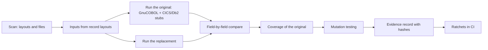

# The Equivalence Harness

> **File Reference:** [`tests/tools/equivalence.py`](https://github.com/squid-protocol/gitgalaxy/blob/main/tests/tools/equivalence.py) · [`equivalence_inputs.py`](https://github.com/squid-protocol/gitgalaxy/blob/main/tests/tools/equivalence_inputs.py) · [`equivalence_cics.py`](https://github.com/squid-protocol/gitgalaxy/blob/main/tests/tools/equivalence_cics.py) · [cases](https://github.com/squid-protocol/gitgalaxy/tree/main/tests/equivalence)

## Engineering Summary
The equivalence harness answers one question about a translated program: does it do what the original did? It does not ask anyone to write expected values. It runs the original COBOL, records what it produced, runs the replacement on the same inputs, and compares the two field by field. This is golden-master (back-to-back) testing: **the original program's recorded outputs are the answer key.**

What it checks is that the replacement agrees with the original on the inputs the harness tried. It does not show the original was right, and it does not try every input. The [limits](#honest-limits) are listed below, next to what is built and what is only planned.

[Proven COBOL-to-Java Ports](05-19-proven-cobol-to-java-ports.md) covers how GitGalaxy's own ports are written and what is proven so far. The [Batch Test Harness](05-06-batch-test-harness.md) checks that generated Java compiles. This page covers the harness itself, the three ways to use it, and where it stops. Commands to run it are in the [cookbook](cookbook/cobol-equivalence-testing.md).

## The pipeline

1. **Scan.** The engine already knows each program's facts: the record layouts behind every copybook (PICTURE, USAGE, offset, OCCURS, REDEFINES), which datasets and CICS files the program opens, and how they are keyed. The harness reads these rather than a hand-written list. A command it does not know stops the run with its name.
2. **Inputs from exact record layouts.** A case lists each dataset. A dataset may name a shipped data file, or say `"input": "@generate"` ([#3804](https://github.com/squid-protocol/gitgalaxy/issues/3804)) and have records built from its copybook. Generation is seeded, so a run can be reproduced exactly. Each field gets values chosen for its storage: zero, one, the PICTURE's maximum and negative, the smallest fraction at its scale, exact halves (where ROUNDED modes differ), full-width and blank text, valid dates. Keys are unique and loaded in key order, as a VSAM KSDS is. A field can be drawn from another file's values, so a join sometimes finds its row and, with `miss`, sometimes does not. For CICS, COMMAREA and screen input are generated the same way, including non-numeric input for numeric fields (landing with [PR #4492](https://github.com/squid-protocol/gitgalaxy/pull/4492)).
3. **Run the original.** GnuCOBOL 3.1.2 in IBM mode (`-std=ibm -fsign=EBCDIC`), in a container. Batch programs run under a generated driver with the JCL PARM and a pinned clock. CICS programs have their `EXEC CICS` translated into calls to a stub runtime. Db2 programs run against IBM Db2 Community Edition in a container. Services such as Language Environment are models limited to documented behaviour. Each run's outputs are recorded.
4. **Run the replacement.** The Java port runs in a generated JUnit test, with inputs loaded through the generated record codecs. A CICS port is run twice: through `runTask`, and again through the Spring facade a deployment would call (`handleTransaction` or `handleLink`).
5. **Compare field by field.** Records are paired in order (a KSDS in key order). Every field in the copybook layout is compared: numerics as exact decimals, everything else byte for byte. Also compared: the return code or abend, every DISPLAY line, every CICS event in order (screen text and cursor, SEND TEXT, RETURN or XCTL with its COMMAREA, LINK, abend), every USING item of a CALL, and every Db2 table row. Fault runs inject the same file status or CICS response at the same statement on both sides.
6. **Coverage.** Which paragraphs and branches of the original the runs exercised ([`cobol_coverage`](https://github.com/squid-protocol/gitgalaxy/blob/main/tests/tools/cobol_coverage.py)). The uncovered ones are listed by line.
7. **Mutation testing.** [`mutation.py`](https://github.com/squid-protocol/gitgalaxy/blob/main/docs/language_status/mutation_testing.md) breaks the port one small change at a time and proves each broken port. A broken port the proof still calls equivalent shows a place the inputs never look.
8. **Evidence record.** One JSON file per case holds the verdict, counts, coverage, mutation score and the oracle's compiler and image, with sha256 digests of the port, case, corpus, harness, oracle models and generator. Whether a record is current is [computed from the tree, never stored](https://github.com/squid-protocol/gitgalaxy/blob/main/docs/language_status/evidence_records.md): change an input and the record reads "stale". Only a person writes an approval.
9. **Ratchets.** A number or a status that may only get better, enforced in CI. A record gone stale after a change to its port or case fails CI; `proof_sweep.py` exits 1 if an unexpected case is unproven, or if a listed unproven case now proves; `det_sweep_baseline.json` lists each unproven case with its reason and issue.

## Worked example: CardDemo account view (COACTVWC)

COACTVWC is the CICS transaction CAVW in AWS CardDemo. It takes an account number from a screen, reads the account, card cross-reference and customer files, and paints the details, or an error message.

- **Scan:** the engine supplies the layouts (`CVACT01Y`, `CVCUS01Y`, `CVACT03Y`, the BMS copybook for the screen, `COCOM01Y` for the COMMAREA) and the three VSAM files with their keys.
- **Case** ([`carddemo-acctview/case.json`](https://github.com/squid-protocol/gitgalaxy/blob/main/tests/equivalence/carddemo-acctview/case.json)): the datasets, the COMMAREA layout, the screen, and 20 named scenarios: enter from the menu, view an account, account not on file, account not numeric, a blank or `*` account id, PF3 back to the menu, a file not open, an I/O error on the account file, customer not found, and so on. Six more runs inject file conditions.
- **Run:** each scenario is one CICS task. The task runs under GnuCOBOL against the stub runtime and again as Java, and the events are compared. Each of the 20 scenarios also runs through the `handleTransaction` facade.
- **Result** (from the committed [evidence record](https://github.com/squid-protocol/gitgalaxy/blob/generated/docs/language_status/evidence/carddemo-acctview.md)): proven on 20 runs and 6 fault runs, with the facade side 20 of 20. The COBOL's coverage is 31 of 32 live paragraphs and 58 of 71 branches. Mutation testing of the port: 328 mutants, 150 sampled, 105 killed and 24 survived; 8 of the survivors are gaps in the case. The record names the oracle (`cobc` 3.1.2.0 in the pinned image) and carries the digests.

This case is hand-written and runs on CardDemo's shipped data plus a few appended rows. A generated version, `carddemo-acctview-generated` (24 generated scenarios), lands with [PR #4492](https://github.com/squid-protocol/gitgalaxy/pull/4492). Its first run found a real difference: the port parses the card number as a Java `long`, which COBOL's `MOVE X(16) TO 9(16)` does not require ([#4491](https://github.com/squid-protocol/gitgalaxy/issues/4491)).

## Three uses

### 1. Verify any vendor's migration
The harness is not tied to GitGalaxy's own translator. Any replacement can be checked against the original's recorded outputs. What it needs from a vendor:

- **The replacement callable once per transaction or step.** The harness feeds one scenario in and reads that scenario's results out, so the vendor's system must be drivable that way.
- **An adapter per interface.** A batch program's datasets, a CICS transaction's COMMAREA and screens, a CALL's arguments, a Db2 table, each need a small piece of code that puts the harness's input in and reads the output back in the harness's form. Today the only adapters are for GitGalaxy's generated Java (JUnit, `runTask`, the facades). An adapter for another vendor's system is work still to be done.
- **The original running here**, or captured outputs from it ([#4050](https://github.com/squid-protocol/gitgalaxy/issues/4050), not built).

When a vendor's difference is intended, for example EBCDIC text becoming UTF-8, the planned way to say so is a declared difference, approved by a named person and listed in the record ([#4051](https://github.com/squid-protocol/gitgalaxy/issues/4051), not built). Until then an intended difference fails the proof.

### 2. Regression and drift for in-place changes (PLANNED, [#4513](https://github.com/squid-protocol/gitgalaxy/issues/4513))
The same generated scenarios can guard a COBOL program that stays on the mainframe. The original's outputs become an approved baseline. After each change, scenarios re-run, and any changed output is flagged with its scenario and field. A person approves intended differences, scoped, built on #4051. Anything unapproved fails. **None of this exists yet.** It would show that behaviour is unchanged, not that it is correct: existing bugs are baselined too.

### 3. Audit evidence
The evidence record is made to be handed over with the port. It states what was run (counts, coverage, mutation score), against which exact inputs (digests), by which oracle (compiler, package, image id), and whether that is still current. It holds no data records, so it can be shared without the data. The diffs stay in the run's `report.json`. Approvals are a separate append-only list that only a person writes.

## Honest limits

- **The answer key is GnuCOBOL with stubs, not z/OS.** The oracle is GnuCOBOL 3.1.2, a model of CICS, models of IBM services and Db2 for Linux. Known or suspected differences from z/OS are in the [oracle-assumptions register](https://github.com/squid-protocol/gitgalaxy/blob/main/docs/language_status/oracle_assumptions.md): for example text compares in ASCII order, not EBCDIC (D1), and a POINTER is 8 bytes here and 4 on z/OS (C9). Using output captured on z/OS as the answer key is [#4050](https://github.com/squid-protocol/gitgalaxy/issues/4050), not built.
- **It proves equivalence on the inputs tried, not on all inputs.** "Proven" means the replacement matched on the runs the case made. Generated inputs widen the set but are still a finite set.
- **Coverage % means branches exercised.** It counts how many of the original's branches the runs reached. It does not say the reached branches were checked against the right behaviour, and the uncovered branches stay listed. In the account-view example, 13 of 71 branches are not reached.
- **It checks field formats, not business rules.** Generated values come from PICTUREs: edge values, valid dates, keys that join. A rule such as "a balance equals the sum of its transactions" or a status transition across several steps is not generated. A `from` join draws from one field only. Such rules need a hand-written scenario.
- **No generated Db2, MQ or IMS inputs yet.** Db2 cases run on hand-written rows. MQ, IMS segments, TS and TD queues, GDGs and variable-length files are not generated. Some layouts cannot be generated yet either (REDEFINES chosen by another field, RENAMES, SYNC). A run that cannot proceed says why; the plan to report each blocker as a fix is [#4493](https://github.com/squid-protocol/gitgalaxy/issues/4493).
- **Language support beyond COBOL** is tracked in [#4515](https://github.com/squid-protocol/gitgalaxy/issues/4515), and the migration parts beyond program logic (data, job streams, interfaces, performance, security, cutover) in [#4514](https://github.com/squid-protocol/gitgalaxy/issues/4514).
- **Some cases are not proven.** Each is listed with its cause in `det_sweep_baseline.json` and `proof_sweep.py`. For example the generated INTCALC case proves on its hand-written port, but its det port is listed unproven because the generated keys mix letters and digits and ASCII and EBCDIC order pick different records (D1).
- **A person approves every port.** No tool marks one approved.

### Languages beyond COBOL

Layout-driven input generation reads a COBOL copybook. For the other mainframe languages GitGalaxy scans, this is where each stands.

| Language | Layout-driven input generation | Issue |
|---|---|---|
| COBOL (batch, CICS, CALL, Db2 embedded) | Supported | this page |
| BMS maps | Not yet | [#4506](https://github.com/squid-protocol/gitgalaxy/issues/4506) |
| DB2 SQL | Not yet | [#4507](https://github.com/squid-protocol/gitgalaxy/issues/4507) |
| JCL job streams | Not yet | [#4508](https://github.com/squid-protocol/gitgalaxy/issues/4508) |
| PL/I | Not yet | [#4509](https://github.com/squid-protocol/gitgalaxy/issues/4509) |
| HLASM (assembler) | Not yet | [#4510](https://github.com/squid-protocol/gitgalaxy/issues/4510) |
| REXX | Not yet | [#4511](https://github.com/squid-protocol/gitgalaxy/issues/4511) |
| Easytrieve | Not yet | [#4512](https://github.com/squid-protocol/gitgalaxy/issues/4512) |

Per [#4515](https://github.com/squid-protocol/gitgalaxy/issues/4515), captured z/OS output ([#4050](https://github.com/squid-protocol/gitgalaxy/issues/4050)) is the only practical runner for PL/I, HLASM and Easytrieve.

## Further reading
- [Cookbook: COBOL equivalence testing](cookbook/cobol-equivalence-testing.md)
- [Proven COBOL-to-Java Ports](05-19-proven-cobol-to-java-ports.md)
- [Evidence records](https://github.com/squid-protocol/gitgalaxy/blob/main/docs/language_status/evidence_records.md) and [mutation testing](https://github.com/squid-protocol/gitgalaxy/blob/main/docs/language_status/mutation_testing.md)
- [Oracle assumptions](https://github.com/squid-protocol/gitgalaxy/blob/main/docs/language_status/oracle_assumptions.md)
