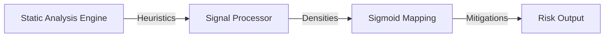

# Cognitive Load Exposure

> **File Reference:** [`gitgalaxy/metrics/signal_processor.py`](https://github.com/squid-protocol/gitgalaxy/blob/main/gitgalaxy/metrics/signal_processor.py)
>
> **Metric:** Density of Decision-Making & Logic Complexity
>
> **Summary:** Measures the mental overhead required for a developer to understand a source file. Unlike raw line count (which measures volume), Cognitive Load evaluates decision density, state mutations, temporal complexity, reflection, and unsafe execution markers per line of code. High cognitive load highlights complex or tangled logic requiring focus, while clear documentation acts as a mitigating factor.
>
> **Effect:** Maps directly to the GitGalaxy Universal Risk Spectrum, scaling from 🟦 **Deep Blue** (linear, straightforward code) to 🟥 **Intense Red** (dense, multi-state async logic).

## Engineering Summary
This subsystem calculates the mental overhead required for developers to comprehend a given source file. It solves the problem of misidentifying codebase maintainability by moving beyond raw line counts, which only measure code volume, to quantify the actual density of logic. The subsystem exists to highlight tangled control flows, state mutations, and temporal complexities that slow down developer velocity and increase the likelihood of defects. By synthesizing these factors into a single metric, this system fits into the broader risk assessment pipeline of GitGalaxy.

## Purpose
To evaluate the density of decision-making and logic complexity within source files and map this density to a universal risk spectrum, enabling engineering teams to identify components that require refactoring or additional documentation to reduce developer friction.

## Problem Being Solved
Human working memory has finite capacity. When reading source code, nested conditionals, dynamic state mutations, concurrency, and reflection require developers to mentally track multiple states simultaneously. Traditional metrics like Lines of Code (LOC) fail to capture this mental friction.

## Design
The calculation processes heuristic counts from static analysis and weights them based on mental tax:
- **Decision Density:** Baseline conditional branching (`if`/`else`, `switch`). Clamped to 0.5/line to handle flat switch blocks smoothly.
- **State Flux:** Variable mutations and state reassignment.
- **Temporal Complexity:** Asynchronous code and non-linear control flows.
- **Abstraction Penalty:** Dynamic dispatch, reflection, and metaprogramming.
- **Unsafe Operations:** Unsafe memory access or dynamic code execution.

**Mathematical Formulation**
1. **Calculate Clamped Line Densities:**
$$\text{BranchDensity} = \min\left(\frac{\text{branch}}{\text{LOC}}, 0.5\right)$$
$$\text{FluxDensity} = \min\left(\frac{\text{state\_mutation}}{\text{LOC}} \times 2.0, 0.75\right)$$

2. **Sum Heavy Logic & Apply Gini Coefficient:**
$$\text{HeavyLogic} = (\text{concurrency} \times 3.0) + (\text{reflection} \times 5.0) + (\text{unsafe} \times 5.0)$$
$$\text{TotalDensity} = \left(\text{BranchDensity} + \text{FluxDensity} + \frac{\text{HeavyLogic}}{\text{LOC}} + \frac{Irc}{\text{LOC}}\right) \times \text{GiniMultiplier}$$

3. **Map Through Sigmoid Curve:**
$$\text{RawScore} = \frac{100}{1 + e^{-4.0 \times (\text{TotalDensity} - 0.75)}}$$

4. **Apply Documentation Mitigation & Path Modifier:**
$$\text{DocCoverage} = \frac{\text{doc} \times 10.0}{\text{LOC}}$$
$$\text{CoolingFactor} = \max\left(0.5, 1.0 - (\text{DocCoverage} \times Fc)\right)$$
$$\text{FinalScore} = \min(\text{RawScore} \times \text{CoolingFactor} \times Mp, 100)$$

## Pipeline Integration

- **Inputs received:** Pre-calculated heuristic counts (branching, state mutations, concurrency, reflection, unsafe code, documentation) and environmental parameters.
- **Outputs produced:** A normalized cognitive load score (0-100).
- **Dependencies:** Relies upstream on the static analysis engine for token counts and downstream on the GitGalaxy reporting dashboard.

## Tradeoffs
- A logistic Sigmoid function was chosen for scoring to smoothly cap extreme outliers, sacrificing linear granularity at the high end for stable bounding.
- Documentation is treated as a mitigating factor (up to 50% reduction). This choice assumes documentation accurately reflects the code, which risks masking overly complex logic with outdated comments.
- Heuristic weights are statically defined rather than dynamically learned, prioritizing predictable and explainable scores over machine-learning adaptability.

## Limitations
- Does not semantically understand the quality of documentation, only its presence and structure.
- Highly nested code that uses functional paradigms without explicit state mutations may be under-penalized.
- Assumes explicit languages (e.g., Java) have more trustworthy documentation than implicit languages (e.g., Shell), which may not hold true for every project.
- Heuristics are clamped (e.g., 0.5 per line for branches) to handle anomalies like flat switch blocks, which may artificially lower the score for exceptionally dense single-line logic.

## Performance Notes
The calculation uses $O(1)$ arithmetic operations per file once the static analysis heuristics are provided, making the scoring process extremely fast and suitable for large-scale continuous integration pipelines. It avoids complex AST traversal during this phase, relying entirely on pre-computed token counts.

## Future Work
Currently, the system relies on fixed heuristic weights and limits documentation mitigation to a maximum of 50%. Future iterations aim to incorporate semantic analysis to verify that documentation actually aligns with the underlying logic. We also plan to introduce configurable heuristic weighting to allow teams to tailor the mental tax penalty to their specific domain.

## Related Components
- Static Analysis Engine
- Path Modifier ($Mp$)
- Universal Framework Parameters ($Irc$, $Fc$)
