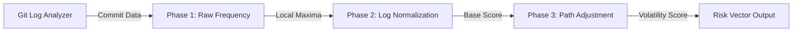

# Deep Churn (Codebase Volatility)

> **File Reference:** [`gitgalaxy/metrics/signal_processor.py`](file:///home/joe/nyx_projects/gitgalaxy/gitgalaxy/metrics/signal_processor.py)
>
> **Metric:** Relative Commit Volatility & Change Frequency
>
> **Summary:** Measures how frequently a source file is modified over time relative to the rest of the repository. Churn is auto-scaled across the codebase so that the most volatile file anchors the maximum score (100.0), and all other files are normalized logarithmically against this maximum.
>
> **Effect:** Maps directly to the GitGalaxy Universal Risk Spectrum, scaling from 🟦 **Deep Blue** (stable, rarely touched code) to 🟥 **Intense Red** (highly active hotspots).

## Engineering Summary
This subsystem measures how frequently a source file is modified over time relative to the rest of the repository. It solves the problem of raw commit counts being misleading by auto-scaling churn across the codebase. It exists to highlight highly active hotspots that may indicate architectural instability or constant bug fixing. By using a two-pass auto-scaling normalization model, it fits into the broader risk assessment pipeline of GitGalaxy.

## Purpose
To measure relative commit volatility and change frequency across the repository, identifying files undergoing frequent, intense modification relative to project history.

## Problem Being Solved
Code stability varies naturally across project types. Raw commit counts fail to capture true volatility because a rapidly evolving repository might see dozens of commits per week, whereas a stable library might average one commit per month. Using raw counts would unfairly penalize fast-moving projects and hide issues in slower ones.

## Design
The system uses a two-pass auto-scaling normalization model to measure relative volatility:
1. **Raw Commit Frequency:** Commit volume is normalized against the square root of the file's age in weeks to dampen the penalty on long-standing legacy files.
2. **Logarithmic Normalization:** The global maximum frequency ($\text{MaxFreq}$) is identified. A logarithmic transformation $\ln(1 + x)$ flattens extreme outliers and scales all scores onto a 0–100 range.
3. **Contextual Path Adjustment:** The directory Path Modifier ($Mp$) is applied.

**Mathematical Formulation**
$$\text{RawFrequency} = \frac{\text{Commits}}{\sqrt{\max(\text{AgeInWeeks}, 1.0)}}$$
$$\text{BaseScore} = \left( \frac{\ln(1 + \text{RawFrequency})}{\ln(1 + \max(\text{MaxFreq}, 1.0))} \right) \times 100.0$$
$$\text{FinalScore} = \min(\text{BaseScore} \times Mp, 100.0)$$

## Pipeline Integration

- **Inputs received:** `commit_count` (total commits modifying the file), `age_in_weeks` (file age relative to newest commit), and `max_freq` (highest raw change frequency in repo).
- **Outputs produced:** A normalized volatility score (0-100).
- **Dependencies:** Requires Git version control history upstream. Feeds downstream into the Universal Risk Spectrum dashboard.

## Tradeoffs
- Logarithmic normalization is chosen to flatten extreme outliers, which sacrifices linear differentiation at the high end but prevents a single hyper-active file from compressing the distribution of the rest of the files.
- Dampening file age using a square root rather than a linear divisor was chosen to avoid over-penalizing legacy files while still accurately highlighting recent churn spikes.
- Explicit language fidelity ($Fc$) and syntactical opacity ($Irc$) are deliberately not applied, as commit history is treated as an exact, deterministic log independent of language syntax.

## Limitations
- Only accounts for commit frequency, not commit size or semantic complexity of changes.
- Cannot distinguish between trivial formatting commits and massive architectural refactors; a file with 10 typo fixes is weighted identically to one with 10 structural redesigns.
- Highly dependent on team commit hygiene (e.g., squashed merges vs. raw commit logs).

## Performance Notes
The logarithmic transformation and square root operations execute in $O(N)$ time across all files during the post-scan phase, ensuring fast calculation. The primary performance cost is bounded by the underlying Git log extraction process.

## Future Work
Current behavior relies strictly on commit frequency. Planned improvements aim to incorporate commit size (lines added/deleted) and semantic impact into the volatility weighting to distinguish between trivial formatting and substantive logic changes. 

## Related Components
- Git Log Analyzer
- Path Modifier ($Mp$)
- GitGalaxy Universal Risk Spectrum
