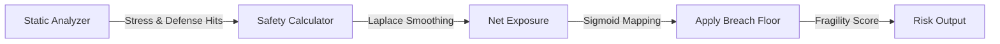

# Structural Fortification (Safety Exposure)

> **File Reference:** [`gitgalaxy/metrics/signal_processor.py`](file:///home/joe/nyx_projects/gitgalaxy/gitgalaxy/metrics/signal_processor.py)
>
> **Metric:** Ratio of Defensive Controls to Execution Stressors
>
> **Summary:** Evaluates how well source files are protected by defensive programming practices. It balances risk triggers (such as unsafe execution, type-suppression, and mutable state) against defensive controls (such as `try/catch` error handling, type guards, and test assertions).
>
> **Effect:** Maps directly to the GitGalaxy Universal Risk Spectrum:
> * 🟦 **VERY LOW (Score 0-19):** Highly Fortified. Defensive controls (`try/catch`, type guards) comfortably exceed execution stressors.
> * 🟨 **INTERMEDIATE (Score 40-59):** Stable. Execution stressors and defensive controls are in equilibrium.
> * 🟥 **VERY HIGH (Score 80-100):** Fragile / High Exposure. Execution stressors significantly exceed defensive controls, leaving code vulnerable to runtime failures.

## Engineering Summary
This subsystem evaluates the balance between dangerous execution patterns and defensive programming safeguards within a source file. It solves the problem of identifying brittle code that lacks adequate error handling or type validation. It exists to flag vulnerable execution paths before they fail at runtime. By computing a net exposure score, this system provides a continuous structural safety metric for GitGalaxy.

## Purpose
To calculate the ratio of execution stressors (e.g., unsafe code, type suppression) to defensive controls (e.g., exception handling, type guards) and map this balance into an overall fragility score.

## Problem Being Solved
Code that relies heavily on dynamic state mutation, unsafe memory access, or type suppression without corresponding error handling is inherently fragile. Traditional linters flag explicit syntax errors, but often fail to weigh structural risk against structural defense across an entire file.

## Design
Heuristic signals are categorized and weighted:
- **Execution Stressors:** `eval`, `exec`, unsafe pointer math (4.0x), type evasions like `@ts-ignore` (1.5x), mutable state operations (0.5x).
- **Defensive Controls:** `try/catch`, bounds checks (1.0x), test assertions (0.5x), inline documentation (0.1x).

**Mathematical Formulation**
1. **Calculate Laplace-Smoothed Densities:**
$$\text{SmoothedLOC} = \max(\text{LOC}, 1) + 20.0$$
$$\text{StressorDensity} = \left(\frac{\text{WeightedStressors} + Irc}{\text{SmoothedLOC}}\right) \times Mp$$
$$\text{ControlDensity} = \left(\frac{\text{WeightedControls}}{\text{SmoothedLOC}}\right) \times Fc$$

2. **Net Exposure & Systems Buffer:**
$$\text{NetExposure} = (\text{StressorDensity} - \text{ControlDensity}) - \text{SystemsBuffer}$$

3. **Sigmoid Scoring & Breach Floor:**
$$\text{RawScore} = \frac{100.0}{1 + e^{-12.0 \times \text{NetExposure}}}$$
A Breach Floor (up to 80.0) is enforced if danger signals exceed a minimum threshold density ($> 0.03$) and outpace controls, preventing comments from masking high-risk execution.

## Pipeline Integration

- **Inputs received:** Heuristic hit counts for danger patterns, safety negatives, flux, safety controls, tests, and documentation, along with LOC and environmental modifiers.
- **Outputs produced:** A normalized structural safety score (0-100).
- **Dependencies:** Relies upstream on token parsing from the static analysis engine.

## Tradeoffs
- Laplace smoothing ($LOC + 20.0$) was chosen to prevent extreme score volatility in very small files, sacrificing raw precision in micro-scripts for stable baseline behavior.
- The Breach Floor design enforces a hard penalty for highly dangerous logic, choosing to prioritize runtime safety over lenient scoring, even if heavily documented.
- Subtracting a 'Systems Buffer' for implicit languages ($Fc < 1.0$) acknowledges inherent architectural opacity but risks over-penalizing idiomatic scripting patterns.

## Limitations
- Cannot evaluate the semantic correctness of a `try/catch` block (e.g., catching exceptions and silently ignoring them still counts as a defensive control).
- Bounds checks implemented via custom external libraries might not be recognized if they do not match standard heuristic patterns.
- Type suppression (`@ts-ignore`) penalties assume the suppression is hiding a legitimate bug, which may penalize necessary build-system hacks.

## Performance Notes
Uses simple $O(1)$ arithmetic aggregation on pre-scanned token hits. By short-circuiting to `0.0` if no stressors exist, the processor eliminates unnecessary floating-point operations for completely benign files.

## Future Work
Currently, defensive controls are weighted by heuristic pattern matches. Future iterations will introduce control-flow graph (CFG) analysis to verify that the safety controls actually wrap or intercept the execution stressors, rather than simply coexisting in the same file. 

## Related Components
- Static Analysis Engine
- Path Modifier ($Mp$)
- Universal Framework Parameters ($Irc$, $Fc$)
