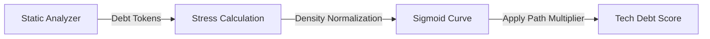

# Tech Debt Exposure

> **File Reference:** [`gitgalaxy/metrics/signal_processor.py`](file:///home/joe/nyx_projects/gitgalaxy/gitgalaxy/metrics/signal_processor.py)
>
> **Metric:** Density of Planned vs. Fragile Work Markers
>
> **Summary:** Measures technical debt density using developer code annotations (`TODO`, `FIXME`, `HACK`, `XXX`). It differentiates between planned pending work (`TODO`, `WIP`) and admitted logic fragility (`HACK`, `FIXME`), calculating a weighted stress score normalized per 100 lines of code.
>
> **Effect:** Maps directly to the GitGalaxy Universal Risk Spectrum:
> * 🟦 **VERY LOW (Score 0-19):** Polished. Code aligns with expectations with no active debt annotations.
> * 🟨 **INTERMEDIATE (Score 40-59):** Active Development. A moderate density of planned task markers.
> * 🟥 **VERY HIGH (Score 80-100):** High Risk. High density of fragile fixes (`HACK`, `FIXME`) and unfinished stubs (`TODO`).

## Engineering Summary
This subsystem quantifies explicit technical debt by analyzing developer code annotations. It solves the problem of unmanaged debt accumulation by converting qualitative comments (`TODO`, `FIXME`) into a measurable density metric. The system exists to distinguish between standard planned work and admitted structural fragility. By normalizing these markers per line of code, it integrates into GitGalaxy as a targeted indicator of code quality and maintenance backlog.

## Purpose
To calculate the density of planned work versus admitted logic fragility and map this density into an actionable technical debt risk score.

## Problem Being Solved
Technical debt is often hidden in codebase comments, making it difficult to measure programmatically. While issue trackers capture macroscopic tasks, localized structural hacks and temporary stubs are frequently forgotten, silently increasing maintenance friction and defect probability.

## Design
The analysis engine categorizes comment tokens into two debt classes:
- **Planned Work (1.0x Weight):** `TODO`, `WIP`, `STUB`, `REFACTOR`. Represents tracked future tasks.
- **Fragile Fixes (3.0x Weight):** `HACK`, `FIXME`, `XXX`, `UGLY`. Explicit admissions of buggy or brittle logic.

**Mathematical Formulation**
1. **Stress Sum Calculation:**
$$\text{StressSum} = (\text{PlannedDebt} \times 1.0) + (\text{FragileDebt} \times 3.0) + (Irc \times 0.5)$$
2. **Density Normalization (per 100 LOC):**
$$\text{Density} = \left( \frac{\text{StressSum}}{\max(\text{LOC}, 1)} \right) \times 100.0$$
3. **Sigmoidal Threshold Mapping:**
$$\text{RawScore} = \frac{100.0}{1 + e^{-0.5 \times (\text{Density} - 5.0)}}$$
4. **Apply Path Modifier:**
$$\text{FinalScore} = \min(\text{RawScore} \times Mp, 100.0)$$

## Pipeline Integration

- **Inputs received:** Heuristic comment token hits (`planned_debt`, `fragile_debt`), LOC, and environmental modifiers.
- **Outputs produced:** A normalized technical debt score (0-100).
- **Dependencies:** Relies upstream on the comment extraction phase of the static analysis engine.

## Tradeoffs
- Weighting `FIXME` at 3x the severity of `TODO` was chosen to heavily penalize admitted broken logic, sacrificing equality among debt markers to prioritize immediate bug risks.
- Sigmoid thresholding around 5.0 stress points per 100 lines assumes a baseline tolerance for debt; this prevents hyper-penalization of standard development workflows, but may mask low-level chronic debt.
- The language Fidelity Coefficient ($Fc$) is deliberately excluded because `TODO` carries identical semantic meaning regardless of language syntax.

## Limitations
- Highly reliant on developer discipline. If a team does not use `TODO` or `FIXME` conventions, this metric will report a false 0.0 risk.
- Does not interface with external issue trackers (e.g., Jira, GitHub Issues) to verify if a `TODO` is actually scheduled or abandoned.
- Custom debt tags (e.g., `OPTIMIZE`, `TECHDEBT`) are not recognized unless explicitly added to the static scanner regex.

## Performance Notes
Operates with $O(1)$ complexity using pre-computed token arrays. Incorporates an early exit shortcut: if no debt markers are present, the function immediately returns `0.0`, bypassing floating-point arithmetic.

## Future Work
Currently, the system is strictly lexical and static. Future iterations plan to integrate with Git history to calculate "Debt Age" (penalizing a 3-year-old `FIXME` more than a 3-day-old `TODO`) and to support custom dictionary definitions for team-specific debt tags.

## Related Components
- Static Analysis Engine
- Path Modifier ($Mp$)
- Implicit Risk Correction ($Irc$)
